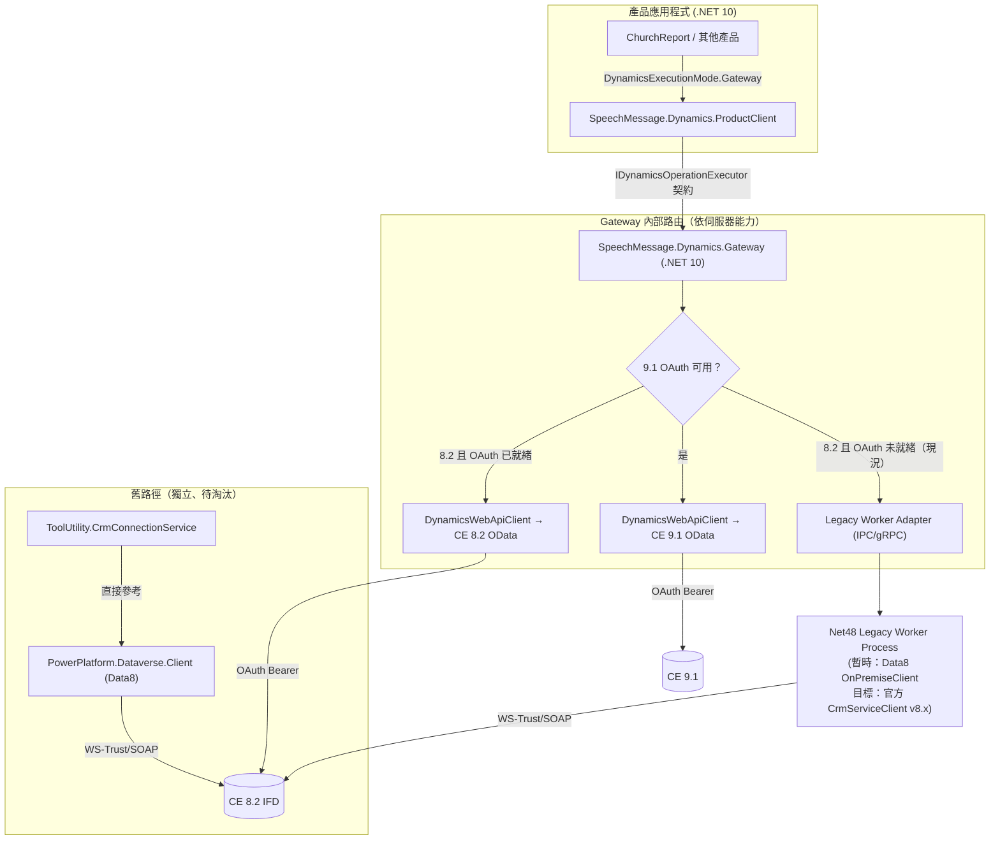

# Dynamics 365 CE 8.2 / 9.1 SDK Bridge 架構評估報告（Full-Stack Architect 觀點）

## 一、整體分析（Holistic Analysis）

我以 read-only 方式核對了程式碼現況，關鍵發現：**新架構（Gateway/Embedded）與舊架構（ChurchReport/ToolUtility）目前是兩條互不相依的路徑**，這點在既有的 Gemini 評估中未被明確點出，但對「何時可以移除 Data8」的判斷至關重要：

- `SpeechMessage.Dynamics.Gateway.csproj` 與 `SpeechMessage.Dynamics.Embedded.csproj` 只參考 `SpeechMessage.Dynamics.Abstractions` 與 `SpeechMessage.Dynamics.WebApi`，**完全沒有參考 `PowerPlatform.Dataverse.Client`（Data8）**。
- `DynamicsExecutionMode.cs` 的設計意圖已寫死在註解中：「產品只在 Gateway 或 Embedded 兩種模式中選一個」「兩種模式對外操作契約必須一致」——這代表 Local Gateway 從一開始就是 Web API-first 設計，Data8 SDK 從未被納入新架構的依賴圖。
- 唯一還參考 `PowerPlatform.Dataverse.Client.csproj` 的是 `ToolUtility.csproj` 與診斷用的 `.ccg/diagnostics/LegacySoapProbe.csproj`。`CrmConnectionService.CreateOnPremiseClient()` 是目前唯一的呼叫點。
- `SpeechMessage.Dynamics.WebApi` 已有 `DynamicsWebApiClient`（`HttpClient`/`SocketsHttpHandler` 直連 OData）與對應的 socket soak test（`DynamicsHttpTransportSocketSoakTests.cs`），顯示團隊已經在為「無 SDK Web API」路徑做生產等級的可靠度驗證，方向與官方文件建議一致。

因此，**Data8 是否移除，不是「等 Gateway 蓋好」的問題，而是「等 ToolUtility/ChurchReport 遷移到 Gateway/ProductClient」的問題**——Gateway 這條新路徑早就不依賴它了。

## 二、直接回答使用者問題 1–3

### Q1：CE 8.2 是否固有需要 Data8 專案才能與 ASP.NET Core / .NET 10 整合？

**否。** CE 8.2 對外是標準 OData v4 Web API（`/api/data/v8.2/`），微軟文件明確指出不需要語言專屬組件即可用 `HttpClient` 呼叫。Data8 專案只是**當前 WS-Trust/IFD 驗證條件尚未打通時的暫時相容橋樑**，用來繞過「ADFS 未註冊 OAuth client、拒絕 password grant、無 refresh token」這幾個純屬**基礎設施/驗證設定**的阻塞點，而非 CE 8.2 Web API 本身的限制。程式碼證據也支持此結論：新的 Gateway/Embedded 架構本來就沒有依賴 Data8，只有舊的 ToolUtility 路徑在用。

### Q2：支援 CE 8.2 與 CE 9.1 最安全的 Local Gateway 架構是什麼？

採**單一 Gateway 契約 + 依伺服器能力路由到不同後端 adapter**，而不是讓 Gateway 本身認識兩種協定：

- Gateway/Embedded 對產品端永遠只暴露 `IDynamicsOperationExecutor` 這一種契約（`OperationExecutionRequest` → `OperationExecutionResult`），產品完全不知道底層是 8.2 還是 9.1、Web API 還是 WS-Trust。
- 對 CE 9.1：只要 OAuth 可用，Gateway 內部直接用 `DynamicsWebApiClient`（OData v9.1）或官方 `ServiceClient`。
- 對 CE 8.2：**先嘗試 Web API + OAuth**（授權碼流程一旦在 ADFS 註冊完成即可用）；在此之前，Gateway 透過一個獨立的 adapter 呼叫「Legacy Worker」，該 Worker 才是 Data8/官方 SDK 存在的地方，而不是把 WS-Trust 邏輯散落在 Gateway 本體。
- 這樣做的全端價值在於：**契約穩定（前端/產品端零改動）**，同時把「哪個版本用哪種驗證」這種易變的基礎設施決策，隔離在 Gateway 背後可替換的 adapter 層，符合「Contract First」原則。

### Q3：官方 SDK 相容性設計，8.2 與 9.1 該用同一個 .NET Framework Worker 還是分開？

**初期必須分開、版本鎖定（version-pinned）**，不要合併：

- **二進位風險**：`Microsoft.Xrm.Sdk.dll` / `Microsoft.Crm.Sdk.Proxy.dll` 在 v8.x 與 v9.x 之間有 breaking change，同一個 AppDomain/process 載入兩個版本會有組件繫結衝突，`bindingRedirect` 無法保證行為一致（尤其是序列化格式、Message Contract 差異）。
- **驗證風險**：CE 8.2 IFD 走 ADFS WS-Trust 1.3／NTLM 混合，CE 9.1 可能已可用 OAuth；同一個 WCF host 內混用兩種安全通道設定，容易發生 credential/token 污染或 channel factory 設定互相覆蓋。
- **合併前必須測試**：(1) v9.x SDK 是否能向下呼叫 8.2 的 `Organization.svc`（官方通常不保證）；(2) 同一 process 內並行處理兩種驗證流程是否會有 session/token 交叉污染；(3) 高併發下 WCF channel 生命週期與連線池是否穩定（可參考現有 `DynamicsHttpTransportSocketSoakTests.cs` 的做法，針對 Worker 補一份對等的 soak test）。
- 在以上測試都通過並有量測數據佐證之前，**用 process 邊界（兩個獨立 Worker exe，各自鎖定 SDK 版本）換取穩定性，是合理的權衡**——這比在同一 process 內賭相容性便宜得多。

## 三、相容性與風險評估表

| 方案 | CE 8.2 | CE 9.1 | 驗證需求 | 風險等級 | 備註 |
|---|---|---|---|---|---|
| Direct Web API adapter | 可行（協定支援），**目前被 ADFS 設定阻擋** | 可行 | OAuth（授權碼／client secret） | 🔴 需真機驗證 | 需在 ADFS 註冊 client/redirect URI；password grant 已證實被拒 |
| 官方 `ServiceClient`（.NET 10） | **不可行**（現代 .NET 上不支援 legacy WS-Trust 帳密） | 可行（OAuth 可用時） | OAuth/憑證/client secret | 🟡 部分適用 | 對 9.1 是首選，對 8.2 IFD 現況無用 |
| 官方 .NET Framework `CrmServiceClient` Worker | 可行 | 可行 | Windows AD / WS-Trust | 🟡 中風險 | 需額外維運 .NET Framework 4.8 process；8.2/9.1 建議分開部署 |
| Data8 `OnPremiseClient`（現況） | 可行（已驗證可用） | 未特別驗證 | WS-Trust/SOAP 帳密 | 🔴 高風險 | 社群專案、無官方支援；`OnPremiseClient` 類別未實作 `IDisposable`，長連線/高併發下有 channel 洩漏疑慮，需比照 `DynamicsWebApiClient` 補 soak test 驗證 |

## 四、建議元件與流程圖

## 五、決策

### 立即決策：**保留** Data8 專案

`ToolUtility.csproj` 與 `.ccg/diagnostics/LegacySoapProbe.csproj` 現在仍直接參考它、`CrmConnectionService.CreateOnPremiseClient()` 是唯一有效的 CE 8.2 連線手段之一，且新的 Gateway/Embedded 路徑本來就不吃這個依賴，兩者互不衝突。現在移除只會破壞既有建置與 ChurchReport 的舊 CRM 連線路徑，沒有換到任何架構收益。

### 最終狀態決策與可衡量移除準則

最終狀態：`PowerPlatform.Dataverse.Client` 專案目錄與相關 WCF/WS-Trust 套件從方案中完全移除。移除必須同時滿足以下 gate（缺一不可）：

1. **契約遷移完成**：`ChurchReport` 不再透過 `ToolUtility.CrmConnectionService.CreateOnPremiseClient()` 取得連線，改為透過 `SpeechMessage.Dynamics.ProductClient`／`IDynamicsOperationExecutor` 呼叫 Gateway 或 Embedded。
2. **CE 8.2 有一條不依賴 Data8 的可用連線**，滿足下列任一：
   - (a) ADFS 已註冊 OAuth client/redirect URI，`DynamicsWebApiClient` 對 CE 8.2 OAuth 授權碼流程在真實伺服器驗證成功；或
   - (b) Legacy Worker（官方 `CrmServiceClient`，.NET Framework 4.8）已完成並通過與 `DynamicsHttpTransportSocketSoakTests.cs` 同等級的連線穩定性測試。
3. **`ToolUtility.csproj` / `LegacySoapProbe.csproj` 的 `ProjectReference` 移除**，方案可成功建置且既有整合測試全綠。
4. **`grep -r "PowerPlatform.Dataverse.Client"` 在方案內無任何生產程式碼命中**（僅允許出現在歷史文件/commit log）。

## 六、需真機驗證，不能只靠文件判斷的結論

- 🔍 ADFS 授權碼流程需實際 `Add-AdfsClient` 註冊並跑通 token 交換（目前尚未註冊）。
- 🔍 CE 8.2 Web API 的功能集是否覆蓋現有 SOAP 端點所用到的全部操作（FetchXML、特定 message 呼叫），需在真實 CE 8.2 伺服器上逐一核對，文件不足以保證。
- 🔍 `OnPremiseClient` 缺少 `IDisposable` 是否在生產負載下造成 socket/channel 洩漏，需要在測試環境用 `netstat`／連線池監控實測，而不是只看程式碼結構推論。
- 🔍 官方 v9.x SDK 是否能相容呼叫 CE 8.2 `Organization.svc`（若考慮以單一 Worker 起步）需要真機互通測試，微軟文件未保證跨版本相容。

---

**Integration Notes（給 Gateway 開發者）**：不需要為了「支援 8.2」而修改 `DynamicsExecutionMode` 或 `IDynamicsOperationExecutor` 契約——這一層已經是版本無關的。真正需要新增的是 Gateway 內部的路由/adapter 選擇邏輯（依伺服器版本與可用驗證方式挑 adapter），以及對應的 Legacy Worker adapter 介面。`ToolUtility` 的遷移應視為獨立於 Gateway 開發的另一條工作，兩者可平行推進，不互相阻塞。

*Read-only 評估，未修改任何原始碼。以上內容由 CCG dual-model-runs 之 Claude architect 分支產出，對應 run: `20260729-120346-dynamics-82-91-sdk-bridge-assessment-architect`。*

---
SESSION_ID: 73d0e0b1-d34c-4a5a-b6a0-4b93e5832e1c
