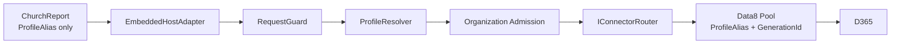

# P4：ChurchReport Embedded F5 設計

## 邊界與資料流

`EmbeddedHostAdapter` 是 `IDynamicsOperationExecutor` 的同程序實作。它不能接收、緩存或回傳原始 connector、credential、endpoint 或 organization identity。每一執行都先交給既有受控 executor；lease 與 permit 的唯一 owner 留在 P3 runtime／pool，並在 `finally` 釋放。

## DI 設計

`AddSpeechMessageDynamicsEmbedded` 支援 instance 與 DI factory 兩種受控註冊。ChurchReport process host 使用 factory 形式，讓 runtime、ProfileResolver、Admission、Router 與 Data8 pool 都由同一個 ServiceProvider 唯一擁有並在關機時反向釋放。它驗證 `ConnectionMode=Embedded` 及 ProfileAlias；不讀取 `Gateway.Endpoint`，不接受 additional secrets，且不建立 HTTP client、timer、background task 或靜態可變狀態。成功時將 `EmbeddedHostAdapter` 註冊為 `IDynamicsOperationExecutor`。

## 設定映射

ChurchReport 沿用既有 `CrmConnection` 來源作為 composition-root input；映射器只在啟動期建構 ControlsPlane 的 `DynamicsProfiles` 與 `OrganizationCatalog`。產品執行期設定僅含 `ConnectionMode`、`ProfileAlias` 和 feature flag。此設計防止請求覆寫組織、endpoint、connector 或 credential。

P4.1 的 `CrmConnection:OrganizationCatalog` 是所有已知 8.2／9.1 Organization identity 的單一來源。別名同時存在於兩個 CE 版本時以 `-ce82`／`-ce91` 消除歧義；例如 `speechmessage-ce82` 與 `speechmessage-ce91`。Catalog entry 的 `ServiceUri` 是能否建立 Data8 factory 的必要條件：只有 GUID 與版本的 entry 代表已登錄但尚未配置連線目標，mapper 必須 fail closed，絕不沿用其他 profile 的 URI 或 credential。

## 生命週期

Adapter 是 stateless singleton。操作範圍內的 cancellation token 只向下傳遞，不自行建立 CTS、timer 或 Task。P3 pool 的 lease faulted／deadline／drain 規則維持不變：不健康 client dispose、不回池；permit 由 admission scope release。Adapter 不保存任何 request、profile 或 result reference。

ChurchReport 在 `ConnectionMode=Embedded` 時，即使 `Package01FeeReadsEnabled=false`，也只於 host StartAsync 執行一次 `runtime.health.whoami`。這是 P4 的受控真實連通性驗證，不是收費清單消費者遷移；既有 ToolUtility 路徑與 feature flag 保持不變。Gateway 模式則維持既有 flag=false 嚴格 no-op。

## 效能

Embedded 移除 HTTP 序列化與 socket 往返，保留相同控制面路徑。基準使用同一 capability、相同固定資料集與 warm-up，比較 p50／p95／p99；p95 只能等於或優於 legacy。若量測環境不具真實 CE，將結果標為「環境待驗證」，不得以合成結果聲稱完成實機驗收。

## 外部 CE 真機量測的延後閘門

使用者決定先完成 P4 Embedded Data8、P5 Dedicated Gateway 與 P6 的程式／離線測試，再自行安排一次受控的外部
CE 量測。因此 P4 不建立密碼、token、cookie、遠端 session 或背景重試來「等待」真機；現有 opt-in 測試只保留為
P6 後的整合驗收工具。當時必須以同一組織、同一不可破壞 read workload、相同 warm-up 與樣本數，依序取得 legacy、
Embedded、Dedicated 的結果一致性與 p50／p95／p99，並確認所有 lease、permit、client、timer、task、handle、
session 都回到基線。任何模式未通過都不得以其他模式的成功取代。
