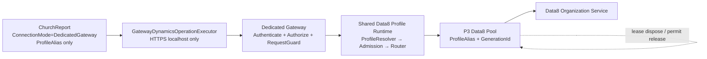

# P5 Dedicated Gateway 對齊設計

## 採用方案

採用「抽取共用 Data8 profile runtime，Dedicated Gateway 以 HTTPS host 取用」方案。

不採用直接複製 `EmbeddedData8Runtime`：複製會使 pool、permit、client、drain、dispose 的規則分叉，後續很容易形成 Session 或 resource leakage。

也不採用 Official Worker／SQL gateway 現有 Development 設定：它與 P5 的 Data8 Dedicated 模式不同，且違反本階段不使用 SQL 的限制。

## 邊界與所有權

| 邊界 | 擁有者 | 不可違反的規則 |
| --- | --- | --- |
| ChurchReport | 產品 host | 僅有 mode、alias、localhost HTTPS endpoint；由 DI process host 擁有 HttpClient factory。 |
| Dedicated Gateway HTTP | Gateway host | Negotiate principal 與 workload binding 決定 alias/operation；request 不能覆寫。 |
| Shared Data8 profile runtime | Gateway/Embedded 各自的 DI container | 各自擁有 runtime、pool registry、admission manager 與 Data8 factory，停止時 await drain/dispose。 |
| Data8 pool | shared P3 implementation | Pool key 是 `(ProfileAlias, GenerationId)`；Organization admission 是唯一總預算。 |
| Data8 client/WCF channel | 一個 lease | 健康 lease 回到原 pool；fault/cancel/timeout/drain 時 dispose；permit 永遠在 finally 釋放。 |

Gateway 與 Embedded 不共享 runtime 或 client 物件。它們只共享程式碼與 immutable configuration shape，這可避免跨進程或跨 mode 的 mutable session/state 外洩。

## 共用 runtime 的抽取

將目前位於 ChurchReport 的 `EmbeddedData8Runtime` 之不含產品組態讀取的組合邏輯，抽取為 `SpeechMessage.Dynamics.Connectors.Data8` 的 shared runtime：

- 建立 immutable `ConfigurationProfileResolver` snapshot；
- 為 Data8 profile 產生單進程 `OrganizationAdmissionPlan`；
- 使用 `InMemoryRuntimeHostSlotCoordinator`；
- 建立 `Data8ConnectorPoolRegistry`、註冊 Data8 pool、公開 `Data8ProfileOperationExecutor`；
- 以 `IAsyncDisposable` 單一 owner 依序 drain pool，再 dispose admission；失敗聚合但不跳過後續 cleanup。

ChurchReport Embedded 和 Gateway Dedicated 都以其 own DI container 建立一個 runtime；其建構所需 profile、catalog、credential reference/connection settings 均只存在於 host 的 deployment configuration。

## Gateway host 模式

新增一個不可由 request 影響的 Gateway deployment-mode options，Development Dedicated 設定固定為 `DedicatedGateway`。該 options 在 startup 驗證後只作為 immutable scalar 使用：

- POST handler 以 `RequestOrigin.DedicatedGateway` 呼叫 RequestGuard；
- 註冊 Dedicated Data8 executor，而不是 Official Worker executor；
- 使用 In-Memory coordinator，`MaximumRuntimeHosts=1`、`RequireDurableHostCoordinator=false`；
- `/ready` 仍只回傳安全的狀態、generation 與計數，且 response 為 no-store，不回傳 endpoint、credential、token 或 connector internals；
- 現有 Central/Official 的設定與行為不在此 P5 改寫；Dedicated 開發設定明確 opt-in。

## F5 開發路徑

Visual Studio 的 Multiple startup projects 啟動順序是：

1. `SpeechMessage.Dynamics.Gateway` 使用 HTTPS profile，監聽 `https://localhost:7244/`；
2. `SpeechMessageProducts.ChurchReport` 使用 Development 設定，`ConnectionMode=DedicatedGateway`、固定 alias 與相同 endpoint。

這是 IDE 的啟動協調，不是產品程式自行建立 child process。Gateway 不可用時，ChurchReport preflight 會在其有界 timeout 內 fail closed；Gateway 停止時由 Generic Host DI lifecycle 負責 runtime drain/dispose。

## 安全、隔離與回滾

- `GatewayDynamicsOperationExecutor` 的 `SocketsHttpHandler` 維持 `UseCookies=false`、`AllowAutoRedirect=false`、`UseProxy=false`，不以 cookie/token/redirect 改變 session。
- Gateway 一律從 authenticated principal 的 workload binding 衍生 alias/operation；所有禁止參數在取得 profile、permit 或 client 前拒絕。
- Configuration reload 不得偷偷替換 active runtime。模式/profile/endpoint 有變更時要求停止既有 host、drain/dispose 後再重啟。
- 回滾只需把 ChurchReport Development `ConnectionMode` 改回 `Embedded`，或停用 Dedicated startup profile；不修改 P3 pool、不移除 Data8，也不變更外部 CE。

## 測試設計

以 unit/integration TestServer 或 stubbed factory 驗證，不發送外部 CE request：

- shared runtime 的 constructor rollback、pool-before-admission disposal、permit/client cleanup、disabled/missing URI fail-closed；
- Dedicated host 設定必須選 Data8 + InMemory 且拒絕 SQL/Official profile；
- HTTP handler 的 Dedicated request origin、non-loopback/HTTP rejection、principal binding 與 reserved parameter rejection；
- ChurchReport Dedicated host 的 endpoint validation、preflight cancellation/timeout、DI provider disposal；
- profile/mode 間沒有 shared static executor/client/credential state。
