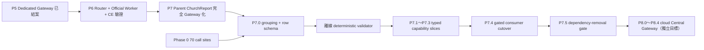

# P7.0 Capability Inventory 與 Deterministic Coverage Gate 設計

## 1. 證據邊界與方法

P7.0 以 Phase 0 的 normalized matrix 為唯一 call-site 基線，並以 [preliminary-capability-inventory.json](./preliminary-capability-inventory.json) 的 SHA-256 固定本輪所研究的版本。該 JSON 不複製 CRM payload、endpoint、credential、token、cookie、connection string 或真機診斷內容；它只保存 row ID、capability grouping 與 coverage 設計所需的非敏感狀態。

任何 Registry 定義、executor 程式、ProductClient method、feature flag 或真機測試都只更新自己的欄位；不得以單一「完成」欄位取代四個獨立證據狀態。

## 2. Traceability matrix schema

最終 machine-readable matrix 的每個 `callSites[]` row 必須至少含有下列欄位；允許用固定字串狀態表達「尚未規劃」，但禁止省略欄位或以自由文字暗示已完成：

| 類別 | 必填欄位 |
|---|---|
| 來源與意圖 | `callSiteId`、`source.file`、`source.symbol`、`legacyBehavior`、`businessUseCase`、`capabilityFamily`、`operationKind` |
| 封閉契約 | `operation.id`、`productClient.owner`、`requestDto.owner`、`responseDto.owner`、`authorization`、`profileBoundary`、`workloadBoundary` |
| 四種 coverage | `registry.status`、`data8Executor.status`、`officialWorkerExecutor.status`、`consumer.status`、`realCeEvidence.ce82`、`realCeEvidence.ce91` |
| rollout/legacy | `featureGate`、`rollout.owner`、`rollback.owner`、`temporaryLegacy.status`、`toolUtilityRemovalGate` |
| 安全生命週期 | `lifecycleRisk.resources`、`lifecycleRisk.owner`、`lifecycleRisk.releasePath`、`lifecycleRisk.isolationBoundary` |

`operation.id` 必須符合 `^[a-z0-9]+(\.[a-z0-9]+)+$`，採 `platform.*`、真正共用的 domain 名稱或 `churchreport.*`。這是 capability 名稱，而非 entity/table 名稱；不能新增 `entity.retrieve`、`entity.update`、`fetchxml.execute` 或讓 client 傳入 entity、FetchXML、endpoint、credential、ConnectorKind、OrganizationId。

## 3. 初步 capability grouping

初步 grouping 將 70 筆 call sites 收斂為 12 個業務 family；完整 ID 對照與來源 hash 位於 task-local JSON。

| Capability family | Rows | 類型摘要 | P7 分流 |
|---|---:|---|---|
| `platform.shared.runtime` | 6 | pool、WhoAmI、profiling、borrow/return | P5/P6 平台 gate；非 consumer cutover |
| `platform.legacy.blocked` | 5 | generic entity CRUD、timing decorator、generic assign | P7.5 前必須消除；不產生 capability |
| `churchreport.list.membership` | 23 | list、member、small-group、權限鏈與 transfer | P7.1 reads、P7.2 mutations、P7.3 paging/large graph |
| `churchreport.member.profile` | 8 | contact、line profile、image、relation goals | P7.1 reads、P7.2 contact/image writes |
| `churchreport.fee.lessons` | 10 | fee/stor lesson 查詢與 editor | P7.1 第一批 read candidates；個別 write 留 P7.2 |
| `churchreport.donation.lifecycle` | 9 | booking、recurring、payment outcome、contact resolution | P7.1 reads、P7.2 financial writes |
| `churchreport.contact.onboarding` | 1 | 新人完整建立 orchestration | P7.2；不可拆成 generic CRUD |
| `churchreport.appointments` | 1 | appointment create/update/assign | P7.2 action/write |
| `churchreport.metadata` | 1 | option set metadata | P7.3 bounded metadata/cache policy |
| `churchreport.attendance` | 3 | present record load/create/upsert | P7.1 read、P7.2 writes |
| `churchreport.weekly.reporting` | 1 | meeting statistics | P7.3 paging/aggregation policy |
| `churchreport.authentication` | 2 | account number/LINE identity lookup | P7.1；單一 workload/authorization gate |

## 4. 現況 coverage 與 Connector 判定

| 層次 | 可驗證現況 | 不可推論的事項 |
|---|---|---|
| Phase 0 | 70 rows；9 rows 映射至既有 registry ID | 不代表 70 個 API 或 70 個 executable operations |
| Registry | 9 declared definitions；含 2 runtime、1 metadata、6 Package01 read | 不代表 executor/consumer/CE 已可用 |
| Data8 executor | 只支援 `runtime.health.whoami`；其他 registry ID 取得 pool 前即 fail closed | 不可宣稱 Package01、metadata 或任何 ChurchReport domain capability 已被 Data8 執行 |
| Official Worker | 已有兩個 identity operation 與 `fee.dedication.retrieve.by.contact.date.range` 的 bounded worker contract；P6.1 Router／Pool／Lease 離線 gate 已通過 | P6.2 尚缺 deployment-owned profile input 與 CE 8.2/9.1 real evidence；不得宣稱 P6 結案 |
| ProductClient | `IPackage01FeeReadClient` 提供 6 個 typed read methods | ChurchReport flag 為 false，沒有 Gateway consumer enablement |
| CE evidence | 70 rows 在 CE 8.2/9.1 都是 `metadata-only`、smoke 都未開始 | 不能以 unit tests、registry hash 或 local appsettings 宣稱真機相容 |

P6 是 P7 Parent（含 P7.0～P7.5）全部 family 的 release prerequisite。Data8 仍是永久 ConnectorKind，但它必須經 Router/profile/admission 對應；官方 Worker 也是同一 connector-selection contract 的另一個選項。P6.1 的離線 Router integration 已通過，但 P6.2 real CE evidence 尚未完成，因此 P7.0 只可保存 planning artifacts，必須等待 P6 正式結案後才可啟動。P7.0 啟動時必須重新從 source 產生 manifest，為每個 capability 決定 `Data8-only`、`Official-worker-required`、`both-required` 或 `evidence-insufficient`，並以 CE 8.2 與 9.1 分開記錄。

coverage status 必須由可重現的 source-derived manifest 取得，不能手寫數字或混合不同層級。Official
Worker 的 protocol/adapter allowlist 現有三個 operation（兩個 identity 加一個 bounded fee read）；這與
「Official Worker 已透過 Router 通過離線 gate」及「已取得 real CE evidence」是獨立欄位。validator 必須分別輸出
`officialWorkerProtocol.status`、`officialWorkerRouter.status` 與 `realCeEvidence`，避免把 3 寫成 1，
或把 P6.1 離線完成誤報為 P6 已結案。

## 5. Offline deterministic coverage validator

輸入為 final matrix、從 source scan 產生的 registry snapshot／Data8 executor manifest／Official Worker
protocol and Router manifest、ProductClient ownership manifest、consumer enablement manifest、CE evidence manifest，以及
P7.5 reference-scan manifest。全部是版本控制的本機檔案；validator 不允許網路、D365、環境變數祕密、
cookie/token、connection string 或產品設定載入。source scan 的每個數字均需附來源檔與 stable hash，讓
後續手動修改 registry/worker/router 時 coverage report 自動反映，不靠文件敘述維持同步。

固定排序依 `callSiteId` ordinal comparison，輸出以 stable rule ID + call-site/operation ID 排序；同一輸入必須產生位元組等價的 JSON report 與相同非零 exit code。它至少要拒絕：

1. 未分類 call site、缺 business use case、缺 operation/owner/DTO ownership。
2. 重複或不合規 operation ID；Registry-only operation 沒有 executor plan。
3. ConnectorKind、CE 8.2、CE 9.1、consumer enablement 或 real evidence 為不明狀態。
4. consumer enabled 與 real CE evidence 被混寫；任何 production temporary legacy 缺 rollout/rollback owner。
5. generic CRUD、任意 Entity／QueryBase、任意 FetchXML，或 caller-controlled profile/connector/credential/endpoint。
6. lifecycle owner/release path/isolation boundary 缺失，或 P7.5 dependency scan 仍找到 ChurchReport production ToolUtility/CRM SDK reference。

P7.0 可以先提供 reference-scan **報告**並列出尚存依賴，讓 migration 全程有可追蹤的進度數字；不得將一個
預期數月失敗的「zero-reference red test」納入必綠 CI。P7.5 才把相同 deterministic scan 的 zero count
設為 release-blocking assertion。

## 6. Rollout、rollback 與 P7.5 gate

P7.1～P7.3 每次只處理一個業務 capability slice，先建立 typed request/response、authorization、bounded response/paging、connector/CE evidence 和故障 cleanup 契約，再在 P7.4 以 capability-specific flag 啟用 consumer。Rollback 必須是關閉該 capability flag、停止新 admission、drain in-flight lease/worker/stream，並回到已核准的 legacy path；不得變更 profile、credential、connector 或把失敗請求改送其他 CE version。

CE 9.1 write/action/function evidence 使用已確認與正式系統分離的 `sunnyvalechback` 公司研發 Organization。使用者目前只授權可建立一筆 test member 而不影響正式資料；這是環境級可行性，不是任意寫入或「寫壞再刪」授權。資料歸屬必須是唯一 test member 與該 operation family 明確建立的 test-owned records；每個 slice 在 activation 前需定義 allowed mutations、fixture owner、precondition、cleanup/reconciliation 與 ambiguous-timeout policy，不能因環境非正式便允許無界或不可辨識資料。CE 8.2 只有在本 matrix 將 capability 標為 `required` 時才要求安全 write fixture；若產品不需要且契約不支援，必須在 dispatch 前 fail closed 並標示 `unsupported`，不得以缺少無條件的 CE 8.2 sandbox 阻塞 CE 9.1 ChurchReport 路線。

P7.5 只在所有 70 rows 不再是 production temporary legacy、所有 consumer 已有證據、CE 8.2/9.1 matrix 均通過、release build/tests/reference scan 均通過、且 rollback window 結束後，才允許移除 ChurchReport 對 ToolUtility、Dataverse client 與 CRM SDK 的 production dependency。

P7.5 結案 artifact 必須固定 ProductClient／operation contract 版本、support matrix、deployment package、required profile aliases、sanitized evidence、resource baseline 與 rollback package。P8.0 只接收這組已封存輸入來評估雲端 readiness；不得在 P7.0～P7.5 先建立 cloud identity、TLS、DNS 或 Central Gateway traffic。

## 7. 本輪已知缺口與決策

本輪沒有阻礙規劃文件完成的產品決策：使用者已明確要求 P5→P6→CE evidence→P7.0→P7.1～P7.5，之後另以 P8.0～P8.4 將 ChurchReport 部署到雲端 Central Gateway。尚未可以宣稱的結果是各 capability 的最終 ConnectorKind、CE support、rollout owner、rollback owner、DTO owner 與 feature gate；這些必須由後續獨立 child task 的具體契約與證據填入，不得在 P7.0 推測或預先啟用。
