# P5～P8 Dynamics Gateway 執行路線

> 2026-08-06 重校。為避免既有引用失效，保留 `roadmap-p5-p7.md` 檔名；本文件內容已擴充至 P8。
> 本文件採納舊規劃中「vertical slice、deterministic coverage、aggregate capacity、可獨立回滾」的優點，修正 P5 已結案、P7 編號漂移與 P8 觸發條件。

## 1. 已鎖定的最終成果

1. P5 Dedicated Gateway 已正式封存，不再重開。
2. P6 在 Lenovo Legion 完成 Official Worker Router 擴充點；Official Worker CE 8.2／9.1 live compatibility 保留為未來 `evidence-pending` 支線。
3. P7.0～P7.5 在 Lenovo Legion 完成 ChurchReport 全部 D365 capability 遷移，P7.5 移除 ChurchReport 對 ToolUtility／CRM SDK 的 production dependency。
4. P8.0～P8.4 將已在本機驗收的單一 ChurchReport 部署到雲端 Central Gateway，完成身分、TLS、監控、回滾與 live validation。
5. 第二、第三產品 onboarding 日後另立獨立 task，不阻塞目前 P6～P8。

## 2. 唯一路線

```mermaid
flowchart LR
    P5["P5 Dedicated Gateway：已封存"] --> P6["P6 Official Worker Router extension：live evidence pending"]
    P6 --> P70["P7.0 Inventory + coverage validator"]
    P70 --> P71["P7.1 Read capabilities"]
    P71 --> P72["P7.2 Write / Action / Function"]
    P72 --> P73["P7.3 Special resources"]
    P73 --> P74["P7.4 Product cutover"]
    P74 --> P75["P7.5 ToolUtility removal"]
    P75 --> P80["P8.0 Cloud readiness"]
    P80 --> P81["P8.1 Identity + TLS"]
    P81 --> P82["P8.2 Central Gateway deployment"]
    P82 --> P83["P8.3 ChurchReport cutover"]
    P83 --> P84["P8.4 Live validation + closure"]
```

前置 gate 仍必須依序通過，但使用者可以用一個整合 `/goal` 預先授權 P6 與 P7 的連續執行。這代表不必每一階段重新下提示詞，不代表完全無人值守：本輪 P6 只需完成既有 P6.1 離線 closure、文件／spec／quality 與封存，Official Worker live compatibility 保留為 `evidence-pending`，不重跑已完成的 profile／Credential Manager handoff。P7.2 先記錄環境級可行性，再於 P7.0 matrix 完成後為每個 required operation family 通過 fixture／cleanup activation gate。它也不代表可略過 Trellis task、測試、quality check、spec update、commit 或 archive。

P6 與 P7.0 位於不同 Trellis parent。執行者必須直接使用 `.trellis/tasks/08-05-official-worker-router-ce-integration` 與 `.trellis/tasks/08-05-gateway-capability-inventory` 兩個明確路徑切換，不得靠任一 parent 的 children traversal 尋找整條路線。

## 3. 目前真實狀態

| 階段 | 狀態 | 已有證據 | 下一個 gate |
|---|---|---|---|
| P5 | 已封存 | Dedicated Gateway 離線 host／lifecycle／quality gate | 無；不得重開 |
| P6.1 | 已通過 | Router／Pool／Lease 與離線 lifecycle／quality evidence | 保留現有結果，不重做 |
| P6.2 | `evidence-pending` | readiness 已 `go`，但兩個 Worker 在 READY 前結束，未執行 CE operation | 保留到未來獨立 Official Worker deployment task |
| P7.0 | 已封存 | 70-row inventory／coverage validator 的唯讀基準 | 不得重做 |
| P7.1 | 已封存 | 六項 Package01 typed Data8 read 與 CE 9.1 唯讀 evidence | consumer gate 維持 disabled |
| P7.2 | 已封存 | 本機候選版；Slice C 最後 CE cycle no-go 並 cleanup | 不得重試 historical cycle |
| P7.3 | 已封存 | 五項 image/metadata/paging 特殊資源本機 contract 與 lifecycle/quality gate | 不構成 CE、traffic 或 removal evidence |
| P7.4 | 進行中 | 已有 disabled ProductClient consumer batches；legacy admission boundary child 已完成本機 controller、runbook、validator、full local quality gate | feature flags 保持 false；繼續 matrix 的 local-only consumer migration |
| P7.5 | 尚未啟動 | 等待所有 temporary legacy rows、zero-reference、parity、soak、drain/rollback gate | P7.4 完整證據與 immutable handoff |
| P8.0～P8.4 | 尚未建立／啟動 | 本文件只有路線定義 | P7.5 結案與獨立 P8 授權 |

### 2026-08-13 P7.5 prerequisite evidence checkpoint

`08-13-p75-prerequisite-evidence-zero-reference-gate` 已完成 P7.4 的 repository-side prerequisite child。它建立
離線 report/validator，將 immutable 70-row matrix、production ToolUtility／CRM SDK source reference 與
fixed capability-family aggregate 分開驗證。現況 report 是已驗證的 P7.5 `no-go`；不得用它改 matrix、重試
Slice C、啟用 gate、移除 ToolUtility 或啟動 P8。封存後依 family backlog 完成尚未遷移 capability child；
P7.5 removal/P8 gate 不變。

## 4. P6：Lenovo Legion Official Worker Router 擴充點

### P6.2A Historical deployment readiness

- 使用預計執行 Gateway／Worker 的 Windows identity。
- 由 deployment owner 建立 CE 8.2 與 CE 9.1 profile input；endpoint、Organization、ConnectorKind 與 credential reference 必須互相一致。
- Credential 只存在 Windows Credential Manager／核准 secret provider，不寫入 source、命令列、JSON artifact、log 或 Trellis 文件。
- readiness probe 必須由 `profile-input-required` 收斂為 `go`；任何 identity、ACL、manifest、runtime、package-lock 或 secret 解析缺口都維持 No-Go。

### P6.2B Historical read-only live matrix

- 以與正式系統隔離的 CE 9.1 `sunnyvalechback` 作未來 Data8／Official Worker allowlisted health／connection control；CE 8.2 使用另行核准的 read-only profile。Official Worker identity/connection evidence 不再是 P6 或 Data8 P7 的必要矩陣；若未來選用 Official Worker，另立 task 再恢復。
- CE 8.2 與 CE 9.1 各自保存 sanitized result、ConnectorKind、operation ID、p50／p95／p99 與 drain 後 process／handle／pipe／permit baseline。
- 任何不相容、錯誤 routing、credential/session/profile leakage 或資源無法回到基線都是 release blocker；不得自動改用另一 Connector、Profile、CE version 或 transport。
- P6.1 的離線 quality、文件與 spec 判斷全綠後依 Trellis Phase 3 執行 task-owned commit 與 archive，才解除 P7.0 前置條件；P6.2 保留為 `evidence-pending`。

P6 是本機 connector／CE gate；它不修改 ChurchReport consumer、feature flag 或 ToolUtility dependency，也不部署雲端。
即使 `sunnyvalechback` 可安全建立 test member，P6 仍不執行業務 write/action/function；P6 的價值是證明版本隔離的 Official Worker、Router／Pool／Lease、identity 與 deterministic cleanup，業務寫入屬 P7.2。

## 5. P7.0：Capability inventory 與 deterministic coverage

- 以 Phase 0 的 70 個 normalized call-site rows 為權威來源，不把 70 rows 當成 70 operations。
- 依業務 use case 收斂為 platform、真正共用 domain 或 `churchreport.*` typed capabilities。
- 分開記錄 Registry declared、Executor implemented、Consumer enabled、Real CE evidence；禁止單一「完成」欄位。
- 建立完全離線、固定排序、固定 exit code 的 validator，阻擋未分類 row、缺 owner／DTO、未知 connector／CE、generic CRUD／FetchXML、無 rollback owner 與 lifecycle 邊界。
- 建立 ToolUtility／CRM SDK reference baseline；P7.0 只報告現有數量，P7.5 才要求 production zero reference。

P7.0 結案輸出是 P7.1～P7.3 的精確 capability child 清單、ownership、依賴與 evidence matrix。它不夾帶 operation implementation。

## 6. P7.1：Read capabilities

先以 Package01 fee／stor 完成第一個完整 vertical slice，再依 matrix 處理其餘 read family。每個 slice 固定包含：

1. fail-first contract／authorization／support-matrix tests；
2. bounded request／response DTO 與 stable Operation ID；
3. Registry、Data8／Official Worker executor support 與 ProductClient；
4. cancellation、timeout、paging、error sanitization、permit／lease cleanup；
5. legacy parity 或 bounded shadow comparison；
6. capability feature gate、rollout owner、rollback owner；
7. CE 8.2／9.1 evidence 與效能／資源基線。

Read shadow failure 不得改變使用者 response；shadow task 必須共用 bounded deadline 並確定清理。

## 7. P7.2：Write／Action／Function capabilities

- 依 transaction、authorization、idempotency 與 rollback owner 拆 child，不依 CRM entity 或 ToolUtility 方法拆分。
- 每次只有一條 authoritative writer；禁止沒有協議的 dual-write。
- 明確定義 duplicate delivery、optimistic concurrency、partial completion、timeout-after-commit 與 reconciliation。
- Live write evidence 只可在明確核准的非正式環境／測試資料範圍執行；若缺少安全的 fixture 或 cleanup path，該 slice 必須停在 No-Go，不能用 mock 冒充真機完成。
- CE 9.1 使用已確認與正式系統隔離的 `sunnyvalechback` 與唯一 test member；這只代表環境級可行性，不是任意寫入授權。每個 required operation family 仍需在 activation 前定義 allowed mutations、fixture owner、可辨識且可清理的 test-owned records、cleanup/reconciliation 與 ambiguous-timeout policy。CE 8.2 只有 capability matrix 標為 required 時才需要 write evidence，否則明確標示 unsupported 並在 dispatch 前 fail closed。

## 8. P7.3：Special-resource capabilities

- Attachment／stream：大小、類型、buffer、timeout 與 dispose 均有硬上限。
- Paging／large result：continuation token、page size、retention 與 cancellation 有界，不保留跨 user/session state。
- Background／scheduler：queue、retry、idempotency、shutdown drain、subscription／timer／task owner 可驗證。
- Metadata cache：Profile／Organization 隔離、容量／TTL 上限與 eviction/dispose 路徑明確。

任何 stream、buffer、timer、registration、task、process、handle 或 cache retained reference 無法回到宣告基線，該 child 不得結案。

## 9. P7.4：ChurchReport ProductClient cutover

- Controller、Service 與 WebServiceConnector 逐 capability 切至 ProductClient，不做全站一次切換。
- 第一個 feature gate 開啟前，必須選定並證明其中一種 aggregate-capacity 方案：共用 durable admission authority，或先 drain legacy 再啟用 Gateway 的 non-overlap runbook。
- 任一資料差異、錯誤語意、授權、隔離、效能或資源退步只回滾該 capability。
- 不在 request-time 改 ConnectorKind、Profile、CE version 或 transport；回滾由 deployment-owned gate 決定。

## 10. P7.5：ChurchReport ToolUtility removal

只有下列條件全部通過才可移除 dependency：

- capability matrix 無未分類或 production temporary-legacy row；
- 所有 enabled consumer 有對應 CE、parity、錯誤、效能與 lifecycle evidence；
- ChurchReport production zero-reference scan 不再找到 ToolUtility、CRM SDK、`IOrganizationService`、`Entity`、`QueryBase` 或 `OrganizationRequest`；
- project reference、DI／Factory、legacy endpoint／credential settings 與直接呼叫已移除；
- Release build、完整 Dynamics／ChurchReport tests、soak、drain 與 rollback drill 全綠；
- observation window 通過，且 rollback package 可重現。

P7.5 只代表 ChurchReport 不再依賴 ToolUtility；若 repository 仍有其他 consumer，ToolUtility project 留待獨立退役 task。

## 11. P8：單一 ChurchReport 雲端 Central Gateway

### P8.0 Cloud deployment readiness

確認 cloud host、網路、DNS、TLS certificate、service identity、secret provider、CE reachability、備份、部署包、容量基線與 rollback package。缺一即 No-Go。

### P8.1 Host／service identity／TLS

建立最小權限 ChurchReport workload identity、Gateway／Worker service identity、TLS trust 與 secret ACL。驗證未授權 workload 在 body parsing、Profile resolution 與 outbound work 前被拒絕。

### P8.2 Central Gateway＋Data8 deployment baseline

以 `CentralGateway + Data8` 的可重現部署包安裝服務，驗證 startup、health、ready、restart、drain、forced termination、log／metric sanitization 與 connection／channel／permit／queue／generation baseline。若未來選擇 Official Worker，另立 task 取得其獨立 evidence；不得把未驗證 Worker 混入本次 Central Gateway baseline。

### P8.3 ChurchReport cutover

在變更視窗先做受控 smoke，再只變更 ChurchReport 的 Central Gateway endpoint／deployment-owned routing。不得同時改 capability contract、Profile、ConnectorKind 或 CE version。

### P8.4 Live validation、monitoring、rollback、closure

取得功能、p50／p95／p99、錯誤率、queue、permit、lease、connection、worker recycle、working set、handle 與 alert evidence；實際演練 rollback。觀測窗通過後才 commit/archive P8。

## 12. 單一 P6／P7 Goal 的自動續跑規則

整合 Goal 從既有 P6.1 closure checkpoint 開始：確認 scoped Git/text baseline、P6.1 離線 quality 與 Official Worker `evidence-pending` 記錄；不重跑 P6.2。同步只記錄 P7.2 的 CE 9.1 環境級 test-member 可行性。P7.0 matrix 產生後，再在 P7.2 activation gate 確認每個 required family 的資料 owner、允許操作與 cleanup/reconciliation。

P6 closure gate 全綠後，整合 Goal 可一次授權：

- 從目前 P6.1 closure checkpoint 續作，不重做已綠的 P6.1，也不重跑 P6.2；
- P6 gate 全綠後執行 spec update、task-owned commit、archive；
- 啟動既有 P7.0，完成後依 matrix 建立並啟動 P7.1～P7.5 children；
- 每個 child 都先規劃、再實作、再 Trellis check，通過才 commit/archive 並自動進入下一個；
- 允許 Lenovo 本機的 feature-gated ChurchReport cutover 與明確核准測試環境的 CE evidence；
- 禁止啟動 P8、部署雲端、push、建立 PR 或操作第二／第三產品。

同一 gate 最多三次自我修復 cycle；同一 root cause 連續兩次即停止。Credential/profile/authorization 缺口不得盲目重試，直接轉 operator handoff。

只有下列情況可以暫停並要求使用者：缺少無法由 repository 推導的 profile／secret／非正式 CE fixture、需要不可逆資料操作、遇到產品語意歧義、或同一阻塞條件依 Goal 規則已重試仍無法安全前進。一般測試失敗、編譯錯誤與可修復的文件／程式缺口由代理自行診斷、修正、重跑與續作。

## 2026-08-12 路線圖狀態校正

| 階段 | 現行狀態 | 可否重做／啟動 |
| --- | --- | --- |
| P3–P6 | 已完成；P6 Official Worker live compatibility=`evidence-pending` | 不重做；不阻擋 Data8-first P7。 |
| P7.0 | 已封存 70-row inventory／validator | 唯讀 baseline。 |
| P7.1 | 六個 Package01 typed Data8 read 與 CE 9.1 read-only evidence 已完成；consumer disabled | 唯讀 evidence；未代表所有 read 完成。 |
| P7.2 | 本機 RC 已封存；Slice C CE no-go 已 cleanup；D–H local-only | 舊 cycle 永不重試；不得當作 CE/cutover evidence。 |
| P7 remaining rebaseline | 已完成並封存 | authoritative 70-row gap matrix 是後續唯一排程基準。 |
| P7.3 | 已封存 | special-resource local contracts；不是 CE/consumer/cutover evidence。 |
| P7.4 | active | disabled local consumer batches、capacity no-go audit 與 legacy admission boundary local control-plane 已完成；所有 flags=false。 |
| P7.5 prerequisite evidence | 已完成，結果=`no-go` | 已建立 deterministic matrix/source/project/settings report；70 temporary-legacy rows、legacy references 與 CE/host gaps 仍存在。 |
| P7.5 ToolUtility removal | 尚未建立 | 僅在 matrix/zero-reference/parity/soak/drain/rollback 全綠且 prerequisite report=`prerequisite-ready` 後建立。 |
| P8.0–P8.4 | 尚未建立 | 僅在 P7.5 immutable handoff 後建立。 |

後續品質策略不變：一般變更執行 targeted tests；每一 child 邊界與 P7/P8 最終交付執行完整 solution tests、Release build、encoding／CRLF、scope、isolation、lifecycle 與 rollback gate。Gemini／Claude 每次等待上限 45 秒，逾時或 quota/session 限制即記錄降級並改採本機驗證，不得反覆等待。

## 13. 2026-08-13 目前下一步（現行權威）

P7.3 已封存，P7.4 的 child `08-13-p74-legacy-gateway-admission` 已完成 repository-side local
admission/drain boundary、固定分類 validator、drain-first/non-overlap runbook 與 full local quality gate。
它證明的是「沒有 durable binding 時保持 fail-closed」，不是 CE、cross-host durable coordinator、legacy
coverage 或 traffic enablement 證據。

`ORG-CALL-00014` 與 `ORG-CALL-00065` 都已完成並封存為相互獨立的 local-only typed reads；兩者的
registry、Data8 fixed query、closed response 與 ProductClient 僅構成本機 capability 證據，consumer、CE、host
與 traffic 仍為 pending。00065 固定額外排除既有「已退出」名稱並投影兩個 leader 的 nullable GUID；它沒有
接入 ChurchReport shared `EntityCollection` consumer，也沒有改變其 temporary-legacy 狀態。下一步從權威 matrix
選擇另一個可獨立驗證的 local P7 child。不得以 Entity/EntityCollection bridge 猜測遷移；若候選 consumer 連到
write、shared state、fallback 或無法證明 DTO-only boundary，即保持 legacy 並改選另一個 candidate。
`ORG-CALL-00005`、`00064`、`00066` 與 Package03 inventory 仍列為 temporary-legacy，除非其 own design
先解決 authorization、write adjacency 或 DTO-only boundary。所有 `Package01FeeReadsEnabled` 設定
（包括 DedicatedGateway F5 profile）維持 false。P7.5/P8 繼續不得提前啟動。

## 14. 2026-08-13 P7.2 financial write-boundary 並行路線

P7.4 的獨立、disabled readonly consumer migration 可以繼續，但不得讓 `ORG-CALL-00064`
（fee-period dedup read）接入 legacy financial write chain。為此新增
`08-13-p72-dedication-payment-return-write-boundary`：它只設計與驗證 local-only recurring payment-return
boundary，明確分離 card update、fee create、owner assignment、booking completion 與 notification。

此 child 的輸出不是 CE mutation evidence。所有 executor/consumer 仍為 false；任何未來 CE cycle 都是
新的 family，須有 new child、new nonce、new ledger、fresh fixture、preflight、single dispatch、exact
read-back/reconcile 與 deterministic cleanup。timeout、ambiguous、partial、mismatch 或 cleanup uncertainty
停止該 family 並禁止 replay。它不解除 P7.5 zero-reference/parity/soak/drain/rollback gate，也不允許建立
P8 parent。

## 15. 2026-08-14 現況與下一步（現行權威）

P3～P6、P7.0、P7.1、P7.2、P7.3 都是封存 baseline；Official Worker live compatibility 保持
`evidence-pending`，不阻擋 Data8-first local work。歷史 P7.2 Slice C 為 `write-not-committed` no-go 且
exact cleanup 完成，永久不可 replay。新封存的 P7.2 payment fresh-fixture control plane 維持
`CeDispatchAllowed=false` 與 `ProductConsumerAllowed=false`，只代表 local planning/admission evidence。

`ORG-CALL-00047` 的獨立 source audit 已判定為 local design no-go：legacy `GetListManager` 是 mutable
login/list workflow，沒有 request-local server-derived list authorization；static list 與 dynamic list 有不同語意，
後者直接執行 CRM `list.query` 保存的 FetchXML。不得以 static-only count、caller listId、raw query／SDK object
或 ToolUtility fallback 假裝完成遷移。這只封鎖該 capability 的直接 migration，不阻擋其他 P7 family；未來必須
先建立獨立 authorization/template boundary，再重新評估。

P7.4 已完成 15 個 local child，所有 checked-in gate 維持 false。這些成果不得誤稱為 consumer cutover、
CE、Dedicated、Central 或 traffic evidence，也不能改寫 70-row matrix 的 legacy consumer 狀態。已確認
`ORG-CALL-00066` fee-editor endpoint 已封存且不得重做；下一 child 必須從尚未安全分流的 capability family
選取，而不是複製既有 endpoint：weekly statistics 的 paging-result、payment-adjacent read、credential/session
read、list action 或 four-field contact update 都需各自先完成 DTO/authorization/resource/write governance
設計。

| 現行 P7.5/P8 gate | 實際狀態 | 允許動作 |
| --- | --- | --- |
| P7.5 prerequisite report | `no-go`；70 temporary-legacy、67 consumer-not-migrated、legacy references 與 CE/host/parity/soak/drain/rollback gap | 繼續 individual local capability family；不得建立 removal child。 |
| P7.5 ToolUtility removal | 尚未達 prerequisite-ready | 不移除 project/DI/settings/SDK reference。 |
| P8.0～P8.4 | P7.5 immutable handoff 與雲端 host/identity/TLS/secret/network/CE/deployment authorization 都尚缺 | 不建立或部署；僅在條件真正成立後進入獨立 P8 sequence。 |

下一個 P7 child 的共同入口是：先做唯讀 source audit，再完成 task PRD/design/implement、TDD 與 bounded
review；只有通過 DTO-only、server authorization、isolation、lifecycle 與 rollback boundary 的 family 才能實作。
任何 timeout、ambiguous、no-go、read-back mismatch 或 cleanup uncertainty 只停止其 mutation family，不得重試；
不依賴它的本機 family 仍可繼續。

## 16. 2026-08-14 MemberInfo smallgroup tree source-only no-go

`ORG-CALL-00031`／`memberinfo.smallgroup.retrieve.descriptors` 與
`ORG-CALL-00032`／`memberinfo.smallgroup.retrieve.memberships` 不是可直接從現有 MemberInfo tree 路徑切出的
Gateway read capability。`GetAccess` 接受 Session cache 或從 shared `InMemoryContext` 推導；Shepherd assignment
還會在 scope 建立前使用保存 credential 載入 mutable `ListManager`。Church 的 fixed descriptor query 不足以
替代 Shepherd authorization，故不得只遷移 Church branch 或以 legacy visible-list allowlist 當 Gateway authority。

## 17. 2026-08-14 MemberInfo relation-goal source-only no-go

`ORG-CALL-00033`／`memberinfo.connection.retrieve.relation.goals` 也不能由現有 MemberInfo consumer 直接切出。
三個 caller 都在相同的 `GetAccess`／`CanViewContactsBatch` chain 後才呼叫 relation query，故 legacy contact
allowlist 沒有獨立、immutable、server-derived Gateway authority。relation helper 又透過共用
`RetrieveAllEntities` 翻完所有 `connection` page，沒有 operation-specific response budget，並把所有 exception
格式化成一般空關係。這不能保證 fail-closed response，也不能分辨 CRM unavailable、partial、timeout 和 truly empty。

恢復路徑是先完成完整 Church／Shepherd 的 request-local authorization-boundary child（Shepherd 不得再用保存帳密
loader），再以 bounded authorized IDs、固定 projection、chunk/page/row/text/byte limits、immutable error union、
A/B isolation 與 deterministic lease cleanup 建立新 capability。00033 no-go 不阻擋其他 P7 family；它不是 CE、
consumer、host、P7.5 或 P8 evidence。

後續恢復順序固定為：先以獨立 child 建立 request-local、server-derived、immutable MemberInfo scope，再由
server 分別選擇 Church／Shepherd capability 並產生 bounded list allowlist，最後才可設計固定 descriptor／
membership template、DTO、Data8/ProductClient、A/B isolation、resource cleanup、disabled gate、CE 與 rollback
evidence。此 no-go 不影響不依賴該 chain 的 P7 family；所有 P7.5/P8 predecessor 維持不變。
