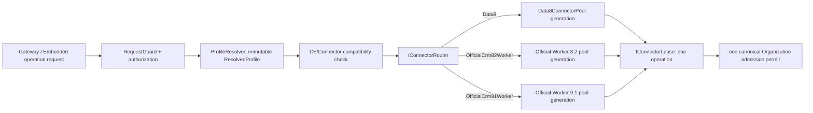

# P6 Official Worker Router 接入與 CE 整合驗證技術設計

> 本設計是既有 P6 `in_progress` task 的執行契約。P6.1 已通過；依
> [2026-08-07 範圍重校](./scope-rebaseline-2026-08-07.md)，P6.1 構成原始
> Official Worker 擴充點交付，P6.2 真機相容性保留為非阻塞的已知限制。

## 1. 權威來源與衝突處理

| 優先序 | 來源 | 本 task 採用的規則 |
| --- | --- | --- |
| 1 | `docs/dynamics-connection-management-spec.md` | ConnectionMode 與 ConnectorKind 正交；Data8 永久合法；Router 只讀 ResolvedProfile；Profile 與 admission／lease 生命週期。 |
| 2 | `docs/dynamics-connection-management-plan.md` | P6 是 Official Connector 擴充與跨模式 CE 整合閘門；P7 在 P6 後才開始。 |
| 3 | P4/P5 task artifacts | Data8 pool/lease/generation 與 Dedicated Gateway 已通過離線驗收；P5 不含 CE 證據。 |
| 4 | `.trellis/spec/backend/dynamics-gateway-hosting-version-routing.md` | Official Worker 的 net48、IPC、process/pipe、drain/dispose 細節；若與前兩列衝突以前兩列為準。 |
| 5 | `.trellis/spec/backend/data8-generation-owned-connector-pool.md` | 既有 Pool/Lease public seam、generation isolation、admission 與 cleanup 的參考契約。 |

因此 P6 **新增** Official Worker Router 實作；它不移除、降級或以 Official Worker 取代 Data8。

## 2. 設計目標與邊界

P6 將「官方 Worker runtime 能執行 allowlisted operation」提升為「可被 deployment-owned
ConnectorKind 透過統一 Router、Pool、Lease 模型選擇」。產品與 Gateway HTTP contract 維持只接受
ProfileAlias、已註冊 CapabilityOperationId 與 bounded typed parameters。

圖中的三個 Pool 不共用 mutable client、worker process、pipe、credential、session 或 profile state；唯一可
跨 profile 共用的運作性資源是以 canonical OrganizationId 為鍵的 admission budget。

## 3. Connector 選擇與相容性

| ConnectorKind | CE 8.2 | CE 9.1 | P6 路由行為 |
| --- | :---: | :---: | --- |
| `Data8` | 支援 | 支援 | 保留既有 Data8 Pool/Lease/Router 實作。 |
| `OfficialCrm82Worker` | 支援 | 拒絕 | 導向 CE 8.2 package-lock 的 net48 Worker Pool。 |
| `OfficialCrm91Worker` | 拒絕 | 支援 | 導向 CE 9.1 package-lock 的 net48 Worker Pool。 |

相容性必須由 immutable profile snapshot 在任何 permit、worker process、pipe、secret provider 或 outbound
operation 建立前驗證。未知 kind、錯誤 CE 組合、遺失 Router registration 或 generation 不符，全部 fail
closed；不得以「較可能成功」為理由改選 Data8 或另一個 Worker。

同一實體 Organization 若需 Data8 與 Official Worker 並存，必須使用不同 ProfileAlias；request 不得切換
ConnectorKind。所有 profile generation 的隔離鍵固定為 `(ProfileAlias, GenerationId)`。

## 4. Router、Pool 與 Lease 契約

### 4.1 Router

`IConnectorRouter.Resolve(ResolvedProfile)` 是唯一的 Connector 選擇點。它不得接受 request-time routing
參數，不得建立 transport fallback，也不得持有或回傳 CRM SDK client。P6 會將目前非 Dedicated branch 的
`ProfileRoutedOperationExecutor` 直接派送模式收斂為 Router → selected Pool → Lease 的路徑；舊的 direct
executor 只能在相容遷移期間保留於未切換的 composition，不可成為新路徑的第二個 Connector selector。

### 4.2 Official Worker Pool

每個 Official Worker Pool 僅接受與自身 ConnectorKind、ProfileAlias、GenerationId 相符的
`ResolvedProfile`。它擁有該 generation 的 bounded worker slot 容器與 supervisor reference；其 local
worker capacity 只限制此 Connector generation，不能取代 Organization admission。

安全預設為每個 worker 同時最多一個 Organization operation。更高併發須有同 package-lock、同 CE version
與同目標 workload 的 stress/soak 證據後，透過部署 profile policy 另行調整；不可由產品 request 影響。

### 4.3 Official Worker Lease

`IConnectorLease` 不公開 SDK service/client、Process、Pipe 或 credential。它只允許執行已註冊且已驗證
revision 的 typed `ConnectorOperation`。Lease 保留：來源 ProfileAlias、GenerationId、來源 pool 的 worker
slot／runtime reference，以及本 operation 的唯一 admission permit。

任何 cancellation、deadline、IPC protocol failure、worker exit、transport failure、result contract failure 或
Pool drain，都將 Lease 標記 faulted。faulted lease 絕不可把 worker process 或 slot 視為可健康重用；它必須
走 termination/quarantine/recycle 路徑，直到已知 resources 全部被釋放。

## 5. Admission、generation 與清理順序

### 5.1 單一 permit owner

P6 採用 Data8 Pool 的核心原則：**選定 Connector 的 Lease 是本次 operation 唯一的 admission permit
owner**。`IConnectorPool.AcquireAsync` 取得 permit 後才取得 worker runtime/slot，並在其 own lease 的
finally 中釋放。現有 Official runtime manager 若仍在新路徑保留一層 admission acquisition，必須先拆出
「不取得 permit 的 generation runtime lease」seam；不可在外層 `ProfileRoutedOperationExecutor` 取得一次、
再由 Official Worker Pool 取得第二次。

Acquire 失敗時應反向釋放已取得的 local slot、runtime reference 與 permit；不得回傳半完成 Lease。等待
admission 時不得預先持有 worker、process、pipe、client、token provider 或 runtime reference，讓 Draining
generation 能確實收斂。

### 5.2 世代替換

1. 新設定經 profile/CE/package-lock 驗證後建立新 generation；舊 generation 原子轉為 Draining。
2. Draining pool 停止新 acquire，但現有 lease 可在其 bounded deadline 內完成。
3. 每個 lease 先歸還／淘汰 worker slot、釋放 runtime reference 與其 IPC 資源，最後才釋放 permit。
4. active lease 為零後，pool 依 graceful drain → bounded wait → forced termination 的順序清理 worker
   process、pipe、stream、timer、CTS、registration、background task、handle 與 admission registration。
5. cleanup 任一項失敗仍持續處理後續 owner，最後回報 AggregateException；未清理的 generation 不得被移除、
   也不得建立第三個 generation 來掩蓋問題。

每一個 alias 同時最多只允許一個 Active 與一個 Draining generation。configuration reload 不可原地改寫
已發布 profile、worker kind、package lock、endpoint 或 credential reference。

## 6. Worker process 與 IPC ownership

| 資源 | 唯一 owner | 最長生命週期與釋放規則 |
| --- | --- | --- |
| immutable profile snapshot／generation registry entry | Router/Pool registry | Active 或 Draining generation；drain 完成後移除強引用。 |
| Organization admission permit | Connector lease | 單一 operation；在 runtime/worker cleanup 完成後的 finally 恰好釋放一次。 |
| worker runtime reference／local slot | Connector lease | 單一 operation；健康時歸還來源 pool，faulted/draining 時淘汰。 |
| worker Process 與 process handle | Official Worker Pool/Supervisor | generation-owned；graceful drain 後等待退出，逾期才 terminate，最後 Dispose handle。 |
| host-side pipe、stream、reader/writer | Supervisor 的 worker-session owner | 單一 worker session；stop、protocol failure、worker exit 或 drain 時關閉／Dispose。 |
| worker-side pipe/stream | `OfficialWorkerProcessHost` | `using` scope；session return、exception 或 cancellation 均釋放。 |
| CRM SDK client | `OfficialWorkerSession` | 單一 worker process session；message loop 停止後恰好 Dispose 一次。 |
| nonce、request-id map、bounded frame buffer | IPC session | 綁定 process nonce 和單一 request deadline；response/failure finally 清除，不跨 session 保存。 |
| deadline CTS、timer、cancellation registration | operation/lease owner | 單一 acquire/execute scope；cleanup 前停止並 Dispose，沒有 background continuation。 |

IPC 保持 length-prefixed、bounded、typed、versioned、nonce-bound 與 deadline-bound。只允許已註冊 operation
與 bounded DTO；不得傳遞 `IOrganizationService`、`Entity`、`QueryBase`、`OrganizationRequest`、FetchXML、
endpoint、connection string、credential、token、cookie、HttpContext、raw principal 或 browser session。

## 7. 錯誤與觀測邊界

| 條件 | 行為 |
| --- | --- |
| profile 不存在、disabled、secret reference 不可解析或 CE/Connector 不相容 | 在任何 worker/permit/outbound work 前 fail closed。 |
| Router 無該 connector/generation | fail closed；不 fallback。 |
| queue 滿或 admission timeout | 回傳既定 admission failure；不配置 process/pipe。 |
| Worker READY nonce/package-lock/generation 不符 | protocol failure，quarantine/terminate worker，回傳 sanitized error。 |
| execute cancellation、deadline、worker exit 或 protocol failure | fault lease，淘汰 worker/slot，完成 cleanup 後釋放 permit。 |
| drain 中 acquire | 拒絕新 lease；不重啟舊 generation。 |
| cleanup 多項失敗 | 繼續 cleanup，彙總回報；不得遺失後續 resource owner。 |

Metrics、logs、ready/health response 與 error envelope 只可有 ProfileAlias、GenerationId、bounded counter、
operation ID、sanitized reason 與 correlation ID。不得記錄 endpoint、OrganizationId、CredentialReference、
credential、token、cookie、session ID、worker pipe name、nonce、PID 或完整 request/response payload。

## 8. 離線與 CE evidence 設計

### 8.1 P6.1：離線 Router 接入與必經驗證

- Router 依 `ResolvedProfile.ConnectorKind` 選取 Data8、Official82、Official91，並拒絕不相容或未註冊的
  generation。
- success、factory failure、queue timeout、execute cancellation、operation timeout、IPC failure、worker exit、
  forced drain 與 cleanup aggregation 每條路徑都驗證 permit 只取得/釋放一次。
- 同 profile replacement 驗證 Active+Draining 上限、drain 拒絕新 lease、舊 generation 在 lease 歸零後才釋放
  process/pipe/admission registration；跨 profile/org 不能共用 worker、pipe、mutable state 或 credentials。
- WorkerTestHost fault injection 與 bounded soak 必須證明 Process、handle、pipe、stream、timer、Task、
  registration、permit、slot 與 retained reference 在 drain 後回到宣告的 baseline。
- 反射／architecture test 證明 product/Abstractions/HTTP DTO 沒有 CRM SDK、ConnectorKind、endpoint 或 secret
  surface；IPC contract 亦不含上述資料。

P6.1 通過後可證明 Connector Router 與生命週期擴充點已完成，足以進入 P6 的品質、spec、commit 與
archive 結案流程；但不可宣稱任何 Official Worker CE version、profile 或 operation 已被真實伺服器驗證。
P7.0 可在 P6 正式封存後啟動，並以永久支援的 Data8 Connector 推進 ChurchReport capability migration。

### 8.2 P6.2：保留但延後的 Official Worker CE read-only matrix

本節保存已建立的 readiness／部署／診斷設計，並如實記錄目前未通過 READY；它不再屬於 P6 結案或
Data8 P7 主線的必要條件。未來只有 deployment 明確選用 Official Worker 且另立 Trellis task 後，才可在
離線品質閘門仍全綠、使用者提供獨立授權的前提下恢復。每個 CE version 需選一個已核准的 deployment
profile，由 host 的 secret provider 解析憑證，且不把任何 secret 寫入 artifact。恢復時的建議順序：

1. 對已確認與正式系統隔離的 CE 9.1 `sunnyvalechback` profile，以現有 Data8 `runtime.health.whoami` 作為受控 control measurement；
   此為 P6.2 的第一筆端到端真機證據，不重開 P5、不啟用 ChurchReport feature flag，也不移轉產品流量。
2. 對每個 selected Official Worker profile 執行 `runtime.health.whoami` 與
   `runtime.pool.validate.connection`；兩者各自記錄 selected ConnectorKind，絕不在 request-time 替換。
   這兩個 operation 對 CE 8.2／9.1 都通過，才構成該未來 Official Worker deployment 的
   connector／version 真機證據；不得回填成 P6 已經取得的證據。
3. 只有在 deployment owner 提供 repository 外、test-owned 且具資料最小化範圍的 contact/date-range input 時，
   才額外執行 `fee.dedication.retrieve.by.contact.date.range`。缺少該核准輸入不阻塞 P6；business read/parity
   evidence 移至 P7.1。現有 Data8 connector 尚未實作此 capability，因此不得在 P6.2 承諾 fee read 的
   Data8 parity。

現有 `Invoke-DynamicsOfficialWorkerCompatibility.ps1` 只支援 `runtime.health.whoami`。未來 task 可沿用它取得
identity evidence，並以測試先行新增或確認一支固定 allowlist 的 evidence harness 來執行
`runtime.pool.validate.connection`；不得把任意 operation ID、Entity 或 FetchXML 參數化成通用探針。

`sunnyvalechback` 可以安全建立 test member 的事實不擴張 P6 scope。P6 不執行 Create／Update／Action／Function；P7.2 才以唯一 test-owned member 與 operation-specific cleanup/reconciliation 驗證 ChurchReport 寫入語意。CE 8.2 寫入證據只在 P7.0 support matrix 將該 capability 標為 required 時才成為該 child 的 gate。

每列需要分開記錄：profile alias（可揭露時）、CE version、ConnectorKind、operation ID、時間窗、結果
分類、sanitized correlation ID、p50/p95/p99、admission/worker recycle counters 和 drain 後 baseline。此矩陣
不得包含 Entity、個人資料、token、cookie、endpoint、connection string 或 credential。

P6.1 的離線 gate 構成 P6 原始完成範圍。P6.2 readiness／diagnostic 結果只作為未來 Official Worker
deployment 的起點；缺少 CE 8.2／9.1 identity/connection evidence 不再阻塞 P6 結案或 P7.0。可選 fee read
亦不得成為 P6 或 Data8 capability 的隱性 blocker。

### 8.3 Lenovo Legion 本機 evidence 邊界

Lenovo Legion 是既有 P6.2 readiness 資產的 execution identity、profile overlay、worker credential target、
Gateway／Worker process 與 evidence owner。profile input、Credential Manager targets 與 readiness=`go` 已完成；
最新兩個 Worker 都在 READY 前以 exit code 20 結束，沒有執行 CE operation。不要重做 Worker artifact、
P6.1 或已完成的 operator steps。

使用者已確認兩個 CE 目標皆採 IFD；本機實測為 `LENOVO-LEGION\Administrator`、CloudAP、非網域成員。Readiness contract 因此固定要求 `authentication="Ifd"`、`identity.mode="WindowsCredentialReference"`、同一 identity 可解析的 credential target，以及 HTTPS `homeRealm`。`HostIdentity` 只允許 Active Directory，在此設計下必須直接拒絕而不是浪費一次 readiness 嘗試。

本機 overlay 只保存非敏感 deployment mapping，credential value 留在 Windows Credential Manager／核准 secret provider。P6 artifact 不保存密碼、token、cookie、connection string、完整 endpoint 或可識別資料。未來雲端 Central Gateway 不沿用 Lenovo identity 或 secret target；P8.0～P8.4 必須以雲端 host 重新完成 identity、TLS、ACL、monitoring、rollback 與 live evidence。

2026-08-07 的使用者決策已取代整合 `/goal` 中把本節設為 P7 前置的舊文字。P7 activation 仍須等待
P6 正式封存，但不等待 Official Worker READY。未來獨立 Official Worker task 的任何 profile／credential／
CE target 缺口仍 fail closed，不因自動續跑而猜測或建立秘密。

P6 No-Go 的責任拆分必須明確：operator 提供或確認 Organization／IFD facts 與同 user Credential Manager target；manifest 提供 Worker executable 的絕對路徑與 hash；`New-DynamicsOfficialWorkerDeployment.ps1` 產生 `worker-profile.xml` 與 Gateway overlay。後兩項是自動化工作，不得錯誤列為使用者手工前置。

## 9. Rollback 邊界

- 若 Official Worker Router registration、profile validation、IPC 或 lifecycle gate 失敗，停止該 Official
  profile 的新 admission 並 drain/terminate 該 generation；不改選 Data8 或另一 Worker。
- Data8 的既有 Profile、Pool、Dedicated Gateway 與 legacy 路徑保持原樣，作為獨立、已部署的合法路徑，
  而不是 P6 request-time fallback。
- ChurchReport flag、routing、traffic、ToolUtility/CRM SDK references 和 P7 artifacts 不因 P6 rollback 而變更。
- Official Worker CE 真機測試失敗或 evidence 不足時，只保留 sanitized evidence、停止後續 CE action，
  並把該 Connector 標為 `evidence-pending`；不得宣稱它已可用，但也不得阻塞已核准的 Data8 profile、
  Embedded／DedicatedGateway 模式或 P7 capability migration。

## 10. 固定交接

`P6 擴充點結案（Official live evidence pending）` → `P7.0 inventory/validator` → `P7.1 reads` →
`P7.2 writes/actions/functions` → `P7.3 special resources` → `P7.4 Embedded+Data8／DedicatedGateway+Data8 local cutover` →
`P7.5 ToolUtility removal`。P8.0～P8.4 另由獨立目標把 ChurchReport 部署為
`CentralGateway + Data8` 第一產品；P6 不準備或切換雲端流量。
