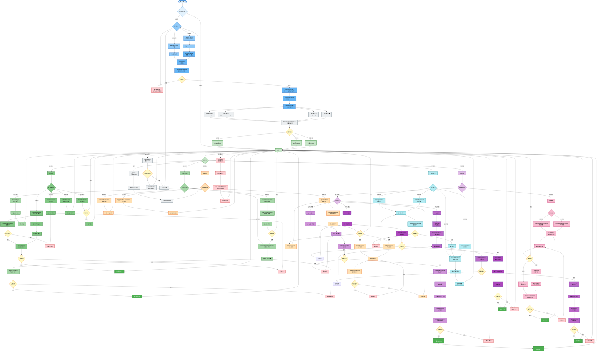

```mermaid
flowchart TB
    %% ==================== 系統入口 ====================
    Start([用戶訪問系統]) --> CheckAuth{檢查是否已登入?}
    
    %% ==================== 登入流程 ====================
    CheckAuth -->|未登入| LoginChoice{選擇登入方式}
    CheckAuth -->|已登入| MainMenu[主選單]
    
    LoginChoice -->|帳號密碼| AccountLogin[帳號密碼登入頁面<br/>Login]
    LoginChoice -->|LINE ID| LineLogin[LINE 登入頁面<br/>LineIdLoginView]
    
    AccountLogin --> InputCredentials[輸入帳號密碼]
    LineLogin --> InputLineId[輸入 LINE User ID]
    
    InputCredentials --> ProcessLogin[ProcessLogin<br/>處理登入]
    InputLineId --> ProcessLineLogin[ProcessLineLogin<br/>處理 LINE 登入]
    
    ProcessLineLogin --> ProcessLogin
    
    %% ==================== 登入驗證 ====================
    ProcessLogin --> ValidateUser[ValidateUserCredentials<br/>驗證使用者憑證]
    
    ValidateUser --> AuthCheck{驗證結果}
    AuthCheck -->|失敗| LoginError[顯示錯誤訊息<br/>密碼錯誤/帳號錯誤]
    LoginError --> LoginChoice
    
    AuthCheck -->|成功| RetrieveData[RetrieveUserData<br/>從 CRM 取得使用者資料]
    
    RetrieveData --> InitSession[InitializeUserSession<br/>初始化 Session]
    
    InitSession --> SetupSystem[SetupSystemData<br/>設定系統資料]
    
    SetupSystem --> SetupList[設定多小組資料<br/>ListManager]
    SetupSystem --> SetupAppt[設定差勤簽核<br/>AppointmentsListManager]
    SetupSystem --> SetupQpay[設定奉獻金流<br/>QpayManager]
    SetupSystem --> SetupFee[設定課程清單<br/>FeeList]
    
    SetupList --> DetermineView[DetermineDisplayViewType<br/>判斷顯示視圖]
    SetupAppt --> DetermineView
    SetupQpay --> DetermineView
    SetupFee --> DetermineView
    
    DetermineView --> ViewType{視圖類型?}
    
    ViewType -->|多小組| MultiGroup[MultiGroupView<br/>多小組管理頁面]
    ViewType -->|單一小組| IntegrateView[IntegrateView<br/>整合式管理頁面]
    ViewType -->|幸福小組| HappyGroup[HappyGroupView<br/>幸福小組頁面]
    
    MultiGroup --> MainMenu
    IntegrateView --> MainMenu
    HappyGroup --> MainMenu
    
    %% ==================== 主選單功能 ====================
    MainMenu --> MenuChoice{選擇功能}
    
    MenuChoice -->|個人資料| PersonalMenu[個人資料管理]
    MenuChoice -->|新人管理| NewPersonMenu[新人管理]
    MenuChoice -->|設備管理| EquipmentMenu[設備管理]
    MenuChoice -->|奉獻管理| DedicationMenu[奉獻管理]
    MenuChoice -->|行事曆| SchedulerMenu[行事曆管理]
    MenuChoice -->|登出| Logout[Logout<br/>清除 Session]
    
    %% ==================== 個人資料管理流程 ====================
    PersonalMenu --> PersonalChoice{個人資料功能}
    
    PersonalChoice -->|查看資料| ViewPersonal[PersonalInfomationView<br/>查看個人資料]
    PersonalChoice -->|維護資料| MaintainPersonal[MaintainPersonInfomationView<br/>維護個人資料]
    PersonalChoice -->|個人報告| PersonalReport[PersonalReport<br/>個人報告]
    
    ViewPersonal --> LoadPersonalData[LoadPersonalInfomation<br/>載入個人資料]
    LoadPersonalData --> ShowPersonalData[顯示個人資料]
    ShowPersonalData --> PersonalAction{選擇操作}
    
    PersonalAction -->|編輯| MaintainPersonal
    PersonalAction -->|返回| MainMenu
    
    MaintainPersonal --> EditPersonalForm[編輯個人資料表單]
    EditPersonalForm --> UpdatePersonal[UpdatePersonalInfo<br/>更新個人資料]
    UpdatePersonal --> SavePersonal{儲存成功?}
    
    SavePersonal -->|成功| PersonalSuccess[顯示成功訊息]
    SavePersonal -->|失敗| PersonalError[顯示錯誤訊息]
    
    PersonalSuccess --> MainMenu
    PersonalError --> EditPersonalForm
    
    PersonalReport --> GenerateReport[產生個人報告]
    GenerateReport --> ShowReport[顯示報告]
    ShowReport --> MainMenu
    
    %% ==================== 新人管理流程 ====================
    NewPersonMenu --> NewPersonChoice{新人管理功能}
    
    NewPersonChoice -->|新增新人| CreateNewPerson[CreateNewPerson<br/>新增新人]
    NewPersonChoice -->|查看名單| ViewNewPersonList[GetNewPersonList<br/>查看新人名單]
    NewPersonChoice -->|更新資料| UpdateNewPerson[UpdateNewPerson<br/>更新新人資料]
    NewPersonChoice -->|刪除新人| DeleteNewPerson[DeleteNewPerson<br/>刪除新人]
    
    CreateNewPerson --> InputNewPersonData[輸入新人資料]
    InputNewPersonData --> ValidateNewPerson[ValidateNewPersonData<br/>驗證資料]
    
    ValidateNewPerson --> NewPersonValidCheck{驗證通過?}
    NewPersonValidCheck -->|失敗| NewPersonError[顯示驗證錯誤]
    NewPersonError --> InputNewPersonData
    
    NewPersonValidCheck -->|成功| SaveNewPerson[SaveToDatabase<br/>儲存至資料庫]
    SaveNewPerson --> SaveNewPersonCheck{儲存成功?}
    
    SaveNewPersonCheck -->|成功| NewPersonSuccess[新人建立成功]
    SaveNewPersonCheck -->|失敗| NewPersonSaveError[儲存失敗]
    
    NewPersonSuccess --> MainMenu
    NewPersonSaveError --> InputNewPersonData
    
    ViewNewPersonList --> ShowNewPersonList[顯示新人清單]
    ShowNewPersonList --> MainMenu
    
    UpdateNewPerson --> SelectNewPerson[選擇要更新的新人]
    SelectNewPerson --> EditNewPersonData[編輯新人資料]
    EditNewPersonData --> SaveNewPerson
    
    DeleteNewPerson --> ConfirmDelete{確認刪除?}
    ConfirmDelete -->|取消| MainMenu
    ConfirmDelete -->|確定| ExecuteDelete[執行刪除]
    ExecuteDelete --> MainMenu
    
    %% ==================== 設備管理流程 ====================
    EquipmentMenu --> EquipmentChoice{設備管理功能}
    
    EquipmentChoice -->|設備清單| EquipmentView[EquipmentView<br/>設備清單]
    EquipmentChoice -->|聯絡資訊| EquipmentContact[EquipmentContactView<br/>設備聯絡人]
    EquipmentChoice -->|課程存檔| EquipmentLesson[EquipmentStorLessonsView<br/>課程存檔]
    
    EquipmentView --> LoadEquipment[LoadEquipmentData<br/>載入設備資料]
    LoadEquipment --> ShowEquipmentList[顯示設備清單]
    ShowEquipmentList --> EquipmentAction{設備操作}
    
    EquipmentAction -->|新增| CreateEquipment[CreateEquipment<br/>新增設備]
    EquipmentAction -->|編輯| EditEquipment[UpdateEquipment<br/>更新設備]
    EquipmentAction -->|刪除| RemoveEquipment[DeleteEquipment<br/>刪除設備]
    EquipmentAction -->|返回| MainMenu
    
    CreateEquipment --> InputEquipmentData[輸入設備資料]
    InputEquipmentData --> ValidateEquipment[ValidateEquipmentData<br/>驗證設備資料]
    
    ValidateEquipment --> EquipmentValidCheck{驗證通過?}
    EquipmentValidCheck -->|失敗| EquipmentError[顯示錯誤]
    EquipmentError --> InputEquipmentData
    
    EquipmentValidCheck -->|成功| SaveEquipment[儲存設備]
    SaveEquipment --> EquipmentView
    
    EditEquipment --> InputEquipmentData
    RemoveEquipment --> EquipmentView
    
    EquipmentContact --> ShowContact[顯示聯絡資訊]
    ShowContact --> MainMenu
    
    EquipmentLesson --> ShowLessons[顯示課程資料]
    ShowLessons --> MainMenu
    
    %% ==================== 奉獻管理流程 ====================
    DedicationMenu --> DedicationChoice{奉獻管理功能}
    
    DedicationChoice -->|線上奉獻| OnlineDedication{選擇金流}
    DedicationChoice -->|稽核管理| AuditDedication[奉獻稽核]
    
    OnlineDedication -->|MyPay 高鋸| MyPayFlow[MyPay 金流]
    OnlineDedication -->|QPay 永豐| QPayFlow[QPay 金流]
    OnlineDedication -->|TSPG 台新| TSPGFlow[TSPG 金流]
    
    %% MyPay 流程
    MyPayFlow --> MyPayLogin[MyPay 登入頁面]
    MyPayLogin --> InputMyPayData[輸入奉獻資料]
    InputMyPayData --> ValidateMyPayData[ValidatePaymentData<br/>驗證資料]
    
    ValidateMyPayData --> MyPayValidCheck{驗證通過?}
    MyPayValidCheck -->|失敗| MyPayError[顯示錯誤]
    MyPayError --> InputMyPayData
    
    MyPayValidCheck -->|成功| CreateMyPayOrder[CreatePaymentOrder<br/>建立訂單]
    CreateMyPayOrder --> ProcessMyPay[ProcessPayment<br/>處理付款]
    ProcessMyPay --> MyPayGateway[跳轉至 MyPay 金流]
    
    MyPayGateway --> MyPayCallback[PaymentCallback<br/>付款回呼]
    MyPayCallback --> HandleMyPayResult[HandlePaymentResult<br/>處理付款結果]
    
    HandleMyPayResult --> MyPayResultCheck{付款成功?}
    MyPayResultCheck -->|成功| MyPaySuccess[PaymentResult<br/>付款成功頁面]
    MyPayResultCheck -->|失敗| MyPayFail[付款失敗頁面]
    
    MyPaySuccess --> SendNotification[SendNotification<br/>發送通知]
    SendNotification --> MainMenu
    MyPayFail --> MainMenu
    
    %% QPay 流程
    QPayFlow --> QPayLogin[QPayLogin<br/>QPay 登入]
    QPayLogin --> InitQPayService[InitializeQPayService<br/>初始化服務]
    InitQPayService --> InputQPayData[輸入奉獻資料]
    InputQPayData --> ValidateQPayData[ValidateQPayData<br/>驗證資料]
    
    ValidateQPayData --> QPayValidCheck{驗證通過?}
    QPayValidCheck -->|失敗| QPayError[顯示錯誤]
    QPayError --> InputQPayData
    
    QPayValidCheck -->|成功| ProcessQPay[ProcessQPay<br/>處理 QPay]
    ProcessQPay --> QPayGateway[跳轉至 QPay 金流]
    
    QPayGateway --> QPayCallback[QPayCallback<br/>付款回呼]
    QPayCallback --> QPayProcessor[QPayProcessor<br/>處理回呼]
    
    QPayProcessor --> QPayResultCheck{付款成功?}
    QPayResultCheck -->|成功| QPaySuccess[QPay 成功]
    QPayResultCheck -->|失敗| QPayFail[QPay 失敗]
    
    QPaySuccess --> MainMenu
    QPayFail --> MainMenu
    
    %% TSPG 流程
    TSPGFlow --> InputTSPGData[輸入奉獻資料]
    InputTSPGData --> ValidateTSPGData[ValidateTSPGData<br/>驗證資料]
    
    ValidateTSPGData --> TSPGValidCheck{驗證通過?}
    TSPGValidCheck -->|失敗| TSPGError[顯示錯誤]
    TSPGError --> InputTSPGData
    
    TSPGValidCheck -->|成功| ProcessTSPG[ProcessTSPG<br/>處理 TSPG]
    ProcessTSPG --> TSPGGateway[跳轉至 TSPG 金流]
    
    TSPGGateway --> TSPGCallback[TSPGCallback<br/>付款回呼]
    TSPGCallback --> TSPGResultCheck{付款成功?}
    
    TSPGResultCheck -->|成功| TSPGSuccess[TSPG 成功]
    TSPGResultCheck -->|失敗| TSPGFail[TSPG 失敗]
    
    TSPGSuccess --> MainMenu
    TSPGFail --> MainMenu
    
    %% 稽核管理流程
    AuditDedication --> AuditChoice{稽核功能}
    
    AuditChoice -->|網頁稽核| AuditWeb[DedicationFeeAuditViewWeb<br/>網頁稽核]
    AuditChoice -->|LINE 稽核| AuditLine[DedicationFeeAuditViewLine<br/>LINE 稽核]
    
    AuditWeb --> LoadAuditList[GetAuditList<br/>載入稽核清單]
    AuditLine --> LoadAuditList
    
    LoadAuditList --> ShowAuditList[顯示待稽核清單]
    ShowAuditList --> AuditAction{稽核操作}
    
    AuditAction -->|核准| ApproveAudit[ApproveAudit<br/>核准奉獻]
    AuditAction -->|退回| RejectAudit[RejectAudit<br/>退回奉獻]
    AuditAction -->|返回| MainMenu
    
    ApproveAudit --> ProcessAudit[ProcessAuditDecision<br/>處理稽核決定]
    RejectAudit --> InputRejectReason[輸入退回原因]
    InputRejectReason --> ProcessAudit
    
    ProcessAudit --> AuditResultCheck{處理成功?}
    AuditResultCheck -->|成功| AuditSuccess[稽核完成]
    AuditResultCheck -->|失敗| AuditError[稽核失敗]
    
    AuditSuccess --> LoadAuditList
    AuditError --> ShowAuditList
    
    %% ==================== 行事曆管理流程 ====================
    SchedulerMenu --> SchedulerChoice{行事曆功能}
    
    SchedulerChoice -->|查看行程| ViewScheduler[GetSchedulerData<br/>查看行事曆]
    SchedulerChoice -->|新增行程| CreateAppointment[CreateAppointment<br/>新增預約]
    SchedulerChoice -->|編輯行程| EditAppointment[UpdateAppointment<br/>更新預約]
    SchedulerChoice -->|刪除行程| RemoveAppointment[DeleteAppointment<br/>刪除預約]
    
    ViewScheduler --> LoadScheduler[載入行事曆資料]
    LoadScheduler --> ShowScheduler[顯示行事曆]
    ShowScheduler --> MainMenu
    
    CreateAppointment --> InputAppointment[輸入預約資料]
    InputAppointment --> ValidateAppointment[ValidateAppointmentData<br/>驗證資料]
    
    ValidateAppointment --> AppointmentValidCheck{驗證通過?}
    AppointmentValidCheck -->|失敗| AppointmentError[顯示錯誤]
    AppointmentError --> InputAppointment
    
    AppointmentValidCheck -->|成功| SaveAppointment[儲存預約]
    SaveAppointment --> ViewScheduler
    
    EditAppointment --> InputAppointment
    RemoveAppointment --> ViewScheduler
    
    %% ==================== 登出流程 ====================
    Logout --> ClearSession[清除 Session 資料]
    ClearSession --> RedirectLogin[重定向至登入頁面]
    RedirectLogin --> LoginChoice
    
    %% ==================== 錯誤處理 ====================
    MainMenu -.->|發生錯誤| ErrorHandler[HandleError<br/>錯誤處理]
    ErrorHandler --> LogError[記錄錯誤日誌]
    LogError --> SendLineError[SendLineErrorNotification<br/>發送 LINE 通知]
    SendLineError --> ShowErrorPage[顯示錯誤頁面]
    ShowErrorPage --> MainMenu
    
    %% ==================== Session 管理 ====================
    MainMenu -.->|Session 管理| SessionCheck[CheckSession<br/>檢查 Session]
    SessionCheck --> SessionValid{Session 有效?}
    SessionValid -->|有效| ExtendSession[ExtendSession<br/>延長 Session]
    SessionValid -->|無效| SessionExpired[Session 過期]
    ExtendSession --> MainMenu
    SessionExpired --> LoginChoice
    
    %% ==================== 樣式定義 ====================
    
    %% 系統入口與登入 - 藍色系
    classDef entryStyle fill:#E3F2FD,stroke:#1976D2,stroke-width:3px,color:#000
    classDef loginStyle fill:#90CAF9,stroke:#1565C0,stroke-width:2px,color:#000
    classDef authStyle fill:#64B5F6,stroke:#0D47A1,stroke-width:2px,color:#000
    
    %% 主要功能 - 綠色系
    classDef menuStyle fill:#C8E6C9,stroke:#388E3C,stroke-width:3px,color:#000
    classDef personalStyle fill:#A5D6A7,stroke:#2E7D32,stroke-width:2px,color:#000
    classDef newPersonStyle fill:#81C784,stroke:#1B5E20,stroke-width:2px,color:#000
    
    %% 設備管理 - 橙色系
    classDef equipmentStyle fill:#FFE0B2,stroke:#E65100,stroke-width:2px,color:#000
    
    %% 金流相關 - 紫色系
    classDef dedicationStyle fill:#E1BEE7,stroke:#7B1FA2,stroke-width:2px,color:#000
    classDef myPayStyle fill:#CE93D8,stroke:#6A1B9A,stroke-width:2px,color:#000
    classDef qPayStyle fill:#BA68C8,stroke:#4A148C,stroke-width:2px,color:#000
    classDef tspgStyle fill:#AB47BC,stroke:#4A148C,stroke-width:2px,color:#000
    
    %% 稽核管理 - 粉色系
    classDef auditStyle fill:#F8BBD0,stroke:#C2185B,stroke-width:2px,color:#000
    
    %% 行事曆 - 青色系
    classDef schedulerStyle fill:#B2EBF2,stroke:#00838F,stroke-width:2px,color:#000
    
    %% 決策節點 - 黃色系
    classDef decisionStyle fill:#FFF9C4,stroke:#F57F17,stroke-width:2px,color:#000
    
    %% 成功狀態 - 深綠色
    classDef successStyle fill:#4CAF50,stroke:#1B5E20,stroke-width:2px,color:#FFF
    
    %% 錯誤狀態 - 紅色系
    classDef errorStyle fill:#FFCDD2,stroke:#C62828,stroke-width:2px,color:#000
    
    %% 系統管理 - 灰色系
    classDef systemStyle fill:#ECEFF1,stroke:#455A64,stroke-width:2px,color:#000
    
    %% 應用樣式
    class Start,CheckAuth entryStyle
    class LoginChoice,AccountLogin,LineLogin,InputCredentials,InputLineId loginStyle
    class ProcessLogin,ProcessLineLogin,ValidateUser,RetrieveData,InitSession,SetupSystem authStyle
    
    class MainMenu,MenuChoice menuStyle
    class PersonalMenu,PersonalChoice,ViewPersonal,MaintainPersonal,PersonalReport,LoadPersonalData,ShowPersonalData,EditPersonalForm,UpdatePersonal,GenerateReport,ShowReport personalStyle
    class NewPersonMenu,NewPersonChoice,CreateNewPerson,ViewNewPersonList,UpdateNewPerson,DeleteNewPerson,InputNewPersonData,ValidateNewPerson,SaveNewPerson,ShowNewPersonList,SelectNewPerson,EditNewPersonData,ExecuteDelete newPersonStyle
    
    class EquipmentMenu,EquipmentChoice,EquipmentView,EquipmentContact,EquipmentLesson,LoadEquipment,ShowEquipmentList,CreateEquipment,EditEquipment,RemoveEquipment,InputEquipmentData,ValidateEquipment,SaveEquipment,ShowContact,ShowLessons equipmentStyle
    
    class DedicationMenu,DedicationChoice,OnlineDedication dedicationStyle
    class MyPayFlow,MyPayLogin,InputMyPayData,ValidateMyPayData,CreateMyPayOrder,ProcessMyPay,MyPayGateway,MyPayCallback,HandleMyPayResult myPayStyle
    class QPayFlow,QPayLogin,InitQPayService,InputQPayData,ValidateQPayData,ProcessQPay,QPayGateway,QPayCallback,QPayProcessor qPayStyle
    class TSPGFlow,InputTSPGData,ValidateTSPGData,ProcessTSPG,TSPGGateway,TSPGCallback tspgStyle
    
    class AuditDedication,AuditChoice,AuditWeb,AuditLine,LoadAuditList,ShowAuditList,ApproveAudit,RejectAudit,InputRejectReason,ProcessAudit auditStyle
    
    class SchedulerMenu,SchedulerChoice,ViewScheduler,CreateAppointment,EditAppointment,RemoveAppointment,LoadScheduler,ShowScheduler,InputAppointment,ValidateAppointment,SaveAppointment schedulerStyle
    
    class AuthCheck,ViewType,PersonalAction,SavePersonal,NewPersonValidCheck,SaveNewPersonCheck,ConfirmDelete,EquipmentAction,EquipmentValidCheck,MyPayValidCheck,MyPayResultCheck,QPayValidCheck,QPayResultCheck,TSPGValidCheck,TSPGResultCheck,AuditAction,AuditResultCheck,AppointmentValidCheck,SessionValid decisionStyle
    
    class PersonalSuccess,NewPersonSuccess,MyPaySuccess,QPaySuccess,TSPGSuccess,AuditSuccess,SendNotification successStyle
    
    class LoginError,PersonalError,NewPersonError,NewPersonSaveError,EquipmentError,MyPayError,MyPayFail,QPayFail,TSPGFail,AuditError,AppointmentError,ErrorHandler,LogError,SendLineError,ShowErrorPage errorStyle
    
    class Logout,ClearSession,RedirectLogin,SessionCheck,ExtendSession,SessionExpired,SetupList,SetupAppt,SetupQpay,SetupFee,DetermineView systemStyle
    
    class MultiGroup,IntegrateView,HappyGroup menuStyle
```