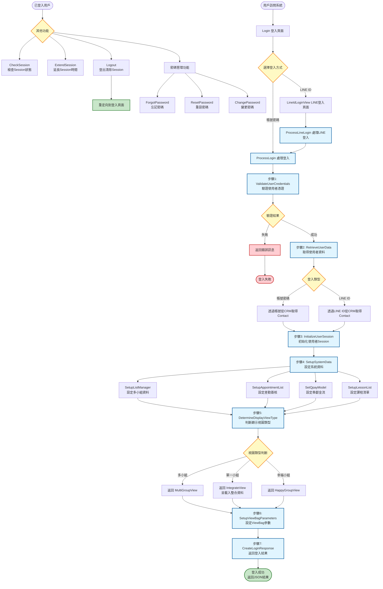

```mermaid
graph TB
    Start([用戶訪問系統]) --> LoginPage[Login 登入頁面]
    
    LoginPage --> AccountLogin{選擇登入方式}
    
    AccountLogin -->|帳號密碼| ProcessLogin[ProcessLogin 處理登入]
    AccountLogin -->|LINE ID| LineIdLoginView[LineIdLoginView LINE登入頁面]
    
    LineIdLoginView --> ProcessLineLogin[ProcessLineLogin 處理LINE登入]
    ProcessLineLogin --> ProcessLogin
    
    ProcessLogin --> Step1[步驟1: ValidateUserCredentials<br/>驗證使用者憑證]
    
    Step1 --> ValidCheck{驗證結果}
    ValidCheck -->|失敗| ErrorReturn[返回錯誤訊息]
    ValidCheck -->|成功| Step2[步驟2: RetrieveUserData<br/>取得使用者資料]
    
    Step2 --> UserType{登入類型}
    UserType -->|帳號密碼| GetByAccount[透過帳號從CRM取得Contact]
    UserType -->|LINE ID| GetByLine[透過LINE ID從CRM取得Contact]
    
    GetByAccount --> Step3
    GetByLine --> Step3
    
    Step3[步驟3: InitializeUserSession<br/>初始化使用者Session] --> Step4[步驟4: SetupSystemData<br/>設定系統資料]
    
    Step4 --> SetupList[SetupListManager<br/>設定多小組資料]
    Step4 --> SetupAppt[SetupAppointmentList<br/>設定差勤簽核]
    Step4 --> SetupQpay[SetQpayModel<br/>設定奉獻金流]
    Step4 --> SetupLesson[SetupLessonList<br/>設定課程清單]
    
    SetupList --> Step5
    SetupAppt --> Step5
    SetupQpay --> Step5
    SetupLesson --> Step5
    
    Step5[步驟5: DetermineDisplayViewType<br/>判斷顯示視圖類型] --> ViewCheck{視圖類型判斷}
    
    ViewCheck -->|多小組| MultiGroupView[返回 MultiGroupView]
    ViewCheck -->|單一小組| IntegrateView[返回 IntegrateView<br/>並載入整合資料]
    ViewCheck -->|幸福小組| HappyGroupView[返回 HappyGroupView]
    
    MultiGroupView --> Step6
    IntegrateView --> Step6
    HappyGroupView --> Step6
    
    Step6[步驟6: SetupViewBagParameters<br/>設定ViewBag參數] --> Step7[步驟7: CreateLoginResponse<br/>返回登入結果]
    
    Step7 --> LoginSuccess([登入成功<br/>返回JSON結果])
    
    ErrorReturn --> LoginFail([登入失敗])
    
    %% 其他功能流程
    LoggedIn([已登入用戶]) --> OtherFunc{其他功能}
    
    OtherFunc --> CheckSession[CheckSession<br/>檢查Session狀態]
    OtherFunc --> ExtendSession[ExtendSession<br/>延長Session時間]
    OtherFunc --> Logout[Logout<br/>登出清除Session]
    OtherFunc --> PasswordMgmt[密碼管理功能]
    
    PasswordMgmt --> ForgotPassword[ForgotPassword<br/>忘記密碼]
    PasswordMgmt --> ResetPassword[ResetPassword<br/>重設密碼]
    PasswordMgmt --> ChangePassword[ChangePassword<br/>變更密碼]
    
    Logout --> RedirectLogin[重定向到登入頁面]
    
    %% 樣式定義
    classDef processClass fill:#e1f5ff,stroke:#01579b,stroke-width:2px
    classDef decisionClass fill:#fff9c4,stroke:#f57f17,stroke-width:2px
    classDef successClass fill:#c8e6c9,stroke:#2e7d32,stroke-width:2px
    classDef errorClass fill:#ffcdd2,stroke:#c62828,stroke-width:2px
    
    class ProcessLogin,ProcessLineLogin,Step1,Step2,Step3,Step4,Step5,Step6,Step7 processClass
    class ValidCheck,UserType,ViewCheck,AccountLogin,OtherFunc decisionClass
    class LoginSuccess,RedirectLogin successClass
    class ErrorReturn,LoginFail errorClass
```