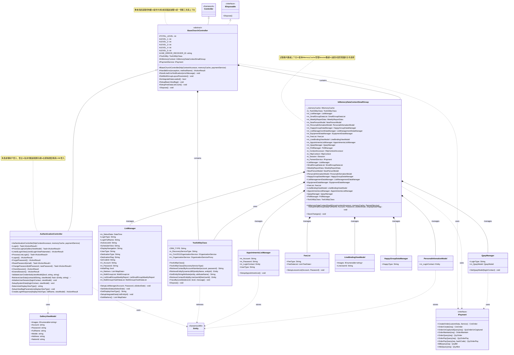

```mermaid
classDiagram
    %% ASP.NET Core 基礎類別
    class Controller {
        <<framework>>
    }
    
    class IDisposable {
        <<interface>>
        +Dispose()
    }
    
    %% 基礎控制器
    class BaseChurchController {
        <<abstract>>
        #TOTAL_LEVEL: int
        #LEVEL_1: int
        #LEVEL_2: int
        #LEVEL_3: int
        #LEVEL_4: int
        #LEVEL_5: int
        #LINE_ERROR_RECEIVER_ID: string
        #ToolUtility: ToolUtilityClass
        #InMemoryContext: InMemoryDataContextSmallGroup
        #PaymentService: IPayment
        #BaseChurchController(httpContextAccessor, memoryCache, paymentService)
        #HandleError(exception, methodName) IActionResult
        #SendLineErrorNotification(errorMessage) void
        #SetMultiGroupLayoutParameter() void
        #IsIntegrateDataLoaded() bool
        #SetupBasicViewBag() void
        #SetupFeeDataListCount() void
        +Dispose() void
    }
    
    %% 認證控制器
    class AuthenticationController {
        +AuthenticationController(httpContextAccessor, memoryCache, paymentService)
        +Login() Task~IActionResult~
        +ProcessLogin(aGalleryViewModel) Task~IActionResult~
        +LineIdLoginView(LineIdLoginViewPatameter) IActionResult
        +ProcessLineLogin() Task~IActionResult~
        +Logout() IActionResult
        +ForgotPassword() IActionResult
        +ResetPassword(email) Task~IActionResult~
        +ChangePassword(oldPassword, newPassword) Task~IActionResult~
        +CheckSession() IActionResult
        +ExtendSession() IActionResult
        -ValidateUserCredentials(viewModel) (bool, string, string)
        -RetrieveUserData(contactIdString, viewModel) Task~(Entity, string)~
        -InitializeUserSession(loginContact, viewModel) void
        -SetupSystemData(loginContact, viewModel) void
        -DetermineDisplayViewType() string
        -SetupViewBagParameters(displayViewType) void
        -CreateLoginResponse(displayViewType, fullName, viewModel) IActionResult
    }
    
    %% ViewModel
    class GalleryViewModel {
        +Images: IEnumerable~string~
        +Account: string
        +Password: string
        +FullName: string
        +Mobile: string
        +Address: string
        +NationId: string
    }
    
    %% 記憶體上下文
    class InMemoryDataContextSmallGroup {
        -_memoryCache: IMemoryCache
        -m_ToolUtilityClass: ToolUtilityClass
        +m_ListManager: ListManager
        +m_SmallGroupDataList: SmallGroupDataList
        +m_WeeklyReportData: WeeklyReportData
        +m_NewPersonModel: NewPersonModel
        +m_PersonalInfomationModel: PersonalInfomationModel
        +m_HappyGroupDataManager: HappyGroupDataManager
        +m_ListManagementDataManager: ListManagementDataManager
        +m_EquipmentDataManager: EquipmentDataManager
        +m_FeeList: FeeList
        +m_LineBindingViewModel: LineBindingViewModel
        +m_AppointmentsListManager: AppointmentsListManager
        +m_QpayManager: QpayManager
        +m_PollManager: PollManager
        -m_ContextAccessor: HttpContextAccessor
        -m_HttpContext: HttpContext
        -m_Session: ISession
        -m_PamentService: IPayment
        +InMemoryDataContextSmallGroup(contextAccessor, memoryCache, PamentService)
        +ListManager: ListManager
        +SmallGroupDataList: SmallGroupDataList
        +WeeklyReportData: WeeklyReportData
        +NewPersonModel: NewPersonModel
        +PersonalInfomationModel: PersonalInfomationModel
        +HappyGroupDataManager: HappyGroupDataManager
        +ListManagementDataManager: ListManagementDataManager
        +EquipmentDataManager: EquipmentDataManager
        +FeeList: FeeList
        +LineBindingViewModel: LineBindingViewModel
        +AppointmentsListManager: AppointmentsListManager
        +QpayManager: QpayManager
        +PollManager: PollManager
        +ToolUtilityClass: ToolUtilityClass
        +SetupSmallGroupData(FullName, Account, Password, aSelectDate, DisplayDateFlag) void
        +SaveChanges() void
    }
    
    %% 管理器類別
    class ListManager {
        +m_SelectDate: DateTime
        +LoginType: String
        +LoginFullName: String
        +ActiveListId: String
        +SchedulerView: String
        +DisplayNavigation: String
        +UserType: String
        +DedicationType: String
        +DedicationFlag: String
        +QrCodeId: String
        +m_Account: String
        +m_Password: String
        +InitialFlag: bool
        +m_Markers: List~MapData~
        +m_MultiGroupList: MultiGroupList
        +m_ListSmallGroupWeeklyReport: ListSmallGroupWeeklyReport
        +m_MultiGroupChartDataList: MultiGroupChartDataList
        +SetupListManager(Account, Password, aSelectDate) void
        +SetSelectDate(aSelectDate) void
        +GetDisplayViewType() String
        +SetupIntegrateData(ListEntityId) void
        +GetMarkers() List~MapData~
    }
    
    class AppointmentsListManager {
        +m_Account: String
        +m_Password: String
        +m_LoginContact: Entity
        +UserType: String
        +SetupAppointmentList() void
    }
    
    class QpayManager {
        +LoginType: String
        +m_QpayModel: QpayModel
        +SetQpayModel(loginContact) void
    }
    
    class FeeList {
        +FeeType: String
        +FeeDataList: List~FeeData~
        +SetupLessonList(Account, Password) void
    }
    
    class LineBindingViewModel {
        +Images: IEnumerable~string~
        +LineUserId: String
    }
    
    class HappyGroupDataManager {
        +HappyType: String
    }
    
    class PersonalInfomationModel {
        +m_LoginContact: Entity
    }
    
    %% 工具類別
    class ToolUtilityClass {
        -CRM_TYPE: String
        -m_DiscoveryServiceType: String
        +m_Crm2011OrganizationService: IOrganizationService
        +m_OrganizationService: OrganizationServiceProxy
        +ToolUtilityClass()
        +ToolUtilityClass(DiscoveryServiceType)
        +RetrieveContactByAccountNumber(account, password) String
        +RetrieveEntityDynamics365(entityName, entityId) Entity
        +GetEntityStringAttribute(entity, attributeName) String
        +RetrieveContactEntityByLineUserId(lineUserId) Entity
        +TraceByLevel(totalLevel, level, message) void
        +Dispose() void
    }
    
    %% 支付服務介面
    class IPayment {
        <<interface>>
        +CreateOrder(customData, Service) CreOrder
        +OrderCreate(req) CreOrder
        +OrderUnCapturedQuery(req) QryOrderUnCaptured
        +OrderMaintain(req) OrderMaintain
        +OrderQuery(req) QryOrder
        +OrderPayQuery(req) QryOrderPay
        +OrderPayQuery(req, hashCode) QryOrderPay
        +BillQuery(req) QryBill
        +AllotQuery(req) QryAllot
    }
    
    %% CRM 實體
    class Entity {
        <<Dynamics365>>
    }
    
    %% 繼承關係
    Controller <|-- BaseChurchController
    IDisposable <|.. BaseChurchController
    BaseChurchController <|-- AuthenticationController
    
    %% 組合關係 - AuthenticationController
    AuthenticationController ..> GalleryViewModel : uses
    AuthenticationController ..> Entity : uses
    
    %% 組合關係 - BaseChurchController
    BaseChurchController *-- ToolUtilityClass : contains
    BaseChurchController *-- InMemoryDataContextSmallGroup : contains
    BaseChurchController ..> IPayment : uses
    
    %% 組合關係 - InMemoryDataContextSmallGroup
    InMemoryDataContextSmallGroup *-- ListManager : manages
    InMemoryDataContextSmallGroup *-- AppointmentsListManager : manages
    InMemoryDataContextSmallGroup *-- QpayManager : manages
    InMemoryDataContextSmallGroup *-- FeeList : manages
    InMemoryDataContextSmallGroup *-- LineBindingViewModel : manages
    InMemoryDataContextSmallGroup *-- HappyGroupDataManager : manages
    InMemoryDataContextSmallGroup *-- PersonalInfomationModel : manages
    InMemoryDataContextSmallGroup *-- ToolUtilityClass : uses
    InMemoryDataContextSmallGroup ..> IPayment : uses
    
    %% 依賴關係
    ToolUtilityClass ..> Entity : retrieves
    AppointmentsListManager ..> Entity : stores
    PersonalInfomationModel ..> Entity : stores
    QpayManager ..> IPayment : uses
    
    %% 註解說明
    note for AuthenticationController "負責處理用戶登入、登出\n及身份驗證相關功能\n支援帳號密碼與LINE登入"
    note for InMemoryDataContextSmallGroup "記憶體內數據上下文\n使用IMemoryCache管理Session數據\n支援多個管理器的生命週期"
    note for BaseChurchController "教會系統基礎控制器\n提供共用功能與錯誤處理\n統一管理工具與上下文"
```