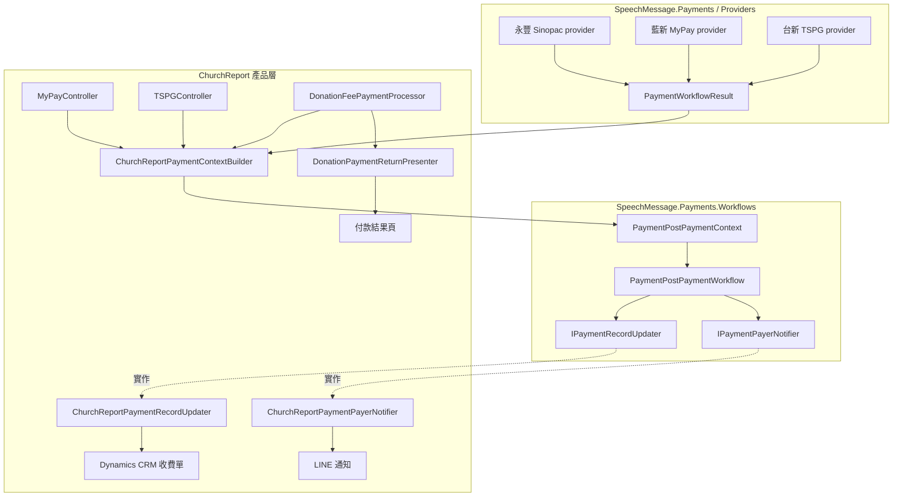
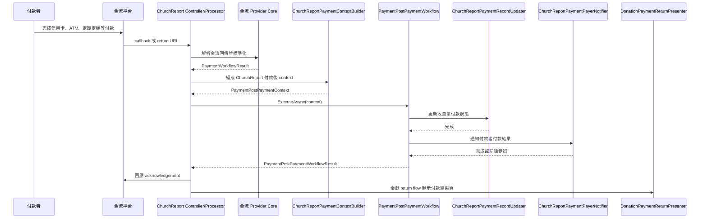

# 金流付款後處理流程重構報告

產出日期：2026-06-30  
工作分支：`Jesus_5.1.5_Worktree_TuneRefactorPament`  
主要程式提交：`f91778fc 統一金流付款後處理流程並分離產品邊界`  
審查與驗證提交：`a2d9f619 新增整合審查報告與本地驗證結果`

## 一、重構目標

本階段重構的核心目標，是將永豐、藍新 MyPay、台新 TSPG 與奉獻付款流程中重複的「付款後處理」整理成可重用的共通 workflow，同時維持乾淨邊界。

付款核心只負責金流共同語言與流程編排，例如付款狀態、訂單編號、交易編號、金額、幣別、付款後 workflow。ChurchReport 專屬規則，例如 Dynamics CRM 收費單欄位、LINE 通知內容、奉獻類別、課程報名、MVC ViewBag 與付款結果頁，仍留在 ChurchReport 產品層。

這個切法的意義是：未來「建設公司維修系統、協會會員系統、發票收款系統」可以共用 `SpeechMessage.Payments`、`SpeechMessage.Payments.AspNetCore`、`SpeechMessage.Payments.Workflows` 的穩定核心，再各自實作自己的付款紀錄更新與通知 handler，而不是複製 ChurchReport 的 CRM/LINE 細節。

## 二、重構前主要問題

1. 各金流 callback 或 return flow 容易各自處理 CRM 更新與通知，導致邏輯重複。
2. TSPG 原本有較多產品後處理責任，controller 同時處理台新 callback、CRM 更新與 LINE 通知，邊界太厚。
3. 奉獻付款流程同時包含付款結果解析、CRM/LINE、課程與奉獻分類、信用卡 token、ViewBag 結果頁，單一類別責任過重。
4. MyPay、TSPG、Donation 都需要相似的付款後 context，但若每個地方自行組資料，欄位與錯誤處理會逐漸分岔。
5. 可重用核心若混入 ChurchReport 欄位名稱或 MVC/LINE 物件，未來其他產品會被迫依賴 ChurchReport。

## 三、重構後架構

重構後分成三層：

1. 金流核心層：`SpeechMessage.Payments` 與 provider 實作，只處理金流協定、簽章、callback 解析、狀態標準化。
2. 共通 workflow 層：`SpeechMessage.Payments.Workflows`，提供 `PaymentPostPaymentWorkflow`、`PaymentPostPaymentContext`、`IPaymentRecordUpdater`、`IPaymentPayerNotifier` 等中立 contract。
3. ChurchReport 產品層：負責把 ChurchReport CRM、LINE、奉獻、課程、MVC 頁面結果接上 workflow。

### 架構圖

## 四、付款後流程圖

## 五、新增與修改檔案

### 新增檔案

| 檔案 | 目的 |
| --- | --- |
| `ChurchReport/Payments/ChurchReportPaymentContextBuilder.cs` | 統一從 CRM fee entity 與標準付款結果建立 `PaymentPostPaymentContext`。 |
| `ChurchReport/Payments/DonationPaymentReturnPresenter.cs` | 統一奉獻付款結果頁 ViewBag 與 ViewResult 組裝。 |
| `ChurchReport.MemberInfo.Tests/Payments/ChurchReportPaymentContextBuilderTests.cs` | 驗證 context builder 會放入付款結果、收費單、成功旗標、奉獻類型與聯絡人資料。 |
| `ChurchReport.MemberInfo.Tests/Payments/DonationPaymentReturnPresenterTests.cs` | 驗證奉獻成功與失敗結果頁的 ViewBag 行為。 |
| `ChurchReport.MemberInfo.Tests/Payments/DonationPaymentPostProcessingDependencyTests.cs` | 驗證 Donation processor 已準備接受共通 workflow/context/presenter。 |
| `ChurchReport.MemberInfo.Tests/Payments/PaymentPostPaymentArchitectureTests.cs` | 驗證 TSPG/Donation 依賴共通付款後 workflow，且 ChurchReport handler 留在 ChurchReport assembly。 |
| `.ccg/tasks/brainstorm-payment-post-processing-extraction/review-prompt.md` | CCG 外部模型審查提示內容。 |
| `docs/superpowers/plans/2026-06-30-payment-post-processing-workflow-unification.md` | 本階段實作計畫。 |

### 修改檔案

| 檔案 | 修改重點 |
| --- | --- |
| `ChurchReport/Controllers/MyPayController.cs` | 改用 `ChurchReportPaymentContextBuilder` 建立 post-payment context，避免 controller 自行組 ChurchReport context。 |
| `ChurchReport/Controllers/TSPGController.cs` | 移除 controller 內直接 CRM/LINE 後處理，改由 `PaymentPostPaymentWorkflow` 執行。 |
| `ChurchReport/Tools/DonationFeePaymentProcessor.cs` | 加入共通 workflow/context/presenter DI 依賴，新增標準 `PaymentWorkflowResult` helper，保留奉獻專屬流程。 |
| `ChurchReport/Payments/ChurchReportPaymentPostPaymentHandlers.cs` | 維持 ChurchReport 專屬 updater/notifier，透過 context keys 讀取產品層資料。 |
| `ChurchReport/Startup.cs` | 註冊 `ChurchReportPaymentContextBuilder` 與 `DonationPaymentReturnPresenter`。 |
| `ChurchReport.MemberInfo.Tests/Payments/MyPayControllerAdapterTests.cs` | 更新 controller 建構依賴測試。 |
| `ChurchReport.MemberInfo.Tests/Payments/TspgControllerAdapterTests.cs` | 更新 TSPG adapter 測試，覆蓋共通 workflow 呼叫。 |
| `.ccg/tasks/brainstorm-payment-post-processing-extraction/task.json` | 更新任務階段。 |
| `.ccg/tasks/brainstorm-payment-post-processing-extraction/review.md` | 記錄外部審查阻塞原因與本機驗證結果。 |

## 六、核心邊界說明

### 可重用金流核心保留的內容

- provider protocol、簽章、callback 解析。
- 標準付款狀態與 `PaymentWorkflowResult`。
- `PaymentPostPaymentWorkflow` 的順序編排。
- `IPaymentRecordUpdater` 與 `IPaymentPayerNotifier` contract。
- ASP.NET Core 金流組態與 provider 選擇輔助能力。

### ChurchReport 產品層保留的內容

- Dynamics CRM 欄位，例如 `new_fee`、付款狀態、實收金額、聯絡人 lookup。
- LINE token、LINE ID、成功/失敗通知文字。
- 奉獻類別、課程付款、信用卡 token、定期定額等 ChurchReport 商業規則。
- MVC controller、`ViewBag`、`ActionResult`、`QPayCard/PaymentResult.cshtml`。

這個分界符合簡單可管理原則：核心處理付款事實，產品層處理產品副作用。沒有新增 provider 繼承鏈，也沒有把 ChurchReport 規則推進通用核心。

## 七、各金流目前狀態

### MyPay

MyPay controller 已使用 `ChurchReportPaymentContextBuilder` 建立 context，再呼叫 `PaymentPostPaymentWorkflow`。controller 仍負責接收 callback 與回傳 acknowledgement，但付款後 CRM/LINE 資料來源已集中。

### 台新 TSPG

TSPG controller 已將付款後處理交給 `PaymentPostPaymentWorkflow`。這是本階段最完整的 controller 瘦身成果：TSPG provider 負責解析台新回傳，ChurchReport context builder 負責組產品資料，workflow handler 負責 CRM 更新與 LINE 通知。

### 永豐 / 奉獻付款

`DonationFeePaymentProcessor` 已準備接受共通 workflow、context builder、presenter，並新增 `PaymentWorkflowResult` 標準化 helper。奉獻流程仍保留課程、奉獻類別、信用卡 token、舊 return URL 與既有結果頁行為。

這是刻意保守的做法：奉獻處理器歷史責任較多，若一次刪除舊 CRM/LINE 分支，可能造成重複更新、重複 LINE 通知或行為改變。因此目前先完成抽象接點與 presenter 分離，再用測試逐步縮小舊分支。

## 八、未來產品如何重用

其他 ASP.NET Core 產品可以沿用以下模式：

1. 引用共用金流核心與 workflow 專案。
2. 在 appsettings 選擇 provider，例如永豐、高鉅、台新。
3. 將 provider callback 結果轉為 `PaymentWorkflowResult`。
4. 實作產品自己的 `IPaymentRecordUpdater`，例如更新維修單、會員費單、發票收款單。
5. 實作產品自己的 `IPaymentPayerNotifier`，例如 LINE、Email、SMS 或內部通知。
6. 建立自己的 context builder，把該產品的訂單/客戶/通知資料放入 `PaymentPostPaymentContext.Items`。
7. 呼叫 `PaymentPostPaymentWorkflow.ExecuteAsync(context)`。

因此，未來產品不需要依賴 ChurchReport 的 CRM 欄位或 LINE 文字，只需要遵守同一個付款後 workflow contract。

## 九、驗證結果

本階段已完成下列驗證：

| 驗證項目 | 結果 |
| --- | --- |
| `dotnet test .\SpeechMessage.Payments.Tests\SpeechMessage.Payments.Tests.csproj` | 通過，53 tests。 |
| `dotnet test .\ChurchReport.MemberInfo.Tests\ChurchReport.MemberInfo.Tests.csproj --filter "FullyQualifiedName~Payments"` | 通過，74 tests。 |
| `dotnet build .\ChurchReport.sln` | 通過，0 warnings，0 errors。 |
| 可重用核心邊界搜尋 | `SpeechMessage.Payments` 與 `SpeechMessage.Payments.Workflows` 未發現 ChurchReport CRM/LINE/MVC 依賴。 |
| TSPG controller 邊界搜尋 | 未發現直接 `LineMessagingClient`、`PushUtility`、CRM 付款狀態欄位更新或舊 updater helper。 |

CCG 外部模型審查已嘗試執行，但本機環境缺少 Gemini 與 Claude backend CLI，因此 wrapper 回報 `gemini command not found in PATH` 與 `claude command not found in PATH`。此阻塞已記錄在 `.ccg/tasks/brainstorm-payment-post-processing-extraction/review.md`。

## 十、已知限制與下一階段建議

1. `DonationFeePaymentProcessor` 已準備使用共通 workflow，但舊 dispatcher 仍有直接建構路徑。下一階段應針對奉獻成功、失敗、ATM、信用卡 token、課程付款建立更細測試後，再逐步移除舊分支。
2. `ChurchReportPaymentContextBuilder.cs` 與部分既有檔案中的中文註解目前顯示為亂碼，代表來源檔案編碼或前次寫入方式仍需整理。建議下一階段建立「UTF-8 編碼掃描與修正」專項，避免在大重構中混入大量註解改動。
3. 共通 workflow 目前只保證 updater 先於 notifier。若未來需要付款後審計、冪等性、重試、事件紀錄，應在 workflow 層新增獨立測試後小步擴充。
4. 不建議把 `ChurchReportPaymentRecordUpdater` 或 `ChurchReportPaymentPayerNotifier` 移入核心專案。它們是 ChurchReport 的產品實作，其他產品應各自實作同 contract。
5. 不建議用繼承建立 `BasePaymentProviderController`。目前 composition 方式較簡單，provider controller 維持薄層即可。

## 十一、結論

本階段已把付款後共通流程的核心骨架建立起來，尤其 TSPG 與 MyPay 已明確走向共通 `PaymentPostPaymentWorkflow`。Donation 則完成必要接點與 presenter 分離，保留高風險商業流程供下一階段用測試逐步消化。

目前架構符合可管理、低耦合、簡單可回溯的原則：核心不認識 ChurchReport，ChurchReport 透過小型 adapter 接上核心，未來產品只需實作自己的 updater、notifier、context builder 即可重用金流模組。
