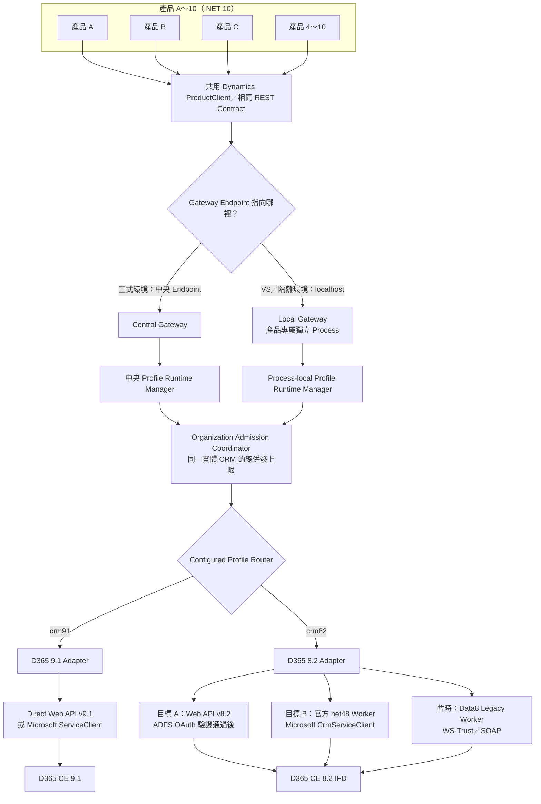
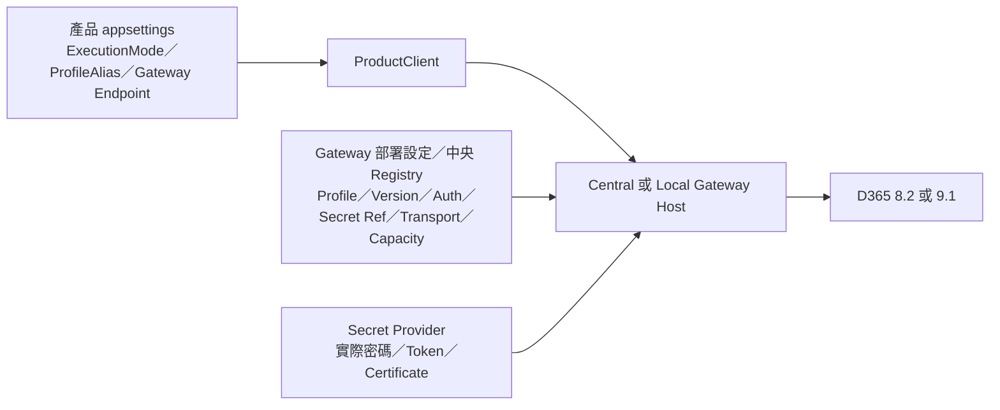

# Dynamics Gateway Central／Local 與 D365 8.2／9.1 設計解釋說明書

> 文件日期：2026-07-29  
> 文件性質：架構理念、討論紀錄、設計決策與後續驗證說明  
> 對應正式 SPEC：`.trellis/spec/backend/dynamics-gateway-hosting-version-routing.md`

可開啟的彩色互動圖：`docs/dynamics-gateway-central-local-82-91-architecture.html`

本說明書已把本次討論的完整脈絡整理進來，包含：

- 舊 CRM SDK 是否真的比新 Web API／`ServiceClient` 差。
- 為什麼不能只用「新舊」或「有沒有 SDK」判斷方案好壞。
- Repository 內 Data8 `PowerPlatform.Dataverse.Client` 與 Microsoft 官方套件的差異。
- 官方 NuGet 仍然是網路下載時，如何做到來源正規、版本可控與可稽核。
- 依目前 ASP.NET Core／.NET 10、D365 8.2 IFD 與 D365 9.1 的建議選項。
- Central Gateway、Local Gateway、Embedded 的用途與取捨。
- 每一個產品 JSON、Gateway Profile 設定及中央設定各自負責什麼。
- Connection Pool 是中央共用、Local 個別持有，還是兩者混合。
- Phase 4、Phase 5、Phase 6 是否需要推翻重做。
- `PowerPlatform.Dataverse.Client.csproj` 現在應保留或刪除，以及最終移除條件。

## 1. 先講最後結論

目前建議採用以下方向：

1. 正式環境以 **Central Gateway** 為預設。
2. Visual Studio 開發與個別隔離環境先使用 **Local Gateway**。
3. Central Gateway 與 Local Gateway 使用相同的 ProductClient、REST Contract、Operation Registry 與 Adapter 介面。
4. D365 8.2 與 D365 9.1 對產品提供相同呼叫方式，但 Gateway 內部必須使用不同 Profile Runtime、驗證狀態與 Transport Adapter。
5. D365 9.1 優先使用 Microsoft 官方 Web API，或在 OAuth 適用時使用官方 `ServiceClient`。
6. D365 8.2 目前先保留 Data8 `OnPremiseClient`，因為現場可工作的 IFD 路徑仍是 WS-Trust／SOAP。
7. Data8 只能作為暫時 Legacy 相容橋接，不能成為 Central／Local Gateway 的永久核心。
8. D365 8.2 的正式替代目標是：
   - ADFS OAuth 打通後使用 Web API v8.2；或
   - 使用獨立 .NET Framework 4.8 Worker 搭配 Microsoft 官方 `CrmServiceClient`。
9. Embedded 不立即刪除，也不繼續擴大；先保留，等 Local Gateway 與 8.2／9.1 驗證完成後再決定。
10. `PowerPlatform.Dataverse.Client` 專案現在不能刪，未來符合移除 Gate 後可以刪除。

最重要的核心觀念是：

> 我們要追求的是「所有產品共用相同的 Dynamics 呼叫契約」，而不是強迫 D365 8.2 與 9.1 共用同一個 SDK、同一條連線或同一個 Session。

## 2. 完整設計總覽



## 3. 我們的討論是怎麼演進到現在這個方案

### 3.1 最初的方向：完全不能使用舊 CRM SDK

最初的限制是「不得參考舊版 CRM SDK 套件、組件或命名空間」。因此第一版目標偏向完全使用 Dynamics Web API、`HttpClient` 與 OData，並逐步移除：

- `Microsoft.Xrm.*`
- `Microsoft.CrmSdk.*`
- `Microsoft.Crm.Sdk.*`
- `IOrganizationService`
- WCF／SOAP／WS-Trust
- Repository 內從 GitHub 取得的 Data8 `PowerPlatform.Dataverse.Client`

這個方向的優點是 Framework 相依較少、HTTP 行為透明、比較容易支援 .NET 10，也比較不會把舊 SDK DLL 分散到每一個產品。

### 3.2 對「新的一定比舊的好」產生疑問

接著討論到：舊 CRM SDK 的語法已經很熟悉，新 Web API 需要重新學習，而且把既有 CRUD、QueryExpression、FetchXML、OrganizationRequest 全部改寫，確實有學習與遷移成本。

因此設計不再用「新的一定比較好」作為理由，而改成看以下實際條件：

- 是否為 Microsoft 官方支援管道。
- 是否能在 .NET 10 產品環境可靠運作。
- 是否能集中管理多產品連線、驗證、Pool 與錯誤處理。
- 是否能避免每一個產品各自保存密碼與 SDK 相依。
- 是否能同時支援實際存在的 D365 8.2 與 9.1。

### 3.3 對「網路下載的 PowerPlatform.Dataverse.Client」的疑慮

Repository 內的：

```text
PowerPlatform.Dataverse.Client/PowerPlatform.Dataverse.Client.csproj
```

並不是 Microsoft 官方 `Microsoft.PowerPlatform.Dataverse.Client` 的原始碼，而是 Data8 的第三方 WS-Trust 相容實作。它：

- 以 .NET 10 建置。
- 提供 `OnPremiseClient`。
- 實作 `IOrganizationService`。
- 內部使用 WCF、SOAP 與 WS-Trust。
- 參考 Microsoft 官方 Dataverse Client 套件。
- README 明確表示不受 Microsoft 或 Data8 正式支援，只提供 best-effort 支援。

問題不在於「從網路下載就一定不好」。Microsoft 官方 NuGet 套件也是透過網路下載。真正需要考慮的是：

- 維護者是誰。
- 有沒有正式支援承諾。
- 資安更新與 Framework 升級由誰負責。
- 發生 WCF、ADFS、Socket 或 Authentication 問題時由誰排除。
- 是否存在可被 Microsoft 官方元件取代的路徑。

所以 Data8 可以暫時使用，但不適合成為十個產品共同依賴的永久核心。

### 3.4 設計目標改成「官方優先」，不再要求「完全不能用 SDK」

後續決定不再把「有沒有 SDK」當成唯一標準，而改成：

1. 優先使用 Microsoft 官方介面或官方 NuGet 套件。
2. 產品不直接依賴 SDK。
3. SDK 即使需要存在，也只能藏在 Gateway 或隔離 Worker 後面。
4. 多產品共用統一的 ProductClient 與 REST Contract。
5. 未來替換內部 Transport 時，不需要修改 ChurchReport 或其他產品的業務程式。

這是目前設計最重要的轉折。

### 3.5 Central Gateway 成為終極目標

由於現有產品可能從四、五個增加到十個以上，最終希望做到：

- 統一 Profile 設定。
- 統一 Secret Reference。
- 統一 Authentication。
- 統一 Connection Runtime／Pool。
- 統一 Retry、Timeout、Circuit Breaker、Health、Audit 與 Telemetry。
- 統一控制對同一個 D365 Organization 的總併發量。

因此 Central Gateway 適合正式環境。產品不直接連 CRM，而是呼叫中央 Gateway。

### 3.6 產品 JSON 與執行方式的討論

每一個產品仍保有自己的 `appsettings.json`，但產品 JSON 的責任要很小：

- 選擇 `ExecutionMode`。
- 指定 `ProfileAlias`。
- 指定 Gateway Endpoint。

產品 JSON 不應保存：

- CRM 密碼。
- Access Token／Refresh Token。
- Client Secret。
- Certificate Private Key。
- 原始 CRM Organization Service URL。
- CRM SDK DLL 位置。
- 任意 Transport 種類。

Central 與 Local 目前不是兩個新的 `DynamicsExecutionMode` enum 值。現有程式契約仍是：

```text
Gateway
Embedded
```

Central／Local 都屬於 `Gateway` 模式，差異在 Endpoint：

- Central：`https://dynamics-gateway.internal/`
- Local：目前專案為 `https://localhost:7244/`；日後若啟動設定變更，以 `SpeechMessage.Dynamics.Gateway/Properties/launchSettings.json` 為準。

這樣可以避免為部署位置增加不必要的程式分支。

### 3.7 Embedded 與 Local Gateway 的討論

Embedded 是把 Dynamics Runtime 直接放入 ChurchReport 等產品 Process。

Local Gateway 則是：

- ChurchReport 是一個 Process。
- Dynamics Gateway 是另一個 Process。
- ChurchReport 透過 localhost HTTP 呼叫 Gateway。

Local Gateway 對目前需求比較適合，因為在 Visual Studio 2026 可以設定 Multiple Startup Projects，同時啟動 ChurchReport 與 Gateway，又能保留：

- 獨立 Console。
- 獨立 Health／Ready Endpoint。
- 獨立 Connection Pool。
- 獨立 SDK／WCF 相依。
- 獨立 Crash 與 Process Recycling 邊界。

因此目前決策是 Local Gateway 優先；Embedded 保留但暫緩。

### 3.8 D365 8.2 讓設計不能只看 Web API 理論

D365 CE 8.2 有 `/api/data/v8.2/` Web API，理論上 .NET 10 可直接使用 `HttpClient` 呼叫，不需要 Data8 或特定 SDK Assembly。

但是目前實際 IFD 環境的結果是：

| 測試路徑 | 結果 |
| --- | --- |
| SOAP／WS-Trust | 可以工作 |
| Web API＋Windows NTLM | 被 IFD 導向，不能直接使用 |
| OAuth Password Grant | ADFS 回覆 `unsupported_grant_type` |
| OAuth Authorization Code | OAuth Client／Redirect URI 尚未註冊 |
| Refresh Token | 尚無可用 Token 路徑 |

所以「8.2 Web API 存在」不等於「目前 8.2 Web API 已可供正式程式使用」。

目前 Data8 暫時必要的原因，是現場 Authentication 條件，而不是 D365 8.2 天生一定依賴 Data8。

### 3.9 加回 Central Gateway 後的完整設計

現在的完整設計不是只選 Local，也不是只選 Central：

- **Central Gateway**：正式環境的共用部署。
- **Local Gateway**：VS 開發、整合測試或個別隔離部署。
- **Embedded**：保留但暫緩。

三者不是三套不同的業務 API。Central 與 Local 共用同一套 Gateway REST Contract；未來如果 Embedded 繼續發展，也必須實作相同 `IDynamicsOperationExecutor` 行為。

## 4. Central Gateway 到底集中什麼

Central Gateway 集中的不是「一個萬用 CRM Connection」。它集中的是管理責任：

- Product Workload Authentication。
- Product／Profile／Operation Authorization。
- Profile Registry。
- Secret Reference Resolution。
- Operation Registry。
- Retry／Timeout／Backpressure。
- Audit／Telemetry／Health。
- Profile Runtime Generation。
- Aggregate Organization Admission。

在 Central Gateway 內，仍然必須有不同 Runtime：

```text
crm82 generation N
crm91 generation M
```

兩者不能共用：

- 可變的 `IOrganizationService`。
- WCF Channel。
- Access Token／Refresh Token Cache。
- Credential Object。
- Metadata Cache（除非有明確版本與 Organization Key）。
- SDK DLL Loading Context。
- Session 或使用者狀態。

## 5. Local Gateway 到底是不是「個別式」

是。Local Gateway 的實體 Process 與實體 Pool 是個別式的。

例如：

```text
ChurchReport -> ChurchReport Local Gateway -> Local Pool
產品 B       -> 產品 B Local Gateway       -> Local Pool
產品 C       -> 產品 C Local Gateway       -> Local Pool
```

但是 Local Gateway 不能把「個別 Pool」理解成「各自可以無限制連線」。如果三個 Local Gateway 都連到同一個實體 D365 Organization，它們仍然要共用同一個 Organization Admission Budget。

因此設計上區分兩件事：

| 項目 | 是否共用 |
| --- | --- |
| HttpClient／Socket Pool | 不共用，屬於 Process |
| WCF／SDK Client Pool | 不共用，屬於 Process／Worker |
| Token／Credential State | 不跨 Profile／Process 共用 |
| 同一個 CRM 的總併發上限 | 必須共用或協調 |
| Operation Registry／REST Contract | 必須一致 |

## 6. D365 9.1 的設計

### 6.1 建議路徑

```text
產品
  -> Central 或 Local Gateway
  -> crm91 Profile Runtime
  -> Direct Web API v9.1 或 Microsoft ServiceClient
  -> D365 CE 9.1
```

優先順序：

1. Direct Web API v9.1。
2. Microsoft 官方 `Microsoft.PowerPlatform.Dataverse.Client.ServiceClient`，前提是目標的 OAuth／Authentication 模式通過實機驗證。

D365 9.1 不需要 Data8 作為必要基礎。

### 6.2 為什麼仍要透過 Gateway

即使使用官方 `ServiceClient`，也不建議每一個產品直接參考，因為 Gateway 還負責：

- Secret 不進入產品。
- 統一 Token Cache。
- 統一 Pool 與 Dispose。
- 統一 Operation Allowlist。
- 統一 Audit 與錯誤格式。
- 未來替換 ServiceClient／Web API 時產品不變。

## 7. D365 8.2 的設計

### 7.1 目前狀態

目前工作路徑：

```text
ChurchReport
  -> ToolUtility
  -> Data8 OnPremiseClient
  -> WS-Trust／SOAP
  -> D365 CE 8.2 IFD
```

現在直接刪除 Data8 會造成：

- `ToolUtility.csproj` ProjectReference 失效。
- `CrmConnectionService.CreateOnPremiseClient` 無法建置。
- 現有 8.2 工作路徑中斷。

### 7.2 第一階段目標

先把產品與 Data8 解耦：

```text
ChurchReport
  -> Gateway REST Contract
  -> crm82 Legacy Adapter
  -> Data8 Legacy Worker
  -> D365 8.2
```

Data8 最好放入可回收的獨立 Worker Process，不應直接成為 Central Gateway 的永久長生命週期 Pool Client。

原因是目前 `OnPremiseClient` 沒有實作 `IDisposable`，既有 Pool 的：

```csharp
(connection?.Service as IDisposable)?.Dispose();
```

無法證明 Data8 內部 WCF Channel／ChannelFactory 已被 `Close` 或 `Abort`。這是 Socket、Handle 與長時間資源保留風險，必須視為正式發布阻擋條件。

### 7.3 最終替代方案 A：Web API v8.2

必須先完成：

- ADFS OAuth Client Registration。
- Redirect URI。
- 適合服務工作負載的 Token Flow。
- Token Renewal／Restart。
- 8.2 Web API Capability Matrix。
- 實際 CRUD、FetchXML、Actions、Functions、Paging 驗證。

不能因為 `/api/data/v8.2/` 可以回應，就認定所有舊 SDK 呼叫都可以搬過去。D365 8.2 Web API 對部分 Action／Return Type 有已知限制。

### 7.4 最終替代方案 B：Microsoft 官方 Legacy Worker

建立獨立 .NET Framework 4.8 Process：

```text
Gateway .NET 10
  -> IPC／localhost HTTP
  -> Legacy Worker .NET Framework 4.8
  -> Microsoft CrmServiceClient
  -> D365 8.2 IFD
```

好處是：

- 產品仍然是 .NET 10。
- Gateway 仍然是 .NET 10。
- 舊 Framework SDK 被隔離在另一個 Process。
- 使用 Microsoft 官方 XrmTooling／CrmServiceClient。
- Worker 可以獨立鎖 SDK 版本與重新啟動。

## 8. 8.2 與 9.1 要不要共用同一個 Worker

初期不要。

建議：

```text
LegacyWorker82 -> 鎖定經 8.2 實機驗證的 SDK／Authentication
LegacyWorker91 -> 只有真的需要 Legacy SDK 時才建立，鎖定 9.1 版本
```

原因：

- `Microsoft.Xrm.Sdk.dll`／`Microsoft.Crm.Sdk.Proxy.dll` 版本可能不同。
- 同一個 .NET Framework Process 可能遇到 Assembly Binding Redirect。
- 8.2 IFD WS-Trust 與 9.1 OAuth／IFD 狀態不同。
- Channel、Token、Credential 與 Metadata 不應混用。
- 最新 9.1 SDK 能否完整支援實際 8.2 Server，必須用實機測試證明，不能只靠套件描述推論。

實機驗證證明可以共用後，才考慮合併，不要一開始就把合併當成前提。

## 9. Product JSON 應該怎麼寫

### 9.1 Central Gateway

```json
{
  "DynamicsAccess": {
    "ExecutionMode": "Gateway",
    "ProfileAlias": "crm82",
    "Gateway": {
      "Endpoint": "https://dynamics-gateway.internal/",
      "ApiPrefix": "/v1"
    }
  }
}
```

### 9.2 Local Gateway

```json
{
  "DynamicsAccess": {
    "ExecutionMode": "Gateway",
    "ProfileAlias": "crm91",
    "Gateway": {
      "Endpoint": "https://localhost:7244/",
      "ApiPrefix": "/v1"
    }
  }
}
```

上例的 `7244` 是目前工作區 `SpeechMessage.Dynamics.Gateway/Properties/launchSettings.json` 所設定的 HTTPS 埠。這個埠號不是 Gateway REST Contract 的固定部分；若日後啟動設定或部署綁定位址改變，產品 JSON 必須跟著使用該環境實際核准的 Endpoint。

### 9.3 為什麼不是 `CentralGateway`／`LocalGateway`

因為目前程式中的 `DynamicsExecutionMode` 是：

```csharp
Gateway = 0,
Embedded = 1
```

Central 與 Local 是 Gateway 的部署拓撲，不需要改變產品業務程式。Endpoint 已經可以表達呼叫中央服務或 localhost。

如果未來真的要加入新的 enum，必須另外修改：

- Strongly Typed Options。
- Validation。
- DI Registration。
- JSON Schema。
- 測試與 Migration。

目前沒有必要增加這個複雜度。

## 10. Embedded 的最後決定是什麼

Embedded 現在：

- 不刪除。
- 不作為目前開發預設。
- 不繼續擴大產品使用範圍。
- 不視為正式 8.2 相容方案。
- 保留程式與研究成果。

等以下條件完成後再決定：

1. Local Gateway 在 ChurchReport 開發流程可正常使用。
2. Central／Local REST Contract 一致。
3. 8.2 與 9.1 實機驗證完成。
4. Aggregate Admission 能涵蓋所有 Runtime Host。
5. Secret／Token／Credential 隔離通過。
6. Runtime Drain／Dispose／Socket／Handle Soak 通過。

之後可以選擇：

- 繼續發展 Embedded，作為非常特殊的零 HTTP Hop 部署。
- 保留但不提供正式支援。
- 確認沒有用途後移除。

## 11. Phase 4、Phase 5 是否會受到影響

目前改變方向仍不算太晚，因為已建立的重要基礎仍可以沿用：

- `IDynamicsOperationExecutor` 抽象。
- Operation Registry。
- ProductClient。
- Gateway HTTP Contract。
- Profile Runtime／Generation 概念。
- Organization Admission／Host Lease。
- Isolation／Lifecycle／Soak Tests。
- 8.2／9.1 Capability Matrix。

需要調整的是 Transport 與 Hosting 決策，不是把 Phase 4、Phase 5 全部推翻。

應避免的作法是讓既有 Phase 4／5 直接把 Data8 或 SDK Client 滲透進產品業務碼。只要產品仍依賴 ProductClient／Gateway Contract，內部 Adapter 可以更換。

## 12. Connection Pool 在這個架構中的真正意思

### 12.1 Central Gateway Pool

中央 Gateway 內可能有：

```text
crm82 generation 7 runtime
crm91 generation 3 runtime
```

每一個 Runtime 擁有自己的：

- Http Handler／HttpClient；或
- Worker Proxy；或
- SDK Client；
- Token／Authentication State；
- Metadata Cache；
- Retry／Health State；
- Cancellation／Timer；
- Dispose／Drain 邊界。

### 12.2 Local Gateway Pool

每一個 Local Gateway 有自己的 Process-local Runtime。它不與 Central Gateway 共用記憶體中的 Pool，也不與另一個 Local Gateway 共用物件。

### 12.3 什麼必須跨 Host 協調

同一實體 D365 Organization 的：

- 最大同時 Outbound Requests。
- 最大 Runtime Host 數。
- Queue Capacity。
- Retry Budget。
- Rollout／Blue-Green Capacity。

必須透過 Organization Admission Plan 協調。否則五個 Local Gateway 各認為自己可以開十條連線，實際上可能同時送出五十個工作，反而失去集中管理的意義。

## 13. Data8 專案什麼時候才能刪

以下條件全部完成前不能刪除：

1. `ToolUtility` 不再 `ProjectReference` Data8 專案。
2. 所有產品不再直接呼叫 `CreateOnPremiseClient`。
3. 程式碼中不再建立 `OnPremiseClient`。
4. ChurchReport 與其他產品全部改走 ProductClient／Gateway。
5. D365 8.2 有通過實機測試的替代 Adapter。
6. D365 9.1 路徑不依賴 Data8。
7. 8.2 替代路徑完成：
   - WhoAmI／Identity Probe。
   - CRUD。
   - Query／FetchXML。
   - Paging。
   - 實際 Actions／OrganizationRequest。
   - Authentication Renewal／Reconnect。
   - Gateway／Worker Restart。
   - Long-running Socket／Handle／Memory Soak。
8. 有可驗證的 Rollback／Feature Flag。
9. Solution、Project、Package、Source 掃描沒有剩餘 Data8 相依。
10. 刪除後完整 Build、Tests、8.2／9.1 Smoke Test 全部通過。

## 14. 失敗時應該怎麼處理

### 14.1 Central Gateway 失效

- 正式產品應回報 Gateway unavailable／NotReady。
- 不可在產品內偷偷改成直接連 CRM。
- 不可自動切換 Data8 或另一個 Profile。
- 由部署層做 Gateway HA、Restart 或 Rollback。

### 14.2 Local Gateway 沒有啟動

- ChurchReport 開發環境顯示明確的 localhost Gateway 連線錯誤。
- Visual Studio Multiple Startup Projects 應同時啟動兩個 Process。
- 不可自動改走正式 Central Gateway，以免開發機誤用正式 CRM。

### 14.3 8.2 Web API OAuth 失敗

- `crm82-webapi` Profile 保持 NotReady。
- 不在同一個請求中偷偷改走 WS-Trust。
- 由部署設定明確選擇暫時 Legacy Profile／Transport。

### 14.4 Worker Crash

- Gateway 偵測 Worker 不健康。
- 停止新請求。
- 正在執行的工作依 Deadline 失敗或取消。
- Worker 可以依政策重新啟動。
- 不得無限重試非冪等寫入。

## 15. 建議實施順序

### 第一階段：固定產品邊界

- ChurchReport 只依賴 ProductClient／Gateway Contract。
- 不再新增任何直接 CRM SDK／Data8 呼叫。
- `ExecutionMode=Gateway` 可透過 Endpoint 選 Central 或 Local。

### 第二階段：Local Gateway 優先

- VS 2026 同時啟動 ChurchReport 與 Local Gateway。
- 驗證 Health、Ready、Authentication、Profile、Pool 與 Error Handling。
- 先跑 9.1 正式路徑。
- 8.2 暫時透過隔離 Legacy Worker。

### 第三階段：Central Gateway

- 多產品改指向中央 Endpoint。
- 集中 Profile、Secret、Policy、Audit、Telemetry。
- 驗證不同產品公平排程與同一 CRM 的總併發限制。

### 第四階段：8.2 官方替代

- 完成 ADFS OAuth PoC；或
- 完成 Microsoft `CrmServiceClient` net48 Worker。
- 與 Data8 路徑做結果、效能與穩定性比對。

### 第五階段：移除 Data8

- 所有移除 Gate 通過。
- 先停用與觀察，再刪除 ProjectReference／Solution Entry／Source。

### 第六階段：重新評估 Embedded

- 有明確效益才繼續。
- 如果 Local Gateway 已滿足 VS 開發與部署需求，Embedded 可以保持停用或移除。

## 16. 常見問題

### Q1：Central Gateway 和 Local Gateway 是不是兩套程式？

建議是同一個 Gateway Host 程式與同一套 Adapter Contract，用不同部署設定啟動。Central 是共用部署；Local 是產品旁邊的獨立 Process。

### Q2：Local Gateway 能不能使用 Central 的設定？

可以使用相同的 Profile Definition／Manifest 模型，但 Local Process 仍要建立自己的實體 Pool。Secret 必須由核准的 Secret Provider 解析，不能直接複製到產品 JSON。

### Q3：產品可以執行中切換 8.2／9.1 嗎？

一般使用者請求不能任意切換。產品與部署設定指定允許的 `ProfileAlias`；Gateway 由授權政策決定該 Workload 能否使用該 Profile。設定變更需要 replace-and-drain。

### Q4：8.2 與 9.1 可以有相同的業務呼叫語法嗎？

可以。產品呼叫相同的 Operation ID 與 Typed Parameters。Gateway 內部不同 Adapter 負責轉換。但只有在 Capability Matrix 證明兩個版本都支援時，該 Operation 才能同時啟用。

### Q5：為什麼不直接讓 ChurchReport 參考 Microsoft 官方 ServiceClient？

因為這仍會把 Authentication、Token、Pool、Retry、SDK 更新與 Secret 放回產品。Gateway 邊界的價值是把這些責任集中，而不是單純把第三方 SDK 換成官方 SDK。

### Q6：Data8 現在是不是不安全？

不能直接下結論說它一定不安全；目前它是可以工作的第三方相容實作。但它缺乏正式支援，且現有 `OnPremiseClient` 的 WCF 生命週期沒有被既有 Pool 的 `IDisposable` 路徑完整覆蓋。因此不適合在沒有額外生命週期保護與 Soak Test 的情況下成為永久長生命週期 Pool。

### Q7：現在改設計會不會讓前面工作浪費？

不會。只要保留 ProductClient、Gateway Contract、Operation Registry、Profile Runtime 與 Admission 等邊界，前面的工作仍是基礎。改變的是內部 Transport 與 Hosting 優先順序。

## 17. 最終決策表

| 項目 | 現在決策 | 未來條件 |
| --- | --- | --- |
| Central Gateway | 正式環境預設 | 完成多產品部署與 HA 驗證 |
| Local Gateway | 目前優先實作／驗證 | 作為 VS 與隔離部署正式選項 |
| Embedded | 保留、暫緩 | Local 與實機 Gate 後再決定 |
| D365 9.1 | Web API／官方 ServiceClient | 依實際 Authentication 選定 |
| D365 8.2 | Data8 暫留 | 改 Web API OAuth 或官方 net48 Worker |
| Data8 專案 | 現在不能刪 | 全部移除 Gate 通過後刪除 |
| 8.2／9.1 Worker | 初期分開鎖版本 | 實機證明相容後才能合併 |
| 產品 JSON | Gateway＋Alias＋Endpoint | 不允許 Secret／CRM URL／Transport |
| Connection Pool | Central 或 Local Process 內分 Profile | 同一 CRM 總容量跨 Host 協調 |

## 18. 本次討論逐題決策紀錄

本章依照實際討論順序，把每一個問題、判斷理由與最後決策放在一起。前面章節偏向「設計是什麼」，本章偏向「為什麼最後這樣決定」。

### 18.1 「不得參考舊版 CRM SDK」時，原先呼叫要改成什麼

舊程式常見的呼叫方式包括：

- `IOrganizationService.Create`／`Update`／`Delete`／`Retrieve`／`RetrieveMultiple`。
- `QueryExpression`、`ColumnSet`、`Entity`、`EntityReference`。
- `OrganizationRequest`、`ExecuteMultipleRequest`、`AssignRequest`、`SetStateRequest`。
- `OrganizationServiceProxy`、`CrmServiceClient`、WCF／SOAP／WS-Trust。

如果完全不使用 SDK，對應做法是透過 Microsoft 官方 Dynamics Web API，以 HTTPS、OData v4 與 JSON 呼叫：

| 舊 SDK 概念 | Web API 對應概念 |
| --- | --- |
| `Create(Entity)` | `POST /api/data/vX.X/{entityset}` |
| `Retrieve`／`RetrieveMultiple` | `GET`＋`$select`／`$filter`／`$expand` |
| `Update(Entity)` | `PATCH /api/data/vX.X/{entityset}({id})` |
| `Delete` | `DELETE /api/data/vX.X/{entityset}({id})` |
| `QueryExpression` | 受控 OData Query 或 Gateway 內固定 FetchXML Template |
| `OrganizationRequest` | 對應的 Web API Action／Function／Batch |
| `IOrganizationService` | 產品端的 Typed ProductClient／`IDynamicsOperationExecutor` |

但目前最後方案不是要求所有人立刻把熟悉的 SDK 語法全部手工改成 OData。產品端改成呼叫穩定的 ProductClient／Gateway Contract，Gateway 內部再依 8.2 或 9.1 選擇 Web API、Microsoft 官方 SDK Adapter 或暫時 Legacy Worker。

### 18.2 舊方式真的比較差嗎

不是。舊方式有實際優點：

- 團隊熟悉，開發速度快。
- `Entity`、`QueryExpression`、`OrganizationRequest` 等型別已把很多底層細節包裝好。
- 對舊版 D365 On-Premises、IFD、WS-Trust 的相容經驗較完整。
- 現有大量產品程式已經驗證過，直接重寫有回歸風險。

它的問題主要不是語法，而是放在目前多產品與 .NET 10 架構中的責任分散：

- 每個產品都可能持有 SDK、帳密、Token、Retry 與 Pool。
- 8.2、9.1 的 SDK／Authentication／Assembly Binding 可能互相衝突。
- 舊 .NET Framework 或 WCF 相依不一定適合直接載入 .NET 10 產品 Process。
- SDK 更新、資安修補、連線回收與問題排查會散落在四到十個產品。
- 很難證明跨產品沒有 Session、Credential、Token、Cache 或 Connection Leakage。

所以本設計不把舊 SDK 判定為「不好」，而是把它視為需要隔離與集中治理的 Transport 實作。

### 18.3 新方式有什麼好處，為什麼值得改

新架構的好處不在於把一行 SDK 語法換成一行 HTTP，而在於責任邊界：

| 改變 | 實際好處 |
| --- | --- |
| 產品只依賴 ProductClient／REST Contract | 產品不用理解 8.2、9.1、SOAP、OData、SDK 版本與 Token 細節。 |
| Central Gateway 集中正式環境 | Secret、Authentication、Pool、Retry、Audit、Health 與版本更新只治理一個邊界。 |
| Local Gateway 使用同一契約 | VS 開發方便，同時保有獨立 Process、Console、Health、Pool 與 Crash 邊界。 |
| 8.2／9.1 使用不同 Adapter | 不必為了表面統一而混用 SDK、Token、WCF Channel 或 Metadata。 |
| Profile Generation＋replace-and-drain | 設定或密碼更換時不原地污染正在使用的 Runtime。 |
| Organization Admission | Central、Local、未來 Embedded 對同一 CRM 的總併發不會被重複放大。 |
| Transport 可替換 | Data8、官方 Worker、Web API 或 `ServiceClient` 的替換不需要重寫產品業務流程。 |

需要承認的成本則包括 Gateway 網路 Hop、部署與監控工作，以及 ProductClient Contract 的設計成本。是否值得，取決於產品數量與治理需求；對目前四到十個產品、同時支援 8.2／9.1 的環境，收益大於成本。

### 18.4 「從網路下載」和「Microsoft 官方」要怎麼區分

不能只用「是不是從網路下載」判斷品質，因為 Microsoft 官方 NuGet 套件本身也是從套件來源下載。真正的差異是來源、維護與供應鏈治理：

| 類型 | 例子 | 判斷 |
| --- | --- | --- |
| Microsoft 官方文件／Web API | Microsoft Learn 所定義的 D365 Web API | 官方支援介面，仍需依實際 CE 版本與 Authentication 驗證。 |
| Microsoft 官方 NuGet | `Microsoft.PowerPlatform.Dataverse.Client`、`Microsoft.CrmSdk.XrmTooling.CoreAssembly` | 可採用，但要鎖版本、保留 Package Lock、掃描弱點並做實機測試。 |
| Repository 內第三方原始碼 | Data8 `PowerPlatform.Dataverse.Client.csproj` | 可作暫時相容橋接，但支援、生命週期與修補責任落在本專案。 |
| 未知網站下載 DLL／Source | 無可信發行者、版本與雜湊 | 不應作為正式依賴。 |

特別注意：Repository 內名稱為 `PowerPlatform.Dataverse.Client` 的 Data8 專案，與 Microsoft 官方 NuGet 套件 `Microsoft.PowerPlatform.Dataverse.Client` 不是同一個來源；不能因為名稱接近，就把本機第三方專案視為 Microsoft 官方原始碼。

如果正式建置環境不允許直接連 Internet，正規做法不是把第三方原始碼複製進 Repository，而是：

1. 只允許核准的 Microsoft／NuGet.org 套件來源。
2. 由公司內部 NuGet Feed／Artifact Proxy 鏡像核准套件。
3. 固定 Package Version 與 Lock File。
4. 保存套件雜湊、SBOM、License 與弱點掃描結果。
5. 升版先在 8.2／9.1 測試環境驗證，再進正式環境。

因此「官方管道」和「完全不經網路」不是同一件事。真正正規的目標是可信來源、可重現建置、版本受控、能追蹤安全更新，而不是來源檔案永遠不經過網路。

### 18.5 依目前程式環境，官方選項選哪個

目前環境是 ASP.NET Core／.NET 10 產品、同時連接 D365 CE 8.2 IFD 與 D365 CE 9.1，且團隊已熟悉舊 CRM SDK。因此建議不是只選一個全域 SDK，而是按版本分流：

| 目標 | 建議 |
| --- | --- |
| 產品 A～10 | 一律呼叫 Gateway ProductClient，不直接參考任何 CRM SDK。 |
| D365 9.1 | 優先 Direct Web API v9.1；若實際 OAuth／IFD 驗證適合，Gateway 內可使用 Microsoft 官方 `ServiceClient`。 |
| D365 8.2 | 目前保留 Data8 路徑維持服務；正式替代優先驗證 Web API v8.2 OAuth，或採用獨立 net48 Worker＋Microsoft 官方 `CrmServiceClient`。 |
| VS 開發 | 先使用 Local Gateway，與 ChurchReport 設為 Multiple Startup Projects。 |
| 正式多產品部署 | 使用 Central Gateway。 |
| Embedded | 保留程式，但暫緩擴大與正式化。 |

一句話建議是：

> 在目前 .NET 10、D365 8.2 IFD 與 D365 9.1 並存的環境中，產品端統一使用 Gateway Contract；9.1 優先 Web API／官方 `ServiceClient`，8.2 暫時隔離 Data8 並以官方 net48 `CrmServiceClient` Worker 或已驗證的 Web API 作為替代目標。

### 18.6 SDK 到底是不是重要方向

「一定要有 SDK」與「一定不能有 SDK」都不應成為最高層設計目標。真正重要的是：

- 是否為 Microsoft 支援或經核准的相容路徑。
- 是否能對實際 8.2／9.1 Server 通過功能與 Authentication 驗證。
- 是否不讓 SDK 型別與版本散入產品業務碼。
- 是否能確定 Token、Credential、WCF Channel、Socket、Timer 與 Cache 有明確擁有者及回收路徑。
- 是否能讓未來 Transport 替換時，產品端不必重新改寫。

因此 SDK 可以存在，但它的位置必須在 Gateway Adapter 或獨立 Worker 內，而不是成為所有產品共同直接依賴的公開程式介面。

### 18.7 Central Gateway、Local Gateway 與 Embedded 的完整差異

| 比較項目 | Central Gateway | Local Gateway | Embedded |
| --- | --- | --- | --- |
| 執行位置 | 內部中央服務／多 Replica | 產品旁邊的獨立 localhost Process | 產品 Process 內 |
| 產品模式 | `ExecutionMode=Gateway` | `ExecutionMode=Gateway` | `ExecutionMode=Embedded` |
| 選擇方式 | Gateway Endpoint 指向中央網址 | Gateway Endpoint 指向 localhost | 啟用 Embedded Branch |
| REST Hop | 有內部網路 Hop | 有 localhost Hop | 無 HTTP Hop，或使用同 Process Adapter |
| 實體 Pool | 中央 Process 內按 Profile／Generation | 每個 Local Process 自己持有 | 每個產品 Process 自己持有 |
| SDK／WCF 隔離 | 可藏在 Gateway／Worker | 可藏在 Local Gateway／Worker | 會進入產品生命週期，隔離最弱 |
| Crash 影響 | Gateway Profile／Replica 範圍 | Local Gateway 範圍 | 可能影響產品本身 |
| VS 觀察性 | 需連遠端或另外啟動 | 最方便，可同時看兩個 Console | 單 Process Debug 最直接 |
| 正式環境建議 | 預設 | 特殊隔離部署才使用 | 目前不建議 |
| 現在決策 | 正式終極目標 | 第一個要完成的實作／驗證 | 保留、暫緩 |

目前只需要先把 Local Gateway 做好，不必立即刪除 Embedded。等 Local Gateway 已能滿足 VS 開發、除錯、效能與部署需求後，再根據實際證據決定 Embedded 是繼續、保持停用或移除。

### 18.8 每個產品的 JSON 與中央設定如何分工

建議分成兩個層級，不是把所有設定都放進每一個產品：



產品 JSON 各自存在，因為 ChurchReport、產品 B、產品 C 可能需要不同 Alias 或不同 Gateway Endpoint；但它只表達「我要透過哪個 Gateway、使用哪個被允許的邏輯 Profile」。

真正的 CRM URL、Authentication、Secret Reference、Transport、Pool 上限與 SDK／Worker 版本屬於 Gateway 部署設定或中央 Registry。Local Gateway 可以載入同一份 Profile Manifest 模型，但仍建立自己的 Process-local Runtime，且正式 Secret 不能複製進產品 JSON。

Central 與 Local 的切換是部署設定切換：更新 Endpoint，通過設定驗證，再重新啟動或 replace-and-drain。不可由登入使用者或單一 Request 隨時切換。

### 18.9 Connection Pool 是集中式還是個別式

答案是「實體連線池個別持有，治理與容量集中協調」：

```text
Central Gateway Process
  ├─ crm82 generation N pool／worker proxy
  └─ crm91 generation M HttpClient／ServiceClient runtime

ChurchReport Local Gateway Process
  ├─ crm82 local pool／worker proxy
  └─ crm91 local HttpClient／ServiceClient runtime

產品 B Local Gateway Process
  └─ 自己的 process-local pool

以上所有 Host 若指向同一實體 Organization
  └─ 共用同一 Organization Admission Budget
```

不能跨 Process 共用同一個 `HttpClient`、WCF Channel 或 SDK Client 物件；但也不能讓每個 Local Gateway 都把自己當成唯一使用者。中央協調的是最大 Host 數、最大併發、Queue、Retry 與 Rollout 容量，不是把所有 Socket 物件放進一個跨 Process Pool。

### 18.10 目前改變方向會不會太晚，Phase 4／5 怎麼辦

現在改不算太晚，也不需要推翻前面工作。應保留並繼續驗證：

- ProductClient 與 `IDynamicsOperationExecutor`。
- Gateway REST Contract。
- Operation Registry 與 Typed Parameters。
- Profile Runtime／Generation。
- Organization Admission／Host Lease。
- Isolation、Lifecycle、Soak、Fault、Performance Test。
- 8.2／9.1 Capability Matrix 與實機 Smoke Test。

調整後的階段定義是：

| Phase | 現在的工作 |
| --- | --- |
| Phase 4 | 驗證 Local／Central、8.2／9.1、Worker、隔離、回收、Soak 與效能；不因改方向而取消。 |
| Phase 5 | 產品逐步改走 Gateway Contract；先搬一個可回滾的 ChurchReport Use Case，再逐產品遷移。 |
| Phase 6 | 所有替代路徑與實機 Gate 通過後，移除 Data8、舊 SDK、WCF 與直接 ProjectReference。 |

真正要避免的是為了保留舊語法，把 Data8／`IOrganizationService` 再擴散到新的產品程式碼。相容性應封裝在 Adapter／Worker 內。

### 18.11 `PowerPlatform.Dataverse.Client.csproj` 現在要移除還是保留

目前要保留，理由不是 D365 8.2 天生需要這個專案，而是現在已知可工作的 8.2 IFD 路徑仍經過它，而且 `ToolUtility` 與既有程式仍有直接相依。現在刪除會造成建置或現場連線中斷。

本次討論所指的實際專案是：

```text
D:\音訊科技產品\系統平台\SpeechMessageProducts\.worktrees\1.0.0.3.Gateway&Embedded.Worktree\PowerPlatform.Dataverse.Client\PowerPlatform.Dataverse.Client.csproj
```

它在新架構中的定位必須降級為：

```text
TemporaryData8LegacyWorker
```

也就是暫時、受限制、可回收、可觀察，而且有明確退出條件的 Legacy 邊界。它不應再新增產品呼叫、不應成為 9.1 的共同底層，也不應直接放進長生命週期 Central Gateway Pool 而沒有 WCF Channel／Socket／Handle 回收證據。

### 18.12 完成後能不能刪除該專案

可以，而且最終目標仍是刪除，但「完成」必須具體定義。至少要同時滿足：

1. 所有產品已改走 ProductClient／Gateway Contract。
2. `ToolUtility` 與其他專案不再 `ProjectReference` 該 csproj。
3. Source 不再建立 Data8 `OnPremiseClient`。
4. D365 8.2 已有 Web API v8.2 或官方 net48 `CrmServiceClient` Worker 替代。
5. 替代路徑通過實際 8.2 的 WhoAmI、CRUD、Query／FetchXML、Paging、Action／Function／OrganizationRequest 驗證。
6. Authentication Renewal、Gateway／Worker Restart 與 Rollback 通過。
7. 長時間 Memory、Socket、Handle、Timer、Cancellation Registration Soak 回到基準，沒有持續成長。
8. D365 9.1 路徑完全不依賴 Data8。
9. Solution、Project、Package 與 Source 掃描沒有可達相依。
10. 刪除後 Release Build、全部 Tests、8.2／9.1 Smoke Test 都通過。

刪除順序應該是先讓所有呼叫不可達，再移除 ProjectReference，接著移除 Solution Entry，最後刪除或移出 buildable source；不要先刪資料夾再回頭修斷掉的產品。

### 18.13 Session Leakage、Memory Leakage 與效能的共同底線

不論最終 Transport 是 Web API、`ServiceClient`、`CrmServiceClient` 或暫時 Data8，以下都是發布阻擋條件：

- 不可用帳號、LINE ID、瀏覽器 Session、JWT、使用者 Token 當 Pool Key。
- `crm82` 與 `crm91` 不可共用可變 Credential、Token Cache、WCF Channel、SDK Client 或 Metadata State。
- 每一個 Handler、Client、Worker Proxy、Timer、Cancellation Registration、Stream 與 Background Task 都要有唯一擁有者與可驗證的 Dispose／Drain 路徑。
- Reload 後舊 Generation 必須在期限內回到零引用或基準值。
- Retry、Queue、Cache、Audit 與 Response Size 必須有上限。
- 效能最佳化只能來自安全的 Connection Reuse、Bounded Concurrency、Metadata Cache 與 Warm-up，不能靠取消隔離、無限平行或延長未回收 Session。

因此最終追求的是「最大安全持續效能」，而不是短時間內最多連線數。

## 19. 一句話總結

> 產品 A～10 永遠只學一種 Dynamics 呼叫方式；Central Gateway 與 Local Gateway 負責部署差異，`crm82` 與 `crm91` 負責版本差異，Web API／官方 SDK／暫時 Data8 Worker 負責 Transport 差異，而這些差異全部不能滲透回產品業務程式。
