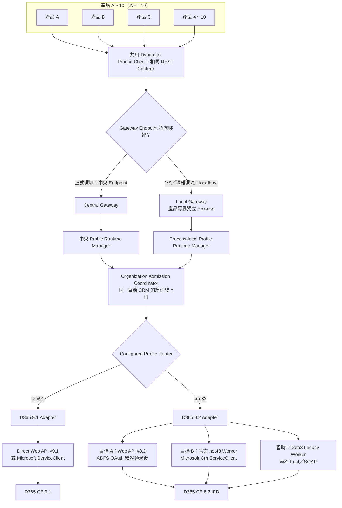
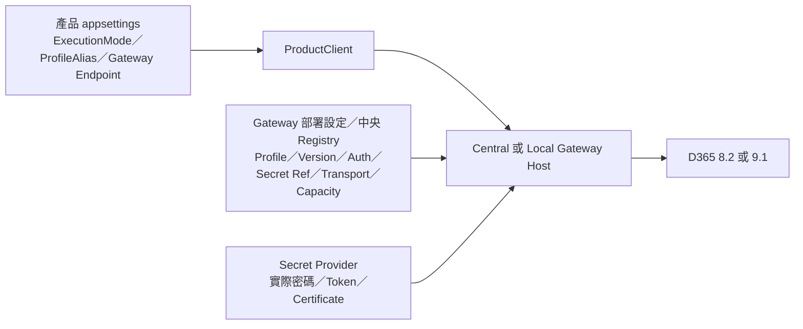
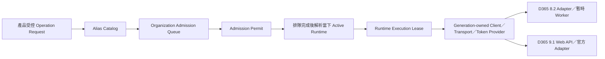
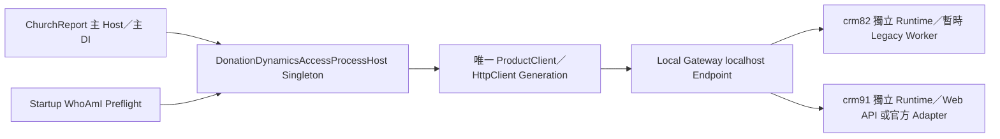
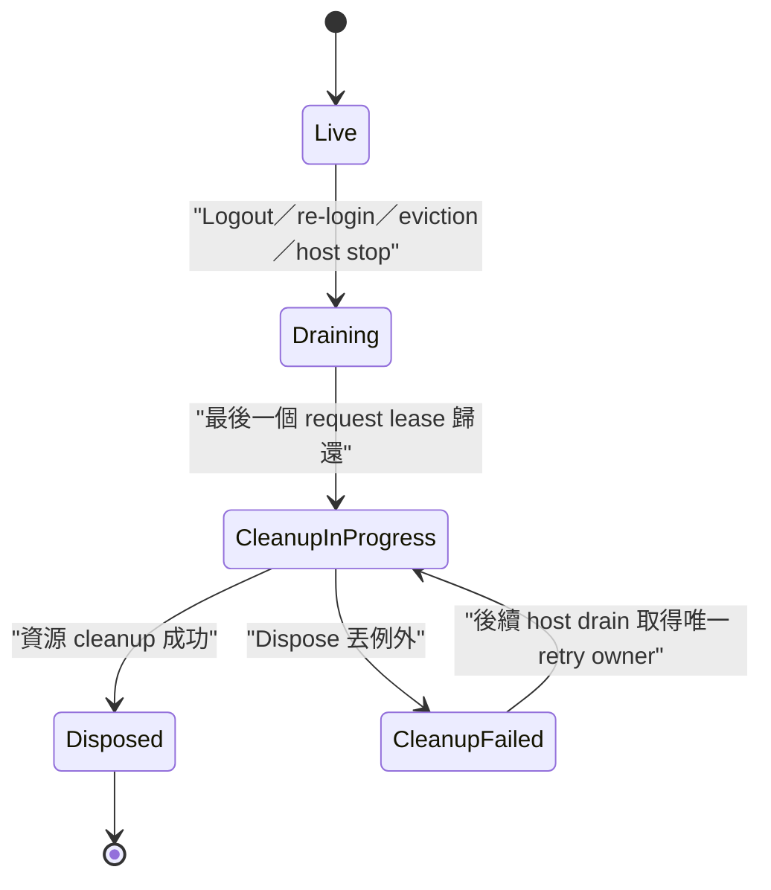
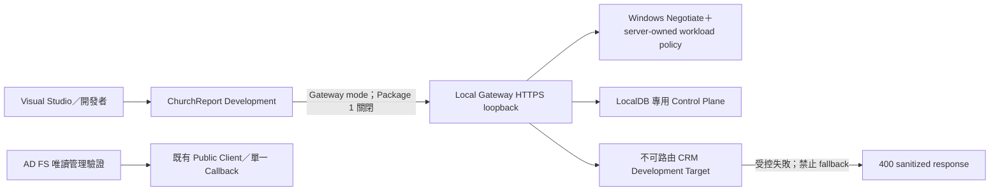
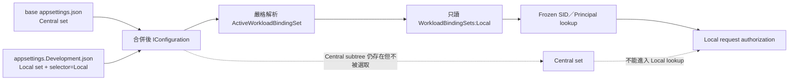
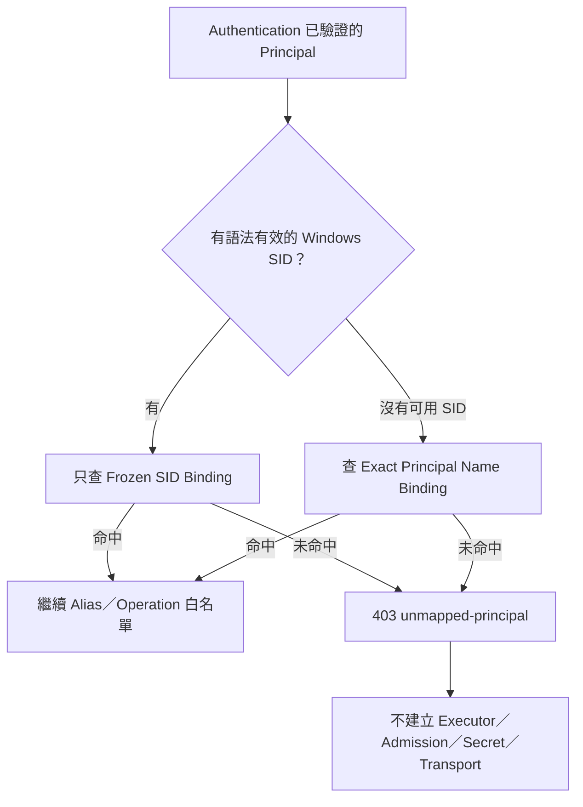

# Dynamics Gateway Central／Local 與 D365 8.2／9.1 設計解釋說明書

> 文件日期：2026-07-29  
> 文件性質：架構理念、討論紀錄、設計決策與後續驗證說明  
> 對應正式 SPEC：`.trellis/spec/backend/dynamics-gateway-hosting-version-routing.md`

可開啟的彩色互動圖：`docs/dynamics-gateway-central-local-82-91-architecture.html`

本說明書已把本次討論的完整脈絡整理進來，包含：

- 舊 CRM SDK 是否真的比新 Web API／`ServiceClient` 差。
- 為什麼不能只用「新舊」或「有沒有 SDK」判斷方案好壞。
- Repository 內 Data8 `PowerPlatform.Dataverse.Client` 與 Microsoft 官方套件的差異。
- 官方 NuGet 仍然是網路下載時，如何做到來源正規、版本可控與可稽核。
- 依目前 ASP.NET Core／.NET 10、D365 8.2 IFD 與 D365 9.1 的建議選項。
- Central Gateway、Local Gateway、Embedded 的用途與取捨。
- 每一個產品 JSON、Gateway Profile 設定及中央設定各自負責什麼。
- Connection Pool 是中央共用、Local 個別持有，還是兩者混合。
- Phase 4、Phase 5、Phase 6 是否需要推翻重做。
- `PowerPlatform.Dataverse.Client.csproj` 現在應保留或刪除，以及最終移除條件。

## 1. 先講最後結論

目前建議採用以下方向：

1. 正式環境以 **Central Gateway** 為預設。
2. Visual Studio 開發與個別隔離環境先使用 **Local Gateway**。
3. Central Gateway 與 Local Gateway 使用相同的 ProductClient、REST Contract、Operation Registry 與 Adapter 介面。
4. D365 8.2 與 D365 9.1 對產品提供相同呼叫方式，但 Gateway 內部必須使用不同 Profile Runtime、驗證狀態與 Transport Adapter。
5. D365 9.1 優先使用 Microsoft 官方 Web API，或在 OAuth 適用時使用官方 `ServiceClient`。
6. D365 8.2 目前先保留 Data8 `OnPremiseClient`，因為現場可工作的 IFD 路徑仍是 WS-Trust／SOAP。
7. Data8 只能作為暫時 Legacy 相容橋接，不能成為 Central／Local Gateway 的永久核心。
8. D365 8.2 的正式替代目標是：
   - ADFS OAuth 打通後使用 Web API v8.2；或
   - 使用獨立 .NET Framework 4.8 Worker 搭配 Microsoft 官方 `CrmServiceClient`。
9. Embedded 不立即刪除，也不繼續擴大；先保留，等 Local Gateway 與 8.2／9.1 驗證完成後再決定。
10. `PowerPlatform.Dataverse.Client` 專案現在不能刪，未來符合移除 Gate 後可以刪除。

最重要的核心觀念是：

> 我們要追求的是「所有產品共用相同的 Dynamics 呼叫契約」，而不是強迫 D365 8.2 與 9.1 共用同一個 SDK、同一條連線或同一個 Session。

## 2. 完整設計總覽



## 3. 我們的討論是怎麼演進到現在這個方案

### 3.1 最初的方向：完全不能使用舊 CRM SDK

最初的限制是「不得參考舊版 CRM SDK 套件、組件或命名空間」。因此第一版目標偏向完全使用 Dynamics Web API、`HttpClient` 與 OData，並逐步移除：

- `Microsoft.Xrm.*`
- `Microsoft.CrmSdk.*`
- `Microsoft.Crm.Sdk.*`
- `IOrganizationService`
- WCF／SOAP／WS-Trust
- Repository 內從 GitHub 取得的 Data8 `PowerPlatform.Dataverse.Client`

這個方向的優點是 Framework 相依較少、HTTP 行為透明、比較容易支援 .NET 10，也比較不會把舊 SDK DLL 分散到每一個產品。

### 3.2 對「新的一定比舊的好」產生疑問

接著討論到：舊 CRM SDK 的語法已經很熟悉，新 Web API 需要重新學習，而且把既有 CRUD、QueryExpression、FetchXML、OrganizationRequest 全部改寫，確實有學習與遷移成本。

因此設計不再用「新的一定比較好」作為理由，而改成看以下實際條件：

- 是否為 Microsoft 官方支援管道。
- 是否能在 .NET 10 產品環境可靠運作。
- 是否能集中管理多產品連線、驗證、Pool 與錯誤處理。
- 是否能避免每一個產品各自保存密碼與 SDK 相依。
- 是否能同時支援實際存在的 D365 8.2 與 9.1。

### 3.3 對「網路下載的 PowerPlatform.Dataverse.Client」的疑慮

Repository 內的：

```text
PowerPlatform.Dataverse.Client/PowerPlatform.Dataverse.Client.csproj
```

並不是 Microsoft 官方 `Microsoft.PowerPlatform.Dataverse.Client` 的原始碼，而是 Data8 的第三方 WS-Trust 相容實作。它：

- 以 .NET 10 建置。
- 提供 `OnPremiseClient`。
- 實作 `IOrganizationService`。
- 內部使用 WCF、SOAP 與 WS-Trust。
- 參考 Microsoft 官方 Dataverse Client 套件。
- README 明確表示不受 Microsoft 或 Data8 正式支援，只提供 best-effort 支援。

問題不在於「從網路下載就一定不好」。Microsoft 官方 NuGet 套件也是透過網路下載。真正需要考慮的是：

- 維護者是誰。
- 有沒有正式支援承諾。
- 資安更新與 Framework 升級由誰負責。
- 發生 WCF、ADFS、Socket 或 Authentication 問題時由誰排除。
- 是否存在可被 Microsoft 官方元件取代的路徑。

所以 Data8 可以暫時使用，但不適合成為十個產品共同依賴的永久核心。

### 3.4 設計目標改成「官方優先」，不再要求「完全不能用 SDK」

後續決定不再把「有沒有 SDK」當成唯一標準，而改成：

1. 優先使用 Microsoft 官方介面或官方 NuGet 套件。
2. 產品不直接依賴 SDK。
3. SDK 即使需要存在，也只能藏在 Gateway 或隔離 Worker 後面。
4. 多產品共用統一的 ProductClient 與 REST Contract。
5. 未來替換內部 Transport 時，不需要修改 ChurchReport 或其他產品的業務程式。

這是目前設計最重要的轉折。

### 3.5 Central Gateway 成為終極目標

由於現有產品可能從四、五個增加到十個以上，最終希望做到：

- 統一 Profile 設定。
- 統一 Secret Reference。
- 統一 Authentication。
- 統一 Connection Runtime／Pool。
- 統一 Retry、Timeout、Circuit Breaker、Health、Audit 與 Telemetry。
- 統一控制對同一個 D365 Organization 的總併發量。

因此 Central Gateway 適合正式環境。產品不直接連 CRM，而是呼叫中央 Gateway。

### 3.6 產品 JSON 與執行方式的討論

每一個產品仍保有自己的 `appsettings.json`，但產品 JSON 的責任要很小：

- 選擇 `ExecutionMode`。
- 指定 `ProfileAlias`。
- 指定 Gateway Endpoint。

產品 JSON 不應保存：

- CRM 密碼。
- Access Token／Refresh Token。
- Client Secret。
- Certificate Private Key。
- 原始 CRM Organization Service URL。
- CRM SDK DLL 位置。
- 任意 Transport 種類。

Central 與 Local 目前不是兩個新的 `DynamicsExecutionMode` enum 值。現有程式契約仍是：

```text
Gateway
Embedded
```

Central／Local 都屬於 `Gateway` 模式，差異在 Endpoint：

- Central：`https://dynamics-gateway.internal/`
- Local：目前專案為 `https://localhost:7244/`；日後若啟動設定變更，以 `SpeechMessage.Dynamics.Gateway/Properties/launchSettings.json` 為準。

這樣可以避免為部署位置增加不必要的程式分支。

### 3.7 Embedded 與 Local Gateway 的討論

Embedded 是把 Dynamics Runtime 直接放入 ChurchReport 等產品 Process。

Local Gateway 則是：

- ChurchReport 是一個 Process。
- Dynamics Gateway 是另一個 Process。
- ChurchReport 透過 localhost HTTP 呼叫 Gateway。

Local Gateway 對目前需求比較適合，因為在 Visual Studio 2026 可以設定 Multiple Startup Projects，同時啟動 ChurchReport 與 Gateway，又能保留：

- 獨立 Console。
- 獨立 Health／Ready Endpoint。
- 獨立 Connection Pool。
- 獨立 SDK／WCF 相依。
- 獨立 Crash 與 Process Recycling 邊界。

因此目前決策是 Local Gateway 優先；Embedded 保留但暫緩。

### 3.8 D365 8.2 讓設計不能只看 Web API 理論

D365 CE 8.2 有 `/api/data/v8.2/` Web API，理論上 .NET 10 可直接使用 `HttpClient` 呼叫，不需要 Data8 或特定 SDK Assembly。

但是目前實際 IFD 環境的結果是：

| 測試路徑 | 結果 |
| --- | --- |
| SOAP／WS-Trust | 可以工作 |
| Web API＋Windows NTLM | 被 IFD 導向，不能直接使用 |
| OAuth Password Grant | ADFS 回覆 `unsupported_grant_type` |
| OAuth Authorization Code | OAuth Client／Redirect URI 尚未註冊 |
| Refresh Token | 尚無可用 Token 路徑 |

所以「8.2 Web API 存在」不等於「目前 8.2 Web API 已可供正式程式使用」。

目前 Data8 暫時必要的原因，是現場 Authentication 條件，而不是 D365 8.2 天生一定依賴 Data8。

### 3.9 加回 Central Gateway 後的完整設計

現在的完整設計不是只選 Local，也不是只選 Central：

- **Central Gateway**：正式環境的共用部署。
- **Local Gateway**：VS 開發、整合測試或個別隔離部署。
- **Embedded**：保留但暫緩。

三者不是三套不同的業務 API。Central 與 Local 共用同一套 Gateway REST Contract；未來如果 Embedded 繼續發展，也必須實作相同 `IDynamicsOperationExecutor` 行為。

## 4. Central Gateway 到底集中什麼

Central Gateway 集中的不是「一個萬用 CRM Connection」。它集中的是管理責任：

- Product Workload Authentication。
- Product／Profile／Operation Authorization。
- Profile Registry。
- Secret Reference Resolution。
- Operation Registry。
- Retry／Timeout／Backpressure。
- Audit／Telemetry／Health。
- Profile Runtime Generation。
- Aggregate Organization Admission。

在 Central Gateway 內，仍然必須有不同 Runtime：

```text
crm82 generation N
crm91 generation M
```

兩者不能共用：

- 可變的 `IOrganizationService`。
- WCF Channel。
- Access Token／Refresh Token Cache。
- Credential Object。
- Metadata Cache（除非有明確版本與 Organization Key）。
- SDK DLL Loading Context。
- Session 或使用者狀態。

## 5. Local Gateway 到底是不是「個別式」

是。Local Gateway 的實體 Process 與實體 Pool 是個別式的。

例如：

```text
ChurchReport -> ChurchReport Local Gateway -> Local Pool
產品 B       -> 產品 B Local Gateway       -> Local Pool
產品 C       -> 產品 C Local Gateway       -> Local Pool
```

但是 Local Gateway 不能把「個別 Pool」理解成「各自可以無限制連線」。如果三個 Local Gateway 都連到同一個實體 D365 Organization，它們仍然要共用同一個 Organization Admission Budget。

因此設計上區分兩件事：

| 項目 | 是否共用 |
| --- | --- |
| HttpClient／Socket Pool | 不共用，屬於 Process |
| WCF／SDK Client Pool | 不共用，屬於 Process／Worker |
| Token／Credential State | 不跨 Profile／Process 共用 |
| 同一個 CRM 的總併發上限 | 必須共用或協調 |
| Operation Registry／REST Contract | 必須一致 |

## 6. D365 9.1 的設計

### 6.1 建議路徑

```text
產品
  -> Central 或 Local Gateway
  -> crm91 Profile Runtime
  -> Direct Web API v9.1 或 Microsoft ServiceClient
  -> D365 CE 9.1
```

優先順序：

1. Direct Web API v9.1。
2. Microsoft 官方 `Microsoft.PowerPlatform.Dataverse.Client.ServiceClient`，前提是目標的 OAuth／Authentication 模式通過實機驗證。

D365 9.1 不需要 Data8 作為必要基礎。

### 6.2 為什麼仍要透過 Gateway

即使使用官方 `ServiceClient`，也不建議每一個產品直接參考，因為 Gateway 還負責：

- Secret 不進入產品。
- 統一 Token Cache。
- 統一 Pool 與 Dispose。
- 統一 Operation Allowlist。
- 統一 Audit 與錯誤格式。
- 未來替換 ServiceClient／Web API 時產品不變。

## 7. D365 8.2 的設計

### 7.1 目前狀態

目前工作路徑：

```text
ChurchReport
  -> ToolUtility
  -> Data8 OnPremiseClient
  -> WS-Trust／SOAP
  -> D365 CE 8.2 IFD
```

現在直接刪除 Data8 會造成：

- `ToolUtility.csproj` ProjectReference 失效。
- `CrmConnectionService.CreateOnPremiseClient` 無法建置。
- 現有 8.2 工作路徑中斷。

### 7.2 第一階段目標

先把產品與 Data8 解耦：

```text
ChurchReport
  -> Gateway REST Contract
  -> crm82 Legacy Adapter
  -> Data8 Legacy Worker
  -> D365 8.2
```

Data8 最好放入可回收的獨立 Worker Process，不應直接成為 Central Gateway 的永久長生命週期 Pool Client。

原因是目前 `OnPremiseClient` 沒有實作 `IDisposable`，既有 Pool 的：

```csharp
(connection?.Service as IDisposable)?.Dispose();
```

無法證明 Data8 內部 WCF Channel／ChannelFactory 已被 `Close` 或 `Abort`。這是 Socket、Handle 與長時間資源保留風險，必須視為正式發布阻擋條件。

### 7.3 最終替代方案 A：Web API v8.2

必須先完成：

- ADFS OAuth Client Registration。
- Redirect URI。
- 適合服務工作負載的 Token Flow。
- Token Renewal／Restart。
- 8.2 Web API Capability Matrix。
- 實際 CRUD、FetchXML、Actions、Functions、Paging 驗證。

不能因為 `/api/data/v8.2/` 可以回應，就認定所有舊 SDK 呼叫都可以搬過去。D365 8.2 Web API 對部分 Action／Return Type 有已知限制。

### 7.4 最終替代方案 B：Microsoft 官方 Legacy Worker

建立獨立 .NET Framework 4.8 Process：

```text
Gateway .NET 10
  -> IPC／localhost HTTP
  -> Legacy Worker .NET Framework 4.8
  -> Microsoft CrmServiceClient
  -> D365 8.2 IFD
```

好處是：

- 產品仍然是 .NET 10。
- Gateway 仍然是 .NET 10。
- 舊 Framework SDK 被隔離在另一個 Process。
- 使用 Microsoft 官方 XrmTooling／CrmServiceClient。
- Worker 可以獨立鎖 SDK 版本與重新啟動。

## 8. 8.2 與 9.1 要不要共用同一個 Worker

初期不要。

建議：

```text
LegacyWorker82 -> 鎖定經 8.2 實機驗證的 SDK／Authentication
LegacyWorker91 -> 只有真的需要 Legacy SDK 時才建立，鎖定 9.1 版本
```

原因：

- `Microsoft.Xrm.Sdk.dll`／`Microsoft.Crm.Sdk.Proxy.dll` 版本可能不同。
- 同一個 .NET Framework Process 可能遇到 Assembly Binding Redirect。
- 8.2 IFD WS-Trust 與 9.1 OAuth／IFD 狀態不同。
- Channel、Token、Credential 與 Metadata 不應混用。
- 最新 9.1 SDK 能否完整支援實際 8.2 Server，必須用實機測試證明，不能只靠套件描述推論。

實機驗證證明可以共用後，才考慮合併，不要一開始就把合併當成前提。

## 9. Product JSON 應該怎麼寫

### 9.1 Central Gateway

```json
{
  "DynamicsAccess": {
    "ExecutionMode": "Gateway",
    "ProfileAlias": "crm82",
    "Gateway": {
      "Endpoint": "https://dynamics-gateway.internal/",
      "ApiPrefix": "/v1"
    }
  }
}
```

### 9.2 Local Gateway

```json
{
  "DynamicsAccess": {
    "ExecutionMode": "Gateway",
    "ProfileAlias": "crm91",
    "Gateway": {
      "Endpoint": "https://localhost:7244/",
      "ApiPrefix": "/v1"
    }
  }
}
```

上例的 `7244` 是目前工作區 `SpeechMessage.Dynamics.Gateway/Properties/launchSettings.json` 所設定的 HTTPS 埠。這個埠號不是 Gateway REST Contract 的固定部分；若日後啟動設定或部署綁定位址改變，產品 JSON 必須跟著使用該環境實際核准的 Endpoint。

### 9.3 為什麼不是 `CentralGateway`／`LocalGateway`

因為目前程式中的 `DynamicsExecutionMode` 是：

```csharp
Gateway = 0,
Embedded = 1
```

Central 與 Local 是 Gateway 的部署拓撲，不需要改變產品業務程式。Endpoint 已經可以表達呼叫中央服務或 localhost。

如果未來真的要加入新的 enum，必須另外修改：

- Strongly Typed Options。
- Validation。
- DI Registration。
- JSON Schema。
- 測試與 Migration。

目前沒有必要增加這個複雜度。

## 10. Embedded 的最後決定是什麼

Embedded 現在：

- 不刪除。
- 不作為目前開發預設。
- 不繼續擴大產品使用範圍。
- 不視為正式 8.2 相容方案。
- 保留程式與研究成果。

等以下條件完成後再決定：

1. Local Gateway 在 ChurchReport 開發流程可正常使用。
2. Central／Local REST Contract 一致。
3. 8.2 與 9.1 實機驗證完成。
4. Aggregate Admission 能涵蓋所有 Runtime Host。
5. Secret／Token／Credential 隔離通過。
6. Runtime Drain／Dispose／Socket／Handle Soak 通過。

之後可以選擇：

- 繼續發展 Embedded，作為非常特殊的零 HTTP Hop 部署。
- 保留但不提供正式支援。
- 確認沒有用途後移除。

## 11. Phase 4、Phase 5 是否會受到影響

目前改變方向仍不算太晚，因為已建立的重要基礎仍可以沿用：

- `IDynamicsOperationExecutor` 抽象。
- Operation Registry。
- ProductClient。
- Gateway HTTP Contract。
- Profile Runtime／Generation 概念。
- Organization Admission／Host Lease。
- Isolation／Lifecycle／Soak Tests。
- 8.2／9.1 Capability Matrix。

需要調整的是 Transport 與 Hosting 決策，不是把 Phase 4、Phase 5 全部推翻。

應避免的作法是讓既有 Phase 4／5 直接把 Data8 或 SDK Client 滲透進產品業務碼。只要產品仍依賴 ProductClient／Gateway Contract，內部 Adapter 可以更換。

## 12. Connection Pool 在這個架構中的真正意思

### 12.1 Central Gateway Pool

中央 Gateway 內可能有：

```text
crm82 generation 7 runtime
crm91 generation 3 runtime
```

每一個 Runtime 擁有自己的：

- Http Handler／HttpClient；或
- Worker Proxy；或
- SDK Client；
- Token／Authentication State；
- Metadata Cache；
- Retry／Health State；
- Cancellation／Timer；
- Dispose／Drain 邊界。

### 12.2 Local Gateway Pool

每一個 Local Gateway 有自己的 Process-local Runtime。它不與 Central Gateway 共用記憶體中的 Pool，也不與另一個 Local Gateway 共用物件。

### 12.3 什麼必須跨 Host 協調

同一實體 D365 Organization 的：

- 最大同時 Outbound Requests。
- 最大 Runtime Host 數。
- Queue Capacity。
- Retry Budget。
- Rollout／Blue-Green Capacity。

必須透過 Organization Admission Plan 協調。否則五個 Local Gateway 各認為自己可以開十條連線，實際上可能同時送出五十個工作，反而失去集中管理的意義。

## 13. Data8 專案什麼時候才能刪

以下條件全部完成前不能刪除：

1. `ToolUtility` 不再 `ProjectReference` Data8 專案。
2. 所有產品不再直接呼叫 `CreateOnPremiseClient`。
3. 程式碼中不再建立 `OnPremiseClient`。
4. ChurchReport 與其他產品全部改走 ProductClient／Gateway。
5. D365 8.2 有通過實機測試的替代 Adapter。
6. D365 9.1 路徑不依賴 Data8。
7. 8.2 替代路徑完成：
   - WhoAmI／Identity Probe。
   - CRUD。
   - Query／FetchXML。
   - Paging。
   - 實際 Actions／OrganizationRequest。
   - Authentication Renewal／Reconnect。
   - Gateway／Worker Restart。
   - Long-running Socket／Handle／Memory Soak。
8. 有可驗證的 Rollback／Feature Flag。
9. Solution、Project、Package、Source 掃描沒有剩餘 Data8 相依。
10. 刪除後完整 Build、Tests、8.2／9.1 Smoke Test 全部通過。

## 14. 失敗時應該怎麼處理

### 14.1 Central Gateway 失效

- 正式產品應回報 Gateway unavailable／NotReady。
- 不可在產品內偷偷改成直接連 CRM。
- 不可自動切換 Data8 或另一個 Profile。
- 由部署層做 Gateway HA、Restart 或 Rollback。

### 14.2 Local Gateway 沒有啟動

- ChurchReport 開發環境顯示明確的 localhost Gateway 連線錯誤。
- Visual Studio Multiple Startup Projects 應同時啟動兩個 Process。
- 不可自動改走正式 Central Gateway，以免開發機誤用正式 CRM。

### 14.3 8.2 Web API OAuth 失敗

- `crm82-webapi` Profile 保持 NotReady。
- 不在同一個請求中偷偷改走 WS-Trust。
- 由部署設定明確選擇暫時 Legacy Profile／Transport。

### 14.4 Worker Crash

- Gateway 偵測 Worker 不健康。
- 停止新請求。
- 正在執行的工作依 Deadline 失敗或取消。
- Worker 可以依政策重新啟動。
- 不得無限重試非冪等寫入。

## 15. 建議實施順序

### 第一階段：固定產品邊界

- ChurchReport 只依賴 ProductClient／Gateway Contract。
- 不再新增任何直接 CRM SDK／Data8 呼叫。
- `ExecutionMode=Gateway` 可透過 Endpoint 選 Central 或 Local。

### 第二階段：Local Gateway 優先

- VS 2026 同時啟動 ChurchReport 與 Local Gateway。
- 驗證 Health、Ready、Authentication、Profile、Pool 與 Error Handling。
- 先跑 9.1 正式路徑。
- 8.2 暫時透過隔離 Legacy Worker。

### 第三階段：Central Gateway

- 多產品改指向中央 Endpoint。
- 集中 Profile、Secret、Policy、Audit、Telemetry。
- 驗證不同產品公平排程與同一 CRM 的總併發限制。

### 第四階段：8.2 官方替代

- 完成 ADFS OAuth PoC；或
- 完成 Microsoft `CrmServiceClient` net48 Worker。
- 與 Data8 路徑做結果、效能與穩定性比對。

### 第五階段：移除 Data8

- 所有移除 Gate 通過。
- 先停用與觀察，再刪除 ProjectReference／Solution Entry／Source。

### 第六階段：重新評估 Embedded

- 有明確效益才繼續。
- 如果 Local Gateway 已滿足 VS 開發與部署需求，Embedded 可以保持停用或移除。

## 16. 常見問題

### Q1：Central Gateway 和 Local Gateway 是不是兩套程式？

建議是同一個 Gateway Host 程式與同一套 Adapter Contract，用不同部署設定啟動。Central 是共用部署；Local 是產品旁邊的獨立 Process。

### Q2：Local Gateway 能不能使用 Central 的設定？

可以使用相同的 Profile Definition／Manifest 模型，但 Local Process 仍要建立自己的實體 Pool。Secret 必須由核准的 Secret Provider 解析，不能直接複製到產品 JSON。

### Q3：產品可以執行中切換 8.2／9.1 嗎？

一般使用者請求不能任意切換。產品與部署設定指定允許的 `ProfileAlias`；Gateway 由授權政策決定該 Workload 能否使用該 Profile。設定變更需要 replace-and-drain。

### Q4：8.2 與 9.1 可以有相同的業務呼叫語法嗎？

可以。產品呼叫相同的 Operation ID 與 Typed Parameters。Gateway 內部不同 Adapter 負責轉換。但只有在 Capability Matrix 證明兩個版本都支援時，該 Operation 才能同時啟用。

### Q5：為什麼不直接讓 ChurchReport 參考 Microsoft 官方 ServiceClient？

因為這仍會把 Authentication、Token、Pool、Retry、SDK 更新與 Secret 放回產品。Gateway 邊界的價值是把這些責任集中，而不是單純把第三方 SDK 換成官方 SDK。

### Q6：Data8 現在是不是不安全？

不能直接下結論說它一定不安全；目前它是可以工作的第三方相容實作。但它缺乏正式支援，且現有 `OnPremiseClient` 的 WCF 生命週期沒有被既有 Pool 的 `IDisposable` 路徑完整覆蓋。因此不適合在沒有額外生命週期保護與 Soak Test 的情況下成為永久長生命週期 Pool。

### Q7：現在改設計會不會讓前面工作浪費？

不會。只要保留 ProductClient、Gateway Contract、Operation Registry、Profile Runtime 與 Admission 等邊界，前面的工作仍是基礎。改變的是內部 Transport 與 Hosting 優先順序。

## 17. 最終決策表

| 項目 | 現在決策 | 未來條件 |
| --- | --- | --- |
| Central Gateway | 正式環境預設 | 完成多產品部署與 HA 驗證 |
| Local Gateway | 目前優先實作／驗證 | 作為 VS 與隔離部署正式選項 |
| Embedded | 保留、暫緩 | Local 與實機 Gate 後再決定 |
| D365 9.1 | Web API／官方 ServiceClient | 依實際 Authentication 選定 |
| D365 8.2 | Data8 暫留 | 改 Web API OAuth 或官方 net48 Worker |
| Data8 專案 | 現在不能刪 | 全部移除 Gate 通過後刪除 |
| 8.2／9.1 Worker | 初期分開鎖版本 | 實機證明相容後才能合併 |
| 產品 JSON | Gateway＋Alias＋Endpoint | 不允許 Secret／CRM URL／Transport |
| Connection Pool | Central 或 Local Process 內分 Profile | 同一 CRM 總容量跨 Host 協調 |

## 18. 本次討論逐題決策紀錄

本章依照實際討論順序，把每一個問題、判斷理由與最後決策放在一起。前面章節偏向「設計是什麼」，本章偏向「為什麼最後這樣決定」。

### 18.1 「不得參考舊版 CRM SDK」時，原先呼叫要改成什麼

舊程式常見的呼叫方式包括：

- `IOrganizationService.Create`／`Update`／`Delete`／`Retrieve`／`RetrieveMultiple`。
- `QueryExpression`、`ColumnSet`、`Entity`、`EntityReference`。
- `OrganizationRequest`、`ExecuteMultipleRequest`、`AssignRequest`、`SetStateRequest`。
- `OrganizationServiceProxy`、`CrmServiceClient`、WCF／SOAP／WS-Trust。

如果完全不使用 SDK，對應做法是透過 Microsoft 官方 Dynamics Web API，以 HTTPS、OData v4 與 JSON 呼叫：

| 舊 SDK 概念 | Web API 對應概念 |
| --- | --- |
| `Create(Entity)` | `POST /api/data/vX.X/{entityset}` |
| `Retrieve`／`RetrieveMultiple` | `GET`＋`$select`／`$filter`／`$expand` |
| `Update(Entity)` | `PATCH /api/data/vX.X/{entityset}({id})` |
| `Delete` | `DELETE /api/data/vX.X/{entityset}({id})` |
| `QueryExpression` | 受控 OData Query 或 Gateway 內固定 FetchXML Template |
| `OrganizationRequest` | 對應的 Web API Action／Function／Batch |
| `IOrganizationService` | 產品端的 Typed ProductClient／`IDynamicsOperationExecutor` |

但目前最後方案不是要求所有人立刻把熟悉的 SDK 語法全部手工改成 OData。產品端改成呼叫穩定的 ProductClient／Gateway Contract，Gateway 內部再依 8.2 或 9.1 選擇 Web API、Microsoft 官方 SDK Adapter 或暫時 Legacy Worker。

### 18.2 舊方式真的比較差嗎

不是。舊方式有實際優點：

- 團隊熟悉，開發速度快。
- `Entity`、`QueryExpression`、`OrganizationRequest` 等型別已把很多底層細節包裝好。
- 對舊版 D365 On-Premises、IFD、WS-Trust 的相容經驗較完整。
- 現有大量產品程式已經驗證過，直接重寫有回歸風險。

它的問題主要不是語法，而是放在目前多產品與 .NET 10 架構中的責任分散：

- 每個產品都可能持有 SDK、帳密、Token、Retry 與 Pool。
- 8.2、9.1 的 SDK／Authentication／Assembly Binding 可能互相衝突。
- 舊 .NET Framework 或 WCF 相依不一定適合直接載入 .NET 10 產品 Process。
- SDK 更新、資安修補、連線回收與問題排查會散落在四到十個產品。
- 很難證明跨產品沒有 Session、Credential、Token、Cache 或 Connection Leakage。

所以本設計不把舊 SDK 判定為「不好」，而是把它視為需要隔離與集中治理的 Transport 實作。

### 18.3 新方式有什麼好處，為什麼值得改

新架構的好處不在於把一行 SDK 語法換成一行 HTTP，而在於責任邊界：

| 改變 | 實際好處 |
| --- | --- |
| 產品只依賴 ProductClient／REST Contract | 產品不用理解 8.2、9.1、SOAP、OData、SDK 版本與 Token 細節。 |
| Central Gateway 集中正式環境 | Secret、Authentication、Pool、Retry、Audit、Health 與版本更新只治理一個邊界。 |
| Local Gateway 使用同一契約 | VS 開發方便，同時保有獨立 Process、Console、Health、Pool 與 Crash 邊界。 |
| 8.2／9.1 使用不同 Adapter | 不必為了表面統一而混用 SDK、Token、WCF Channel 或 Metadata。 |
| Profile Generation＋replace-and-drain | 設定或密碼更換時不原地污染正在使用的 Runtime。 |
| Organization Admission | Central、Local、未來 Embedded 對同一 CRM 的總併發不會被重複放大。 |
| Transport 可替換 | Data8、官方 Worker、Web API 或 `ServiceClient` 的替換不需要重寫產品業務流程。 |

需要承認的成本則包括 Gateway 網路 Hop、部署與監控工作，以及 ProductClient Contract 的設計成本。是否值得，取決於產品數量與治理需求；對目前四到十個產品、同時支援 8.2／9.1 的環境，收益大於成本。

### 18.4 「從網路下載」和「Microsoft 官方」要怎麼區分

不能只用「是不是從網路下載」判斷品質，因為 Microsoft 官方 NuGet 套件本身也是從套件來源下載。真正的差異是來源、維護與供應鏈治理：

| 類型 | 例子 | 判斷 |
| --- | --- | --- |
| Microsoft 官方文件／Web API | Microsoft Learn 所定義的 D365 Web API | 官方支援介面，仍需依實際 CE 版本與 Authentication 驗證。 |
| Microsoft 官方 NuGet | `Microsoft.PowerPlatform.Dataverse.Client`、`Microsoft.CrmSdk.XrmTooling.CoreAssembly` | 可採用，但要鎖版本、保留 Package Lock、掃描弱點並做實機測試。 |
| Repository 內第三方原始碼 | Data8 `PowerPlatform.Dataverse.Client.csproj` | 可作暫時相容橋接，但支援、生命週期與修補責任落在本專案。 |
| 未知網站下載 DLL／Source | 無可信發行者、版本與雜湊 | 不應作為正式依賴。 |

特別注意：Repository 內名稱為 `PowerPlatform.Dataverse.Client` 的 Data8 專案，與 Microsoft 官方 NuGet 套件 `Microsoft.PowerPlatform.Dataverse.Client` 不是同一個來源；不能因為名稱接近，就把本機第三方專案視為 Microsoft 官方原始碼。

如果正式建置環境不允許直接連 Internet，正規做法不是把第三方原始碼複製進 Repository，而是：

1. 只允許核准的 Microsoft／NuGet.org 套件來源。
2. 由公司內部 NuGet Feed／Artifact Proxy 鏡像核准套件。
3. 固定 Package Version 與 Lock File。
4. 保存套件雜湊、SBOM、License 與弱點掃描結果。
5. 升版先在 8.2／9.1 測試環境驗證，再進正式環境。

因此「官方管道」和「完全不經網路」不是同一件事。真正正規的目標是可信來源、可重現建置、版本受控、能追蹤安全更新，而不是來源檔案永遠不經過網路。

### 18.5 依目前程式環境，官方選項選哪個

目前環境是 ASP.NET Core／.NET 10 產品、同時連接 D365 CE 8.2 IFD 與 D365 CE 9.1，且團隊已熟悉舊 CRM SDK。因此建議不是只選一個全域 SDK，而是按版本分流：

| 目標 | 建議 |
| --- | --- |
| 產品 A～10 | 一律呼叫 Gateway ProductClient，不直接參考任何 CRM SDK。 |
| D365 9.1 | 優先 Direct Web API v9.1；若實際 OAuth／IFD 驗證適合，Gateway 內可使用 Microsoft 官方 `ServiceClient`。 |
| D365 8.2 | 目前保留 Data8 路徑維持服務；正式替代優先驗證 Web API v8.2 OAuth，或採用獨立 net48 Worker＋Microsoft 官方 `CrmServiceClient`。 |
| VS 開發 | 先使用 Local Gateway，與 ChurchReport 設為 Multiple Startup Projects。 |
| 正式多產品部署 | 使用 Central Gateway。 |
| Embedded | 保留程式，但暫緩擴大與正式化。 |

一句話建議是：

> 在目前 .NET 10、D365 8.2 IFD 與 D365 9.1 並存的環境中，產品端統一使用 Gateway Contract；9.1 優先 Web API／官方 `ServiceClient`，8.2 暫時隔離 Data8 並以官方 net48 `CrmServiceClient` Worker 或已驗證的 Web API 作為替代目標。

### 18.6 SDK 到底是不是重要方向

「一定要有 SDK」與「一定不能有 SDK」都不應成為最高層設計目標。真正重要的是：

- 是否為 Microsoft 支援或經核准的相容路徑。
- 是否能對實際 8.2／9.1 Server 通過功能與 Authentication 驗證。
- 是否不讓 SDK 型別與版本散入產品業務碼。
- 是否能確定 Token、Credential、WCF Channel、Socket、Timer 與 Cache 有明確擁有者及回收路徑。
- 是否能讓未來 Transport 替換時，產品端不必重新改寫。

因此 SDK 可以存在，但它的位置必須在 Gateway Adapter 或獨立 Worker 內，而不是成為所有產品共同直接依賴的公開程式介面。

### 18.7 Central Gateway、Local Gateway 與 Embedded 的完整差異

| 比較項目 | Central Gateway | Local Gateway | Embedded |
| --- | --- | --- | --- |
| 執行位置 | 內部中央服務／多 Replica | 產品旁邊的獨立 localhost Process | 產品 Process 內 |
| 產品模式 | `ExecutionMode=Gateway` | `ExecutionMode=Gateway` | `ExecutionMode=Embedded` |
| 選擇方式 | Gateway Endpoint 指向中央網址 | Gateway Endpoint 指向 localhost | 啟用 Embedded Branch |
| REST Hop | 有內部網路 Hop | 有 localhost Hop | 無 HTTP Hop，或使用同 Process Adapter |
| 實體 Pool | 中央 Process 內按 Profile／Generation | 每個 Local Process 自己持有 | 每個產品 Process 自己持有 |
| SDK／WCF 隔離 | 可藏在 Gateway／Worker | 可藏在 Local Gateway／Worker | 會進入產品生命週期，隔離最弱 |
| Crash 影響 | Gateway Profile／Replica 範圍 | Local Gateway 範圍 | 可能影響產品本身 |
| VS 觀察性 | 需連遠端或另外啟動 | 最方便，可同時看兩個 Console | 單 Process Debug 最直接 |
| 正式環境建議 | 預設 | 特殊隔離部署才使用 | 目前不建議 |
| 現在決策 | 正式終極目標 | 第一個要完成的實作／驗證 | 保留、暫緩 |

目前只需要先把 Local Gateway 做好，不必立即刪除 Embedded。等 Local Gateway 已能滿足 VS 開發、除錯、效能與部署需求後，再根據實際證據決定 Embedded 是繼續、保持停用或移除。

### 18.8 每個產品的 JSON 與中央設定如何分工

建議分成兩個層級，不是把所有設定都放進每一個產品：



產品 JSON 各自存在，因為 ChurchReport、產品 B、產品 C 可能需要不同 Alias 或不同 Gateway Endpoint；但它只表達「我要透過哪個 Gateway、使用哪個被允許的邏輯 Profile」。

真正的 CRM URL、Authentication、Secret Reference、Transport、Pool 上限與 SDK／Worker 版本屬於 Gateway 部署設定或中央 Registry。Local Gateway 可以載入同一份 Profile Manifest 模型，但仍建立自己的 Process-local Runtime，且正式 Secret 不能複製進產品 JSON。

Central 與 Local 的切換是部署設定切換：更新 Endpoint，通過設定驗證，再重新啟動或 replace-and-drain。不可由登入使用者或單一 Request 隨時切換。

### 18.9 Connection Pool 是集中式還是個別式

答案是「實體連線池個別持有，治理與容量集中協調」：

```text
Central Gateway Process
  ├─ crm82 generation N pool／worker proxy
  └─ crm91 generation M HttpClient／ServiceClient runtime

ChurchReport Local Gateway Process
  ├─ crm82 local pool／worker proxy
  └─ crm91 local HttpClient／ServiceClient runtime

產品 B Local Gateway Process
  └─ 自己的 process-local pool

以上所有 Host 若指向同一實體 Organization
  └─ 共用同一 Organization Admission Budget
```

不能跨 Process 共用同一個 `HttpClient`、WCF Channel 或 SDK Client 物件；但也不能讓每個 Local Gateway 都把自己當成唯一使用者。中央協調的是最大 Host 數、最大併發、Queue、Retry 與 Rollout 容量，不是把所有 Socket 物件放進一個跨 Process Pool。

### 18.10 目前改變方向會不會太晚，Phase 4／5 怎麼辦

現在改不算太晚，也不需要推翻前面工作。應保留並繼續驗證：

- ProductClient 與 `IDynamicsOperationExecutor`。
- Gateway REST Contract。
- Operation Registry 與 Typed Parameters。
- Profile Runtime／Generation。
- Organization Admission／Host Lease。
- Isolation、Lifecycle、Soak、Fault、Performance Test。
- 8.2／9.1 Capability Matrix 與實機 Smoke Test。

調整後的階段定義是：

| Phase | 現在的工作 |
| --- | --- |
| Phase 4 | 驗證 Local／Central、8.2／9.1、Worker、隔離、回收、Soak 與效能；不因改方向而取消。 |
| Phase 5 | 產品逐步改走 Gateway Contract；先搬一個可回滾的 ChurchReport Use Case，再逐產品遷移。 |
| Phase 6 | 所有替代路徑與實機 Gate 通過後，移除 Data8、舊 SDK、WCF 與直接 ProjectReference。 |

真正要避免的是為了保留舊語法，把 Data8／`IOrganizationService` 再擴散到新的產品程式碼。相容性應封裝在 Adapter／Worker 內。

### 18.11 `PowerPlatform.Dataverse.Client.csproj` 現在要移除還是保留

目前要保留，理由不是 D365 8.2 天生需要這個專案，而是現在已知可工作的 8.2 IFD 路徑仍經過它，而且 `ToolUtility` 與既有程式仍有直接相依。現在刪除會造成建置或現場連線中斷。

本次討論所指的實際專案是：

```text
D:\音訊科技產品\系統平台\SpeechMessageProducts\.worktrees\1.0.0.3.Gateway&Embedded.Worktree\PowerPlatform.Dataverse.Client\PowerPlatform.Dataverse.Client.csproj
```

它在新架構中的定位必須降級為：

```text
TemporaryData8LegacyWorker
```

也就是暫時、受限制、可回收、可觀察，而且有明確退出條件的 Legacy 邊界。它不應再新增產品呼叫、不應成為 9.1 的共同底層，也不應直接放進長生命週期 Central Gateway Pool 而沒有 WCF Channel／Socket／Handle 回收證據。

### 18.12 完成後能不能刪除該專案

可以，而且最終目標仍是刪除，但「完成」必須具體定義。至少要同時滿足：

1. 所有產品已改走 ProductClient／Gateway Contract。
2. `ToolUtility` 與其他專案不再 `ProjectReference` 該 csproj。
3. Source 不再建立 Data8 `OnPremiseClient`。
4. D365 8.2 已有 Web API v8.2 或官方 net48 `CrmServiceClient` Worker 替代。
5. 替代路徑通過實際 8.2 的 WhoAmI、CRUD、Query／FetchXML、Paging、Action／Function／OrganizationRequest 驗證。
6. Authentication Renewal、Gateway／Worker Restart 與 Rollback 通過。
7. 長時間 Memory、Socket、Handle、Timer、Cancellation Registration Soak 回到基準，沒有持續成長。
8. D365 9.1 路徑完全不依賴 Data8。
9. Solution、Project、Package 與 Source 掃描沒有可達相依。
10. 刪除後 Release Build、全部 Tests、8.2／9.1 Smoke Test 都通過。

刪除順序應該是先讓所有呼叫不可達，再移除 ProjectReference，接著移除 Solution Entry，最後刪除或移出 buildable source；不要先刪資料夾再回頭修斷掉的產品。

### 18.13 Session Leakage、Memory Leakage 與效能的共同底線

不論最終 Transport 是 Web API、`ServiceClient`、`CrmServiceClient` 或暫時 Data8，以下都是發布阻擋條件：

- 不可用帳號、LINE ID、瀏覽器 Session、JWT、使用者 Token 當 Pool Key。
- `crm82` 與 `crm91` 不可共用可變 Credential、Token Cache、WCF Channel、SDK Client 或 Metadata State。
- 每一個 Handler、Client、Worker Proxy、Timer、Cancellation Registration、Stream 與 Background Task 都要有唯一擁有者與可驗證的 Dispose／Drain 路徑。
- Reload 後舊 Generation 必須在期限內回到零引用或基準值。
- Retry、Queue、Cache、Audit 與 Response Size 必須有上限。
- 效能最佳化只能來自安全的 Connection Reuse、Bounded Concurrency、Metadata Cache 與 Warm-up，不能靠取消隔離、無限平行或延長未回收 Session。

因此最終追求的是「最大安全持續效能」，而不是短時間內最多連線數。

### 18.14 新增程式的繁體中文註解與 UTF-8 規則

本次後續所有新增或實質修改的程式都必須符合以下規則：

- 每個新增或實質修改的 Production／Test／Tool／Script 型別、方法與生命週期成員，都要有完整、深入、詳細且可維護的繁體中文註解；C# 使用 XML 文件，PowerShell 使用 comment-based help，不能只用 `<inheritdoc />` 取代實質說明。
- 每個涉及 Routing、Admission、Authentication、Connection Pool、Generation、Reload、Drain、Cancellation、Dispose、Worker 與資源擁有權的方法，都要說明設計目的、信任邊界、併發行為、失敗結果及回收順序。
- 重要的程式分支要在附近加入繁體中文實作註解，特別是「為什麼一定要先做 A 再做 B」，不能只寫「建立物件」「釋放資源」這類重複語法的表面註解。
- 註解必須明確指出 Handler、Client、Token Provider、Stream、Timer、Cancellation Registration、Semaphore、Background Task、Admission Permit、Runtime Lease 與 Worker Process 的唯一擁有者及確定性清理路徑。
- 測試註解必須交代它保護的契約、故障注入時序與主要 assertion，讓後續維護者知道測試失敗代表哪一項隔離、生命週期、安全或相容性保證被破壞。
- 所有新增或修改的原始碼、測試、設定、Script、SPEC 與文件均以 UTF-8 儲存；目前 Repository `.editorconfig` 規定為 UTF-8 without BOM、CRLF 與 final CRLF。
- 驗證階段會逐檔使用嚴格 UTF-8 Decoder 檢查，並盤點新增型別及生命週期方法的繁體中文註解。缺漏或編碼錯誤都視為發布阻擋問題。

這項規則不是為了增加註解數量，而是確保未來維護者可以直接從程式中理解為什麼不會發生 Session Leakage、Token Leakage、Memory Leakage 或資源提前釋放。

### 18.15 目前 Phase 4 已實作到哪裡

目前已經不是只有架構圖或介面，Local／Central Gateway 共用的 Multi-Profile Runtime 基礎已進入可執行驗證階段：



這個順序有三個重要意義：

1. Queue 等待期間不保存 Runtime、Client、Handler 或 Token Provider，所以舊 Generation 可以正常 drain，不會被尚未 dispatch 的工作強引用。
2. Admission 成功後才取得「當下」Active Generation，所以設定替換期間排隊的工作可使用新 Generation，而不是黏住舊連線狀態。
3. 每個 Runtime 在發布及 Gateway Ready 前都必須先完成 Host Slot 驗證，避免尚未受到跨 Host Aggregate Budget／Fencing 保護就先接受產品流量。

目前 Runtime Manager 已具備以下生命週期限制：

- `crm82` 與 `crm91` 使用不同 Profile Runtime Key、Client、Transport、Token／Credential State。
- 相同實體 Organization 只共享 Canonical Admission Manager 與容量權威，不共享可變連線物件。
- 每個 Alias 同時最多一個 Active 加一個 Draining Generation。
- 平行 replacement 在建立 Factory 資源前就會被拒絕；若前一個 owner 已離開但仍留有 Draining，下一次 Replace 會先重試該舊 Runtime，完成前不建立第三套資源。
- 新 Generation 驗證完成後原子發布，舊 Generation 同時停止取得新 Lease。
- 已 Disposed 的舊 Runtime 即使 cleanup 回報錯誤，也只清除精確的 Draining reference 並把錯誤交還操作者；尚未 Disposed 的 Runtime 則繼續由 Catalog 擁有，不能成為孤兒。
- Shutdown 會先停止新路由、以 linked cancellation 結束 Replace owner，再等待既有 Execution Lease，最後由唯一 Dispose owner 清空 Alias Catalog。
- Readiness 會彙整所有 Active Profile 的 Host Slot 狀態，只輸出 Alias、Generation、狀態與 bounded Admission 指標，不輸出 Endpoint、Credential、Token 或 Namespace。

本次又針對兩個非典型但高風險的錯誤路徑完成 RED→GREEN 驗證：

| 錯誤路徑 | 舊風險 | 現在的契約 |
| --- | --- | --- |
| Runtime Lease 已取得，但後續 acquisition 與 Lease Dispose 都失敗 | 第一個 Dispose error 可能讓 Admission Permit 永久不歸還，並遮蔽原始錯誤。 | Runtime Lease 與 Permit 都會被獨立嘗試清理；原始 acquisition failure 排第一，cleanup failures 一起 Aggregate 回報。 |
| 初始 Profile N 建立失敗，而且先前候選 Runtime 的 Dispose 也失敗 | `_ready`／`_initializationTask` 可能沒有重設，Gateway 永遠拿到同一個失敗 Task，不能重新初始化。 | 全部候選都會嘗試清理，Catalog 狀態無條件回滾，原始與 cleanup 錯誤一起保留，暫時故障排除後可重新初始化新 Generation。 |
| 舊 Runtime 已 Disposed，但 cleanup 結尾回報錯誤 | `slot.Draining` 可能永久保留幽靈強引用，後續所有 Replace 都被拒絕。 | 錯誤仍向上回報；只要 State 已是 Disposed 且 reference identity 相同，就從 Catalog 清除，讓後續 Replace 可繼續。 |
| 第一次 Replace 因 caller cancellation 離開，舊 Runtime 仍在 Draining | 若直接清除會遺失 Handler／Token／Lease owner；若入口永遠拒絕則無法自行恢復。 | 下一個唯一 replacement owner 先重試舊 Draining；Lease 歸零前 Factory 不增加，完成後才建立下一代。 |
| Manager Shutdown 發生在發布後 drain wait | 裸 caller token 不能反映 Host 已關閉，Replace lifecycle 可能拖到完整 timeout。 | Drain 使用 caller＋Manager shutdown linked token；Replace owner 先結束，最終 Dispose owner 保留 Runtime 到 Lease 歸還。 |

第二個測試也揭露了一個容易忽略的同步完成競態：測試 Factory 或某些快速實作可能在 `InitializeAsync` 尚未發布 `_initializationTask` 前就同步失敗。現在初始化核心會先建立明確的非同步邊界，確保 Task ownership 已發布後，失敗路徑才可以安全清空它。這是一次性啟動成本，不影響正常 Dynamics Request 的效能。

這次 Drain recovery 修正的核心不是「遇到例外就清掉」或「遇到例外就永遠保留」二選一，而是看 Runtime 真正走到哪個生命週期狀態：`Disposed` 代表 cleanup 已完成全部嘗試，可以移除 Catalog reference 但仍須回報錯誤；`Draining` 代表尚有 Lease 或等待被取消，Manager 必須保留 reference，讓下一次 Replace 或 Shutdown 繼續清理。Generation 編號與 Factory allocation 都延後到舊 Draining 收斂後，才能實際守住 Active＋最多一個 Draining 的上限。

外部 re-review 進一步要求不能只相信測試 Fake，因此又加入 Manager＋真正 `DynamicsProfileRuntimeFactory`＋真正 `DynamicsProfileRuntime` 的整合測試。它實際證明第一次取消後，Production Runtime 會清除已 fault/cancel 的 `_drainTask` 快取，但仍保持 Draining ownership；第二次 Replace 才能建立新的 drain attempt，並在舊 Lease 歸還後完整釋放 Transport、Token Provider 與 Admission Registration。刻意移除這個重設動作時，測試會因永遠重用同一個已取消 Task 而失敗。

截至 2026-07-29 的本地驗證結果：

```text
SpeechMessage.Dynamics.Tests 全部測試
  Passed 159 / Failed 0 / Skipped 0

Multi-Profile／Registry／Factory／Readiness／Phase4 Soak focused suite
  Passed 36 / Failed 0 / Skipped 0

SpeechMessageProducts.sln Release Build
  0 warnings / 0 errors

PowerPlatform.Dataverse.Client NuGet vulnerability audit
  未發現已知易受攻擊套件

Changed-file scoped dotnet format verification
  WebApi／Gateway／Tests 全部通過
```

外部審查也已完成收斂：原始雙模型 review 找到 `slot.Draining` 永久鎖死 Critical；修正後 re-review 確認 Critical 已關閉，但要求補真實 Production Runtime `_drainTask` 測試；加入該整合測試後，最後一輪 Gemini 與 Claude 都回報 PASS、無 Critical／Warning，且沒有 quota fallback。Gemini 的 UTF-8 with BOM Info 建議未採用，因本專案與使用者明確要求 UTF-8 without BOM＋CRLF。

這些結果代表「Multi-Profile Runtime 的本地 deterministic isolation／lifecycle 基礎已通過目前測試」，不代表整個 Phase 4 或最終遷移已完成。後續已再完成真實 Development Local Gateway、LocalDB readiness、ChurchReport localhost 與瀏覽器登入頁的 fail-closed 切片；但仍然需要真實 CE 8.2／9.1 WhoAmI、Authentication、Operation Matrix、rollback、跨 Process Capacity、Fault／Soak／Performance、OData 安全投影，以及 Phase 5 Consumer Migration 與 Phase 6 Data8／SDK Removal Gate。

### 18.16 為什麼成功回應也不能顯示 CRM 真實位址

Gateway 不只是把呼叫轉送出去，它同時是一道資訊信任邊界。產品只需要知道 Local／Central Gateway 的位址、Profile Alias、Operation ID 與業務資料；CRM 真正 hostname、Organization base path 與 `/api/data/v8.2|v9.1/` 都是 Gateway 內部路由資料。

先前 `DynamicsWebApiClient` 在成功結果主動加入 `approvedWebApiRoot`。這雖然方便除錯，卻會讓所有已授權產品看到後端 CRM 拓撲，並鼓勵產品逐漸依賴內部位置。現在這個欄位已移除，成功 envelope 只保留：

```text
operationId + ceVersion + data
```

內部 `ApprovedWebApiRoot` 並沒有被刪除；它仍由每個 Profile Generation 擁有，負責檢查 HTTPS、host、port、Organization base path 與 API version，防止要求或 nextLink 逸出核准範圍。差別只在於「內部可以用來保護路由，但不能序列化給產品」。

這個修正已用 RED→GREEN 測試驗證，並完成 Gemini＋Claude 雙模型審查，兩者都沒有 Critical 或 Warning。新增測試與 Production 註解也依本文件 18.14 的規則，說明信任邊界、資源 owner、取消／釋放不變量及效能取捨，檔案為 UTF-8 without BOM＋CRLF。

仍要注意：真實 OData 回應本身可能帶有 `@odata.context` 或 `@odata.nextLink` 絕對 URL。因此「移除 `approvedWebApiRoot`」只完成 Gateway 自己造成的洩露點；正式啟用產品 operation 前，後續分頁應由 Gateway 驗證後在伺服器端繼續，或將資料投影成不含 CRM 絕對 URL 的 typed contract，不能把原始 OData annotation 當成產品資料直接傳出。

### 18.17 ChurchReport 現在如何接 Local Gateway，以及 Session 資源怎麼回收

這次實作把前面討論的架構真正接到 ChurchReport 的主生命週期，但仍然維持安全開關：

```text
DynamicsAccess:Package01FeeReadsEnabled = false
```

也就是程式結構、DI owner、preflight 與回收路徑已經存在，但目前不會把真實 ChurchReport 奉獻讀取流量切到 Local Gateway。Local Gateway 與 ChurchReport 瀏覽器的本機 fail-closed 啟動證據已完成；仍必須等真實 CE 8.2／9.1、單一 workflow parity、rollback、跨程序容量與 soak 證據完成後，才能另行核准開啟。

#### 18.17.1 Local Gateway 連線在 ChurchReport 裡由誰擁有



重點不是 ChurchReport 自己建立 Connection Pool，而是：

- ChurchReport 主 DI 只擁有一個 Dynamics process host。
- process host 只允許一個不可變的 ProductClient／HTTP generation。
- 相同設定重用同一 generation；設定不同時要求重啟並 drain，不能在同一 Process 偷偷建立第二個 pool。
- `runtime.health.whoami` preflight 走正式 ProductClient pipeline，不另建第二個 `HttpClient`。
- flag=false 與 Embedded mode 都不解析 Gateway executor，維持嚴格 no-op。
- WhoAmI 失敗、逾時或設定無效會阻止 Host Ready，不會自動改走 Embedded、Central Gateway、Data8 或其他 Profile。

這代表 Local Gateway 與 Central Gateway 的差別仍然只是部署 Endpoint；ChurchReport 的呼叫契約與 ProductClient 不需要改寫。

#### 18.17.2 DonationPaymentManager 為什麼不能只靠 MemoryCache TTL

以前的 Donation Manager 以 Session 衍生 key 放入 `IMemoryCache`，但沒有可證明的唯一 Dispose owner。登出、重新登入、TTL callback、host stop 與正在執行的 request 可能互相競爭，造成：

- Manager 在 request 尚未完成時被提前 Dispose。
- 登出後舊 Session scope 又被遲到 request 建立回來。
- cache callback 尚未執行時，新 generation 被發佈在 dictionary 看不到的舊 slot，成為孤兒。
- `Dispose()` 丟例外後 Active 計數仍歸零，健康檢查出現假綠燈。

現在的狀態機如下：



具體契約是：

1. Session 只保存 256-bit 隨機 Base64Url scope，不使用 Session ID、帳號、LINE ID、Token 或 Credential 當 cache／pool key。
2. 每個 request 取得一個 ref-counted lease；eviction 只先停止新 lease，不會中止已在執行的奉獻或 LINE 流程。
3. Logout 與 re-login 使用與 scope 建立相同的固定 stripe lock。scope 讀取／建立、generation 發佈與 lease 發佈在同一線性化區段，所以身份重設完成後，較早 request 不能再用舊 scope 建立 Manager。
4. 沒有 slot 的 drain 是 no-op，不能再呼叫 `cache.Remove`；否則會誤刪線性化點之後才建立的新世代。
5. cache 已失效但 callback 尚未執行時，Acquire 必須回到 `_slots.GetOrAdd` 取得新的 registered slot，不能在已移除的 slot 發佈孤兒資源。
6. `DonationPaymentManager` 只 Dispose 自己建立的 LINE client 與 `SemaphoreSlim`；Factory／DI 擁有的 CRM utility 與 workflow 不越權清理。
7. cleanup 失敗時，entry 仍由 coordinator 強參考；`ActiveEntryCount` 保持非零，`CleanupFailureCount` 增加，後續 host drain 可重試。只有實際成功才回到零基準。

#### 18.17.3 為什麼沒有強迫 InMemoryDataContextSmallGroup 實作 IDisposable

原始計畫曾寫成「Scoped context Dispose 歸還 lease」，但實際盤點發現大量 legacy Controller 是手動 `new InMemoryDataContextSmallGroup`，不一定受 DI scoped disposal 管理。如果只依賴 context Dispose，正常 HTTP 回應或中止 request 都可能漏掉 lease。

現在核准的做法是：

- 第一個存取把 lease 放在 `HttpContext.Items` 的 request-local holder。
- 同一 request、同一 coordinator、同一 scope 只建立一個 lease。
- 同時註冊 `Response.OnCompleted` 與 `Response.RegisterForDispose`。
- 兩條 cleanup 路徑共用同一個 `Interlocked` 冪等 lease，所以同時觸發也只歸還一次。
- context 本身不是 lease owner，避免某個手動 context 先 Dispose，卻讓同 request 的其他 legacy context 提前失去 Manager。

這不是忽略原計畫，而是依實際 ChurchReport 建構模式修正 owner 契約；SPEC 與測試已同步改成以 response lifecycle 為權威。

#### 18.17.4 本次新增的競爭與故障測試

本次測試不只驗證正常 Dispose，還刻意固定下列時序：

| 故障注入 | 必須證明的結果 |
| --- | --- |
| 無 slot drain 與稍後 cache publication 競爭 | 不誤刪新世代，Factory 只執行一次。 |
| cache 已移除、callback 延後 | 第二與第三個 request 共用新的 registered generation，不建立孤兒第三代。 |
| factory 尚未 publish 時開始 logout | logout 等待 publication 線性化，之後確實 drain 該世代。 |
| 最後 lease cleanup 第一次失敗 | Active 不歸零、failure count 增加、後續 host drain 重試同一資源。 |
| host stop 發生在 factory 完成與 cache publish 之間 | 禁止 publish；失敗的 pre-publication cleanup 仍保有 owner 並可重試。 |
| 真正執行 Logout action 與 re-login 初始化 | 兩條 production 呼叫點都在 `Session.Clear` 前 drain，in-flight lease 完成後回到基準。 |

截至本次本地驗證：

```text
ChurchReport.MemberInfo.Tests
  Passed 367 / Failed 0 / Skipped 0

SpeechMessage.Dynamics.Tests（一般執行）
  Passed 230 / Failed 0 / Skipped 1

被略過的 LocalDB durable live contract
  另行明確啟用後通過

SpeechMessageProducts.sln Release Build
  0 warnings / 0 errors
```

這些證據加上下一節的實機啟動結果，代表 Local Gateway／ChurchReport Development fail-closed 邊界與 deterministic lifecycle 已通過；仍不代表真實 Dynamics operation 或正式 consumer 已可啟用。仍待完成：CE 8.2／9.1 真實 WhoAmI、Authentication 與 Operation Matrix、rollback、OData annotation 安全投影、跨 Process 容量、Fault／Soak／Performance、Phase 5 單一產品 workflow 遷移，以及 Phase 6 Data8／SDK 移除 Gate。

#### 18.17.5 對 PowerPlatform.Dataverse.Client 的結論沒有改變

這次完成的是 ChurchReport → ProductClient → Local／Central Gateway 的 host 與 Session 資源邊界，沒有證明 CE 8.2 已能移除 Data8。因此：

- `PowerPlatform.Dataverse.Client.csproj` 目前繼續保留。
- 9.1 不應把 Data8 當共同底層。
- 8.2 Data8 應逐步移到 bounded、可回收 Legacy Worker 邊界。
- Embedded 保留但延後，不因 Local Gateway 優先而立即刪除。
- `Package01FeeReadsEnabled` 繼續維持 `false`。

### 18.18 Development Local Gateway、ChurchReport 瀏覽器與 AD FS 實機證據

這一輪已把「只存在於圖上的 Local Gateway」推進到真正可啟動、可觀察、可停止的 Development 切片，但刻意使用不可路由的 CRM 目標，避免本機驗證意外碰到正式 Dynamics：



#### 18.18.1 Development 設定的責任分工

- Gateway 的 Development control plane 使用同一 Windows 使用者可擁有的 `(localdb)\\MSSQLLocalDB` 與專用 `SpeechMessageDynamicsControlPlane` 資料庫，採 Integrated Security、有界 pool 32 及 5 秒 connect timeout。
- Gateway startup 只驗證已由操作者 provision 的 schema；不連接 Dynamics 原生 SQL、不自行建資料庫，也不在失敗時退回 in-memory coordinator。
- ChurchReport Development 固定為 `ExecutionMode=Gateway`、`ProfileAlias=crm82`、`CeVersion=8.2`、HTTPS localhost、`/v1`，但 `Package01FeeReadsEnabled=false`，所以設定對齊不等於已切換奉獻讀取。
- CRM Development target 保持不可路由；即使授權 operation 真的執行，也只能得到受控、已清理的失敗，不會自動改走 Central Gateway、Embedded、Data8、其他 alias 或正式 endpoint。

#### 18.18.2 真實 Local Gateway 驗收矩陣

| 驗收項目 | 實際結果 | 代表意義 |
| --- | --- | --- |
| `/health` | 200 | Process 活著。 |
| `/ready` | 200 | LocalDB durable control-plane 契約與 Gateway readiness 通過。 |
| anonymous `/v1` | 401 | 未驗證要求在 body／CRM／token／queue 工作前被拒絕。 |
| 正確 Windows workload catalog | 200 | Server-issued Windows identity 能映射到核准 workload。 |
| 錯誤 alias | 403 | 產品不能只靠 JSON 選取未授權 Profile。 |
| 未授權 operation | 403 | Operation Registry／Policy 在 transport 前 fail closed。 |
| 唯一允許 operation＋不可路由 target | 受控 400 | Connector 失敗沒有 fallback，也沒有洩露私密 endpoint。 |

#### 18.18.3 ChurchReport 與瀏覽器結果

Local Gateway 與 ChurchReport 曾同時啟動；ChurchReport root 回 200，Codex 內建瀏覽器登入頁到達 `readyState=complete`，JavaScript error 為 0。畫面只有兩個既有 DevExtreme deprecated warning，與本次 Gateway 切片無關。測試結束後兩個 Process 都已停止，localhost 5080 與 7244 listener 都已釋放，沒有留下測試 Host 或 Socket owner。

這個結果證明 Visual Studio 開發時可以採用「ChurchReport＋獨立 Local Gateway」模式，不需要先把 Embedded 變成主要路徑。Embedded 仍可保留作未來離線／單檔部署實驗，但現在沒有必要讓 ChurchReport 同時建立第二套 Embedded transport／pool。

#### 18.18.4 AD FS 與舊 Probe 的處理

- 透過 WinRM／Negotiate 進行唯讀管理驗證，已確認唯一 Public Client、單一 callback，以及 shared IFD／Gateway／fail-closed 描述 marker；驗證過程沒有輸出 ClientId、callback、Relying Party identifiers、完整 endpoint 或 description。
- 舊 `docs/scripts/Invoke-AdfsTokenProbe.ps1` 已改成退役的 fail-closed 入口：不接受帳密／Token／結果參數、不讀 appsettings、不呼叫 AD FS／CRM、不寫結果檔，也不建立背景或計時資源。
- 支援的互動式本機路徑是既有 ChurchReport Public Client authorization-code 診斷流程；不再維護第二套 token probe、token cache 或 credential owner。

#### 18.18.5 審查結果與仍開放的 Gate

Development 設定與退役 probe 的 CCG 終審 `20260730-022825-local-gateway-development-config-adfs-probe-final-review-reviewer` 已由 Gemini 與 Claude 完整通過，`ok=true`、`degradedFallback=false`、`quotaBlocked=false`。Dynamics 測試 230 passed、ChurchReport 測試 367 passed、方案 Release build 0 warning／0 error，格式、UTF-8 without BOM、CRLF、final CRLF、`git diff --check` 與新增行敏感值掃描均通過。

ChurchReport lifecycle 與本說明書的補充終審 `20260730-024616-churchreport-local-gateway-documentation-lifecycle-final-review-reviewer` 也已由 Gemini 與 Claude 都完成，runner 為 `ok=true`、`degradedFallback=false`、`quotaBlocked=false`。Claude 逐檔判定 PASS、沒有 lifecycle Critical；Gemini 唯一的 Critical 是把繁體中文檔案錯誤解碼成 mojibake。針對審查範圍中的 18 個 Production／Test／Config／Script 檔案（包含 Gemini 明列的 12 檔）重新執行 strict UTF-8 decoder、BOM、CRLF、final CRLF 與常見亂碼 pattern 檢查後，全部通過且 mojibake match 為 0，因此該項是 reviewer 工具解碼誤判，不是實際檔案損壞。兩者當時共同留下的實質 Warning 是 workload binding 的 index merge hardening；該 Warning 後續已由 18.19 節的具名 binding set 設計關閉。

最後的文件整合終審 `20260730-030439-dynamics-gateway-documentation-reconciliation-final-review-reviewer` 再由 Gemini 與 Claude 同時 PASS，沒有 quota 或 degraded fallback。兩者確認本 SPEC、Phase 4 證據與繁體中文說明書可以作為後續 Phase 4～6 的權威文件；該次審查時唯一持續 Warning 仍是 Development workload binding 的 index merge，並未被錯寫成已修正。18.19 節記錄的是其後完成的修正與新證據，不能反向改寫當時審查的歷史結果。

但 Phase 4 仍有以下未完成項目：

1. 真實 CE 8.2 與 CE 9.1 的 WhoAmI、Authentication、Operation Matrix 與 rollback。
2. 第一個真實資料 operation 前，必須由 Gateway 安全消費或投影 `@odata.context`／`@odata.nextLink`，不能把絕對 CRM URL 傳給產品。
3. Central／Local 跨 Process aggregate capacity、durable coordinator outage、fault／soak／performance 與 shutdown resource baseline。
4. 將 deployment readiness preflight 與 `Package01FeeReadsEnabled` 解耦的設計評估；在此之前 consumer flag 仍維持 false。
5. Phase 5 只能先遷移一個可比較、可快速回滾的 ChurchReport workflow，不能一次打開多條 Package 1 read path。
6. Phase 6 仍是 report-only；Data8、Embedded 與 `PowerPlatform.Dataverse.Client` 都不得因本機 Gateway 成功而刪除。
7. 舊 `ToolUtilityFactory` 是 process-wide singleton，內含可釋放的 CRM／trace 資源，但目前只有測試用 reset，尚未證明 Production host stop 由唯一 owner 確定性清理。其他 Session cache manager 只引用這個共享 singleton，eviction 不能自行 Dispose，否則會造成跨 Session use-after-dispose；此 process owner／移除問題是 Phase 6 前的既有 lifecycle blocker。

先前的 Development hardening Warning 已在 18.19 節關閉：授權設定不再使用同一路徑的陣列覆寫，而是使用 `ActiveWorkloadBindingSet` 加上 `WorkloadBindingSets:Central／Local／Testing`。Local Host 只 materialize `Local`，即使 base configuration 仍包含 Central subtree，Central principal 與 Central-only operation 也不會進入 Local 的 frozen authorization lookup。

Claude 另指出其他 legacy Session cache manager 使用 `Get` 後 `Set` 的非原子模式，而且 eviction callback 沒有有效 state。根因盤點確認這些 manager 本身不是 `IDisposable`，由 provider 取得的 `ToolUtilityClass` 也是同一個 process-wide singleton，因此目前主要風險是並行首取時重複建立短命 wrapper／資料並可能覆蓋狀態，而不是每個 Session 另建一套 CRM connection。後續可以逐個 manager 現代化，但必須先判斷 owner；禁止用「eviction 時 Dispose subValue」的一刀切方式破壞共享 singleton。

## 18.19 Development workload binding 具名集合隔離

### 18.19.1 為什麼原本的陣列覆寫不安全

.NET Configuration 並不是把後載入的 JSON 物件整段取代前一份 JSON，而是把所有 provider 展平成以冒號分隔的 leaf key，再由後面的 provider 覆寫相同 leaf。JSON array 的 index 也只是 key 的一部分。因此：

```text
base:        DynamicsGateway:WorkloadBindings:0:...
Development DynamicsGateway:WorkloadBindings:1:...
結果:        index 0 與 index 1 同時存在
```

這表示 Development 原本新增 index `1` 時，base 的 Central binding index `0` 仍會被 authorizer 一起讀取。更重要的是，只把 Development 改成 index `0` 也不夠安全：如果 base 的 `CapabilityOperationIds` 有 index `1..N`，Development 只覆寫 index `0`，後面的 operation leaf 仍可能殘留。授權設定不能依賴「陣列看起來像被覆寫」這種假設。

### 18.19.2 最終採用的設計

現在把授權資料分成具名 subtree，再以一個部署擁有的 selector 選出唯一 active set：

```json
{
  "DynamicsGateway": {
    "ActiveWorkloadBindingSet": "Central",
    "WorkloadBindingSets": {
      "Central": [
        {
          "PrincipalName": "CENTRAL-SERVICE-PRINCIPAL",
          "WorkloadSubjectId": "church-report-service",
          "ProfileAliases": ["crm82"],
          "CapabilityOperationIds": ["runtime.health.whoami"]
        }
      ]
    }
  }
}
```

Development 檔案只把 selector 切換為 `Local`，並在另一個 subtree 定義 Local binding：

```json
{
  "DynamicsGateway": {
    "ActiveWorkloadBindingSet": "Local",
    "WorkloadBindingSets": {
      "Local": [
        {
          "PrincipalName": "LOCAL-DEVELOPER-PRINCIPAL",
          "WorkloadSubjectId": "church-report-development",
          "ProfileAliases": ["crm82"],
          "CapabilityOperationIds": ["runtime.health.whoami"]
        }
      ]
    }
  }
}
```

Central 與 Local subtree 可以同時存在於最後的 `IConfiguration`，但這已經不構成權限聯集，因為 authorizer 不再列舉 `WorkloadBindings` 的全部 children；它先解析 selector，只複製選定 subtree 的 binding，最後發布兩個 immutable／frozen lookup。



### 18.19.3 Fail-closed 規則

`ActiveWorkloadBindingSet` 是部署設定，不是 request、使用者、瀏覽器 Session 或產品 JSON 可以切換的欄位。Host 啟動時必須滿足以下條件：

1. selector 必須存在、非空白、無 wildcard，而且只能對應一個直接 child set。
2. 被選到的 set 必須是 collection，不能是 scalar，也不能沒有任何 binding。
3. 每個 binding 仍要通過既有 SID／principal、workload、alias、operation、重複值與 wildcard 驗證。
4. 任何失敗都由 startup validator 在 listener 接流量前中止；不能回退到 `Central`、第一組、base provider 或所有集合聯集。
5. selector 與 binding 只在 constructor materialize 一次。request 熱路徑仍是 frozen dictionary 的有限次 O(1) 唯讀查找，不新增 lock、reload subscription、principal cache、timer、Task、socket 或 disposal owner。

Testing 也必須明確選 `Testing` set。這可避免測試 Host 因為載入 base JSON 而默默使用 Central binding，並使每個 Factory 擁有自己的 immutable configuration／authorization snapshot。

### 18.19.4 驗證結果

先新增 regression 並確認 RED：base＋Development JSON 載入後，原實作會讓 Central principal 在 Development 得到 `Succeeded=true`。完成具名集合後，同一案例改為 `unmapped-principal`；空白、wildcard、未知與 scalar-only selector 也都在 Host startup 失敗。當時名為 empty 的案例實際使用 scalar provider value，不得當成真實 JSON childless object 的證據；後者已在 18.20 節補上獨立測試。

當時完整驗證結果：

```text
GatewayWorkloadBoundaryTests                 23 passed
GatewayRequestBodyBoundaryTests              24 passed
GatewayKestrelNegotiateTests                  7 passed
GatewayReadinessTests                         4 passed
SpeechMessage.Dynamics.Tests ordinary run   235 passed / 0 failed / 1 skipped
ChurchReport.MemberInfo.Tests               367 passed / 0 failed
SpeechMessageProducts.sln Release build       0 warnings / 0 errors
```

真實 Development Local Gateway 重新啟動後的狀態矩陣為：

```text
/health                                      200
/ready                                       200
anonymous operation                          401
authorized operation catalog                 200
wrong alias                                  403
unauthorized data operation                  403
allowed WhoAmI against non-routable target   controlled 400
```

驗證後 Gateway parent／child process 均停止，7244 listener 回到 0，臨時 stdout／stderr 檔案也已移除。這項修正只關閉 Development authorization inheritance；它不代表 CE 8.2／9.1 真實伺服器 Gate、跨 Process aggregate capacity、soak、Phase 5 migration 或 Phase 6 SDK/Data8 removal 已完成。`Package01FeeReadsEnabled=false`、Embedded 延後、Data8 與 `PowerPlatform.Dataverse.Client` 暫時保留的決策全部不變。

### 18.19.5 外部審查先前狀態

Gemini reviewer 已在多次正式 runner attempt 中回報 PASS，沒有 Development→Central inheritance、selector fallback／path injection、Testing→Central inheritance、lifecycle/resource leak、繁體中文註解或 UTF-8 Critical／Warning。Claude provider CLI 則連續以 status 1 結束且沒有模型輸出；正式 retry `20260730-040201-development-workload-binding-set-final-review-retry-reviewer` 的 summary 是：

```text
ok=false
completedBackends=gemini
failedBackends=claude
quotaBlocked=false
degradedFallback=false
```

因此這不是完整 Gemini＋Claude 審查，也不是專案允許的 quota single-model fallback。正確結論是：本地 TDD、完整測試、建置與真實 Local Gateway 證據均通過，Gemini 沒有 finding，但外部雙模型 review gate 仍待 Claude 可用時重試。Generated artifacts 中的 provider Session marker、本機 profile path、設定 identity／SID／secret-reference 值均已遮罩，runner 中斷留下的 temporary shim 也已清除。

這一段保留的是當時真實歷史狀態；其後完整 Gemini＋Claude 補審已在 18.20.6 節完成，不能把早期失敗 attempt 改寫成成功，也不能再用早期限制否定後續正式 PASS。

## 18.20 Windows SID 才是穩定身分：同名帳號不得繼承舊權限

### 18.20.1 審查發現的真實問題

原先 `ConfigurationGatewayOperationAuthorizer.ResolveAuthenticatedBinding` 的邏輯是：

```text
先查 Windows SID
  → SID 命中：使用 SID binding
  → SID 未命中：繼續查 principal name
```

看起來像是「SID 優先」，但安全上並不足夠。Windows 帳號名稱可能被刪除後重新建立，新帳號可以取得相同名稱，但 SID 會不同。若新帳號的 SID 沒有 binding，程式卻因為名稱相同而 fallback，就會讓新帳號錯誤取得舊 workload 的 Profile Alias、Capability Operation、Organization Admission 容量身分與 Audit `WorkloadSubjectId`。

這不是單純的顯示名稱問題，而是把不同 Windows security authority 當成同一個身分。

### 18.20.2 現在的嚴格契約



重點是：

1. 一旦 principal 帶有語法有效的 SID，SID 就是唯一權威，未命中必須直接拒絕。
2. Principal name 只是舊環境相容路徑；只有 authentication 根本沒有可用 SID 時才能使用。
3. Name fallback 仍只允許完整、不分大小寫的 exact equality，不允許 prefix、substring、wildcard 或 caller header。
4. 這個改法沒有新增共用 mutable state、lock、cache、timer、Task、socket 或 disposable owner；request 熱路徑仍只做有限次 FrozenDictionary 查找。

### 18.20.3 TDD 如何證明這不是紙上推測

先把舊測試「有效但未 mapping SID 可 fallback 到同名 principal」改成正確要求：

```text
預期 HTTP 403
executor.CallCount == 0
executor.LastRequest == null
```

在修改 Production 程式前，測試實際回傳 200，因此準確 RED。這證明測試真的抓到原缺陷，不是對已存在行為寫一個立即通過的斷言。

最小 GREEN 修正是：有效 SID 分支無論命中與否都直接回傳 SID lookup 結果，不再落入名稱查找。同時重跑「完全沒有 SID」的既有名稱相容案例，確認並沒有把舊部署全部破壞。

### 18.20.4 Selector 測試證據也同時校正

原先名為 `Selected_empty_workload_binding_set_fails_host_startup` 的測試，其實是將 section 設為 scalar 字串，只能證明 scalar-only 失敗，不能證明真實 JSON 的 `{}` childless object 失敗。現在已拆成不同案例：

- scalar-only；
- 真實 JSON childless object；
- scalar 與 children 同時存在的歧義 provider 形狀；
- selector 缺少、前後空白、`*`、`?`、未知名稱與 `Local:0`；
- `tEsTiNg` 可大小寫不敏感地精確選到 `Testing`。

`Local:0` 是特別重要的邊界：authorizer 不能把 selector 直接串到 configuration path，否則含冒號的值會改變 section 階層。現在程式是先列舉 `WorkloadBindingSets` 的直接 children，再做 exact case-insensitive equality，所以 selector 不能穿越具名集合邊界。

### 18.20.5 本次 fresh 驗證

```text
GatewayWorkloadBoundaryTests                 31 passed / 0 failed
SpeechMessage.Dynamics.Tests ordinary run   243 passed / 0 failed / 1 skipped
ChurchReport.MemberInfo.Tests               367 passed / 0 failed
SpeechMessageProducts.sln Release build       0 warnings / 0 errors
```

所有新增或實質修改的 Production／Test 程式註解都依 18.14 節規則，使用繁體中文說明信任邊界、唯一 owner、並行特性、fail-closed 順序、cleanup 邊界與效能／記憶體取捨。檔案仍必須通過 UTF-8 without BOM、CRLF 與 final CRLF Gate。

這個修正只關閉同名不同 SID 的授權漏洞，並讓 selector 證據更精確。它不改變整體架構決策：Central Gateway 仍是正式目標，Local Gateway 仍是目前開發路徑，Embedded 保留且延後，Data8 與 `PowerPlatform.Dataverse.Client` 在 Phase 6 Gate 前保留，`Package01FeeReadsEnabled=false` 也不變。

### 18.20.6 完整雙模型補審與審查產物清理

本次授權隔離增量最後透過專案規定的 self-healing runner 完成正式補審：

```text
20260730-045814-valid-unmapped-sid-selector-final-review-reviewer
ok=true
degradedFallback=false
quotaBlocked=false
completedBackends=gemini,claude
Gemini=PASS / Critical 0 / Warning 0
Claude=PASS / Critical 0 / Warning 0
```

兩個模型共同確認：

1. authenticated principal 只要帶有語法有效的 SID，SID 就是唯一 authority；未 mapping 必須立即 403，不得因 principal name 相同而回復舊權限。
2. principal 完全沒有可用 SID 時，才保留 exact、case-insensitive principal-name 相容路徑；它不是 request header、瀏覽器 Session 或 caller 可控制的替代身分。
3. selector 只與 `WorkloadBindingSets` 的直接 child name 做 exact、case-insensitive 比對；缺少、空白、wildcard、未知、scalar-only、childless、scalar-plus-children 與 `Local:0` 都 fail closed。
4. 拒絕發生在 executor、admission、secret、token 與 outbound transport 之前；request 熱路徑只讀既有 FrozenDictionary，不新增共用 mutable state、lock、cache、timer、Task、socket 或需要回收的新 owner。
5. 新增與實質修改的 Production／Test 程式註解已使用繁體中文說明 trust boundary、唯一 owner、並行不變量、fail-closed 順序、cleanup 與效能／記憶體取捨。往後 Tool／Script 也適用同一硬性規則，不能只有語法翻譯或 `<inheritdoc />`。

Claude stdout／stderr 原先帶有 provider Session marker，prompt／stderr 也帶有本機 profile path。這些值只存在於 generated review artifacts，已以固定占位符遮罩，未改寫 reviewer 的 PASS／finding。Runner 本次建立且經絕對路徑確認位於系統 Temp 的唯一 Claude shim 檔案與空目錄也已刪除；沒有終止 Claude Desktop 的既有 GUI process。清理後證據：

```text
SESSION_LEAKS=0
PROFILE_LEAKS=0
SID_LEAKS=0
CONFIG_VALUE_LEAKS=0
RECENT_SHIM_DIRECTORIES=0
LISTENER_7244=0
```

文件與審查產物完成正規化後，最後一輪本地品質證據為：

```text
GatewayWorkloadBoundaryTests       31 passed / 0 failed / 0 skipped
SpeechMessage.Dynamics.Tests      243 passed / 0 failed / 1 opt-in live SQL skipped
ChurchReport.MemberInfo.Tests     367 passed / 0 failed / 0 skipped
SpeechMessageProducts.sln Release   0 warnings / 0 errors
Scoped dotnet format               35 C# files / passed
Traditional Chinese comment audit  36 program files / passed
Strict text encoding               60 delivery files / passed
git diff --check                   passed
```

這裡的 strict text gate 不是只看編輯器顯示正常，而是用會拒絕無效位元組的 UTF-8 decoder 逐檔讀取，
並拒絕 BOM、bare LF、bare CR、缺少 final CRLF 與 Unicode replacement character。註解 Gate 涵蓋全部
變更或新增的 `.cs`／`.ps1` 程式檔；未來新增檔案也必須走相同檢查，不能只依人工目視判定。

因此，本次 valid-unmapped-SID／selector 增量的強制雙模型 review Gate 已關閉；整體 Phase 4 仍然是 in progress。真實 CE 8.2／9.1、OData 安全投影、跨 Process 容量、coordinator fault、soak／performance、shutdown baseline、Phase 5 與 Phase 6 都沒有因此完成。`Package01FeeReadsEnabled=false`、Embedded 延後、Data8 與 `PowerPlatform.Dataverse.Client` 保留的決策完全不變。

所有新增或修改的 source、test、tool、script、configuration、SPEC 與文件都必須通過 strict UTF-8 decoder，並維持 UTF-8 without BOM、CRLF-only 與 final CRLF。註解或編碼不合格不是排版小問題，而是會阻擋交付的規格違反。

## 19. 一句話總結

> 產品 A～10 永遠只學一種 Dynamics 呼叫方式；Central Gateway 與 Local Gateway 負責部署差異，`crm82` 與 `crm91` 負責版本差異，Web API／官方 SDK／暫時 Data8 Worker 負責 Transport 差異，而這些差異全部不能滲透回產品業務程式。
