# [CLAUDE] ChurchReport 首個雲端產品總計畫（P6 → P7 → P8）

> **檔案標記：CLAUDE 系列。** 本系列由 Claude 撰寫，是獨立的一套規劃，
> 與 `2026-08-06-p6-p7-integrated-execution.md`、`2026-08-06-p6-p8-roadmap-rebaseline.md`
> （Codex 撰寫）**平行存在、互不覆寫**。修改 CLAUDE 系列時不要改動非 CLAUDE 檔案，反之亦然。
>
> **CLAUDE 系列共三份：**
> 1. `2026-08-06-claude-churchreport-master-plan.md` ← 本文件（總контракт與路線）
> 2. `2026-08-06-claude-p6-p7-local-execution.md`（Lenovo Legion 本機執行）
> 3. `2026-08-06-claude-p8-central-gateway-deployment.md`（雲端機房部署）

建立日期：2026-08-06
撰寫者：Claude
授權主體：使用者（Lenovo Legion 開發主機擁有者）

---

## 1. 最終目標

把 **ChurchReport 變成第一個正式產品**：部署到雲端機房，透過 **Central Gateway**
連接 Dynamics 365 Customer Engagement on-premises **8.2 或 9.1**，穩定跑通。

達成路徑分兩段，**順序不可對調**：

1. **本機段（P6＋P7）** — 在 Lenovo Legion 上把 ChurchReport 全量改走 Gateway／ProductClient，
   移除產品端 ToolUtility／CRM SDK 依賴，取得完整真機證據。
2. **雲端段（P8）** — 本機全綠後，才把已驗收的成果部署到雲端機房的 Central Gateway。

> **使用者明確要求：** 本機全部測試成功之後，才去雲端正式產品環境機房部署。
> 任何代理不得因為「想一次做完」而提前碰雲端。

## 2. 唯一路線

```mermaid
flowchart LR
    P5["P5 Dedicated Gateway<br/>已封存"] --> P6["P6 Official Worker + CE 證據<br/>進行中"]
    P6 --> P70["P7.0 Inventory + validator"]
    P70 --> P71["P7.1 Read"]
    P71 --> P72["P7.2 Write/Action/Function"]
    P72 --> P73["P7.3 特殊資源"]
    P73 --> P74["P7.4 產品 cutover"]
    P74 --> P75["P7.5 移除 ToolUtility"]
    P75 --> HANDOFF{{"P8 immutable handoff"}}
    HANDOFF --> P80["P8.0 雲端就緒"]
    P80 --> P81["P8.1 身分 + TLS"]
    P81 --> P82["P8.2 Central Gateway 部署"]
    P82 --> P83["P8.3 ChurchReport cutover"]
    P83 --> P84["P8.4 Live validation + 結案"]
```



**分界線：** `P7.5 → P8.0` 之間是**兩個獨立 Goal 的交界**。
P6／P7 的 Goal 不得啟動 P8；P8 需要使用者另外授權，因為它涉及雲端主機、DNS、TLS 憑證、
正式變更視窗與不可逆的對外部署。

第二、第三產品 onboarding **不在本計畫內**，日後另立獨立 task，不阻塞 ChurchReport 上線。

## 3. 環境事實（2026-08-06 使用者確認，已驗證）

| # | 項目 | 值 | 來源 |
|---|---|---|---|
| 1 | Lenovo Legion 連得到 CE 8.2 | **是** | 使用者確認 |
| 2 | Lenovo Legion 連得到 CE 9.1 | **是** | 使用者確認 |
| 3 | 驗證形態 | **IFD** | 使用者確認 |
| 4 | P7.2 寫入驗證用 Organization | **`sunnyvalechback`，可自由寫入、寫壞可刪、不影響正式系統** | 使用者確認 |
| 5 | 本機 Windows 執行身分 | **`LENOVO-LEGION\Administrator`** | `WindowsIdentity::GetCurrent().Name` |
| 6 | 本機是否加入網域 | **否**（`PartOfDomain = False`、`AuthType = CloudAP`） | WMI 查詢 |
| 7 | 正式路線 ProfileAlias | `crm91` | `SpeechMessageProducts.ChurchReport/appsettings.json` |
| 8 | 開發路線 ProfileAlias | `sunnyvalechback` | `appsettings.Development.json` |

**這八項全部已解決，沒有待答問題。** P6 與 P7 的環境阻塞已全部解除。

### 3.1 IFD 的強制結果（非選擇題，程式碼寫死）

`docs/scripts/Test-DynamicsOfficialWorkerDeploymentReadiness.ps1:328-333`：

```powershell
'HostIdentity' {
    Assert-ExactProperties -Object $identity -Expected @('mode')
    if ($authentication -cne 'ActiveDirectory') {
        throw 'identity-shape-invalid'
    }
}
```

因此在 IFD 下：

- **`HostIdentity` 模式非法**，必然丟 `identity-shape-invalid`。不要浪費一輪迭代去試。
- 只能用 **`WindowsCredentialReference`**，且 `identity` 物件必須**恰好三個屬性**
  （`Assert-ExactProperties` 是嚴格相等，多一個或少一個都失敗）：

  ```json
  {
    "mode": "WindowsCredentialReference",
    "reference": "<Credential Manager 目標名稱>",
    "homeRealm": "https://<ADFS home realm>"
  }
  ```

- `homeRealm` 必須通過 `Test-SafeHttpsUri`（HTTPS、非 placeholder）。**IFD 專屬欄位，最容易漏。**
- `reference` 是**目標名稱，不是密碼**（`SpeechMessage.Dynamics.WorkerHost/OfficialCrmIdentityMode.cs:14-18`）。
- `authentication` 值必須是字面 `Ifd`（大小寫敏感，`-cne` 比較）。

### 3.2 Credential Manager 的 per-user 限制

Windows Credential Manager 是**每個使用者各自一份**。
**建立 credential 項目的帳號，必須與執行 Worker 的帳號相同**，
否則 probe 回報 `credential-reference-unresolvable`。

本機不在網域，網域服務帳號不存在，因此 P6／P7 使用 `LENOVO-LEGION\Administrator`。

> ⚠️ **P8 禁止照抄。** 雲端必須改用最小權限、非人類的專用服務帳號。
> 本機用 Administrator 是開發便利，**不是部署範例**。詳見 CLAUDE 系列第 3 份文件 P8.1。

## 4. 執行契約

### 4.1 單一 Goal 授權的範圍

使用者下一次 Goal，即授權代理在**該 Goal 涵蓋的階段內**：

- 從既有 checkpoint 續作，不重做已綠的階段
- 建立、規劃、`task.py start`、實作、Trellis check、spec update、
  建立**只含 task-owned 變更**的本機 commit、archive，然後自動進入下一個 child
- 不需要在每個 Trellis phase 或 child 再次要求使用者 PROCEED

「一次完成」的意思是**使用者不必反覆下提示詞**，
**不是**取消技術順序、fail-closed gate、真機證據或安全邊界。

### 4.2 一律禁止（任何 Goal 都不解除）

- 猜測、建立、讀出或保存密碼、token、cookie、connection string、private key
- 把 credential、endpoint、OrganizationId、原始例外文字寫入 source、命令列、log、
  Trellis artifact 或任何 evidence 檔
- `git push`、建立 PR
- 跨越 Goal 邊界（P6／P7 的 Goal 不得碰 P8）
- 第二／第三產品的任何 onboarding
- 用 mock 冒充真機證據
- 為了「一次做完」跳過 gate、放寬斷言、註解掉 cleanup 或加 fallback

### 4.3 硬性不變量（全階段適用）

1. 每個 request 只可用 deployment-owned ProfileAlias／ConnectorKind，**永不 request-time routing**
2. 每個 operation 恰有一個 Organization admission permit owner；runtime lease 先釋放，permit 最後釋放
3. Profile isolation 鍵是 `(ProfileAlias, GenerationId)`；同 Organization 只共用 admission budget
4. 任何異常、取消、deadline、drain 或 protocol failure 一律 **fail closed**，
   沒有 transport／CE／profile fallback
5. 沒有 operation 能讓 SDK type、secret 或跨 request mutable state 穿越
   product、Gateway 或 IPC 邊界
6. Registry declaration、離線測試通過或 `/ready` **不得**單獨宣稱支援 CE 8.2／9.1
7. 任何 isolation、credential、session、memory、connection、process、handle、pipe
   洩漏皆為 release blocker

### 4.4 文字檔格式

所有新增或修改文字檔：**strict UTF-8 without BOM、CRLF-only、final CRLF、無行尾空白**。

每個 task 結案前執行 `git diff --check`，輸出必須為空。

> **已知歷史債（2026-08-06 已修）：** `.trellis/tasks/08-05-*` 的 13 個檔案與
> `docs/dynamics-connection-management-plan.md` 曾出現混合換行與行尾空白，已全部正規化。
> 非 CLAUDE 系列的兩份 Codex 計劃書仍為全 LF，由其擁有者自行處理。

### 4.5 Operator PowerShell bridge

當代理無法直接存取 D365 主機、Credential Manager、特定 Windows service identity
或雲端環境時，**不把整個 task 交回使用者**。固定流程：

1. 代理先完成所有 repository 內可完成的程式、測試與靜態檢查
2. 代理在 `docs/scripts/` 建立 task-specific PowerShell 與對應 tests；
   script 必須 bounded、fail closed、Windows PowerShell 5.1 相容、**不得讀出或輸出 secret blob**
3. 代理在 task 目錄寫 `operator-handoff-*.md`：執行主機、Windows identity、
   逐步命令、預期 sanitized schema、停止條件
4. 使用者只貼回**去識別化**的 JSON／文字結果；
   不得貼密碼、token、cookie、connection string、private key 或完整個資 payload
5. 代理驗證結果後**自動從 checkpoint 續跑**；只有結果揭露新的真實 blocker 才再產生更小的 handoff

> 此設計源自 Codex 的 `2026-08-06-p6-p7-integrated-execution.md`，經稽核認定有效，
> CLAUDE 系列予以採用。一般編譯、測試與本機檔案工作**不得**要求使用者代做。

### 4.6 重試預算與停止條件

**自動修復（不必問使用者）：** 編譯失敗、單元測試失敗、靜態掃描發現、格式／編碼缺陷、
deterministic script 缺陷、可修復的 lifecycle bug。

**重試上限：**

- 同一個 gate 最多 **3 次**自我修復嘗試
- 同一個 root cause 連續出現 **2 次** → 停止

**必須停止並回報使用者：**

1. 需要的 D365／Profile／Organization 事實無法由 repository 或 sanitized probe 推導
2. 需要在代理無法存取的身分下建立 credential target（且已先提供 PowerShell bridge）
3. 缺少已授權的非正式／test-owned fixture 或確定的 cleanup 路徑
4. 決策會改變業務語意、authoritativeness、資料保存或造成不可逆 D365 狀態
5. 需要在 task-owned 邊界外執行破壞性檔案／Git 操作
6. **重試預算耗盡**

停止時必須在 active Trellis task 內寫明：卡在哪個 Task／Step、根因、已嘗試手段、
**使用者需要提供什麼**、以及續跑用的 checkpoint 與下一道命令。

## 5. Trellis task 對應

| 階段 | Trellis task 目錄 | 目前狀態 |
|---|---|---|
| P6 | `.trellis/tasks/08-05-official-worker-router-ce-integration/` | `in_progress` |
| P7 parent | `.trellis/tasks/08-05-gateway-purpose-and-positioning/` | `planning` |
| P7.0 | `.trellis/tasks/08-05-gateway-capability-inventory/` | `planning` |
| P7.1～P7.5 | 尚未建立，由 P7.0 matrix 決定邊界 | — |
| P8.0～P8.4 | 尚未建立，需獨立授權 | — |

> ⚠️ **結構注意：** P6 的 parent 是 `08-04-dynamics-connection-management-plan`，
> **不是** `08-05-gateway-purpose-and-positioning`。兩者在不同子樹。
> 用 `task.py` 走 children 找不到 P6，必須直接指定目錄路徑。

## 6. 兩個 Goal 提示詞

### 6.1 Goal A — 本機段（P6＋P7）

前置條件：readiness probe 對 CE 8.2 與 CE 9.1 兩個 profile 都回報 `go`。
執行細節見 CLAUDE 系列第 2 份文件。

```text
按照 Trellis Workflow，依照 docs/superpowers/plans/2026-08-06-claude-churchreport-master-plan.md
與 docs/superpowers/plans/2026-08-06-claude-p6-p7-local-execution.md，
從既有 task .trellis/tasks/08-05-official-worker-router-ce-integration 的 P6.2 checkpoint 開始，
連續完成並封存 P6，再自動完成並封存 P7.0～P7.5，
直到 ChurchReport 在 Lenovo Legion 全部透過 Gateway／ProductClient 正確執行，
且 ChurchReport production code／project／DI／設定不再依賴 ToolUtility、CRM SDK、
IOrganizationService、Entity、QueryBase 或 OrganizationRequest。

這是 P6＋P7 的單一持續執行授權。前置 gate 全綠時，你可以自行建立、規劃、task.py start、
實作、Trellis check、spec update、建立只含 task-owned 變更的本機 commit、archive，
然後自動進入下一個 child，不需要每階段再問我。
技術順序固定為 P6.2 → P6 結案 → P7.0 → P7.1 → P7.2 → P7.3 → P7.4 → P7.5。

環境事實已確認，不需要再問我：CE 8.2 與 9.1 都連得到；驗證形態是 IFD；
IFD 只能用 WindowsCredentialReference 且必須含 homeRealm；
執行身分是 LENOVO-LEGION\Administrator；
P7.2 寫入驗證用 sunnyvalechback，可自由寫入、寫壞可刪、不影響正式系統。

遵守 master plan 第 4 節的執行契約，特別是 4.2 禁止事項、4.5 operator bridge
與 4.6 重試預算。禁止 push、建立 PR、啟動 P8、部署雲端、操作第二／第三產品。

完成後回報 P6／P7 完成摘要與 P8 啟動建議，然後停止。
```

### 6.2 Goal B — 雲端段（P8）

前置條件：P7.5 已封存且 immutable handoff 已產出。
**這是另一次獨立授權，執行細節見 CLAUDE 系列第 3 份文件。**

Goal B 的提示詞在 `2026-08-06-claude-p8-central-gateway-deployment.md` 第 8 節。
在 P7.5 結案前不要使用它。

## 7. 完成定義

**本機段完成（Goal A）：**

- P6 與 P7.0～P7.5 的 Trellis tasks 全部通過各自 quality／evidence／spec／commit／archive gate
- P7 coverage matrix 無未分類、無 production temporary-legacy row
- 需要支援的 CE 8.2／9.1 組合都有真實去識別化證據
- ChurchReport 本機流程全部 Gateway 化
- zero-reference scan、Release build、完整 tests、效能、stress／soak、drain／dispose、
  rollback drill 全綠
- Session／credential／profile／tenant leakage 與 memory／resource leakage 為零

**雲端段完成（Goal B）：**

- ChurchReport 在雲端機房透過 Central Gateway 連上 CE 8.2 或 9.1 並正常服務
- 身分、TLS、secret ownership、監控、告警、rollback 均已驗證
- rollback 已實際演練過，不是紙上流程
- 觀測窗通過

達成後，ChurchReport 即成為第一個正式產品。第二、第三產品另立獨立範圍。
